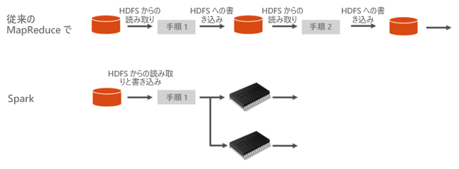
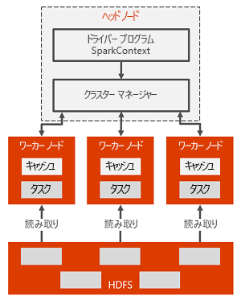

# Apache Spark とは - Azure HDInsight

Apache Spark は、ビッグデータ分析アプリケーションのパフォーマンスを向上させるメモリ内処理をサポートする並列処理フレームワークです。 Azure HDInsight の Apache Spark は、クラウドでの Apache Spark の Microsoft の実装です。 HDInsight により、Azure での Spark クラスターの作成と構成が簡単になります。 HDInsight の Spark クラスターは、[Azure Blob Storage](../../storage/common/storage-introduction.md)、[Azure Data Lake Storage Gen1](../../data-lake-store/data-lake-store-overview.md)、[Azure Data Lake Storage Gen2](../../storage/blobs/data-lake-storage-introduction.md) と互換性があります。 そのため、HDInsight Spark クラスターを使用して、Azure に格納されているデータを処理できます。 コンポーネントとバージョン情報については、[Azure HDInsight での Apache Hadoop のコンポーネントとバージョン](../hdinsight-component-versioning.md)に関するページを参照してください。

## Apache Spark とは

Spark には、クラスターの計算処理をインメモリで行うための基本的な要素が備わっています。 Spark ジョブは、データをメモリに読み込んでキャッシュし、それを繰り返しクエリできます。 メモリ内計算は、Hadoop 分散ファイル システム (HDFS) 経由でデータを共有する Hadoop などのディスクベースのアプリケーションよりもはるかに高速です。 また Spark は、Scala プログラミング言語との親和性が高く、分散データ セットをローカル コレクションのように扱うことができます。 計算内容をすべて map 処理と reduce 処理に分ける必要がありません。

Azure HDInsight の Spark クラスターでは、フル マネージドの Spark サービスを利用できます。 以下の一覧は、HDInsight で Spark クラスターを作成する利点をまとめたものです。

| 機能 | 説明 |
| --- | --- |
| 簡単な作成 |Azure Portal、Azure PowerShell、または HDInsight .NET SDK を使用すると、HDInsight に新しい Spark クラスターを数分で作成できます。 [HDInsight での Apache Spark クラスターの概要](apache-spark-jupyter-spark-sql-use-portal.md)に関する記事を参照してください。 |
| 使いやすさ |HDInsight の Spark クラスターには、Jupyter Notebook と Apache Zeppelin Notebook が含まれています。 対話型のデータ処理と視覚化にこれらの Notebook を使用できます。 [Apache Spark での Apache Zeppelin ノートブックの使用](apache-spark-zeppelin-notebook.md)と [Apache Spark クラスターでのデータの読み込みとクエリの実行](apache-spark-load-data-run-query.md)に関するページを参照してください。|
| REST API |HDInsight の Spark クラスターには、ジョブの送信と監視をリモートで実行する REST API ベースの Spark ジョブ サーバーである [Apache Livy](https://github.com/cloudera/hue/tree/master/apps/spark/java#welcome-to-livy-the-rest-spark-server) が含まれています。 「[Apache Spark REST API を使用してリモート ジョブを HDInsight Spark クラスターに送信する](apache-spark-livy-rest-interface.md)」を参照してください。|
| Azure Storage のサポート | HDInsight の Spark クラスターは、プライマリ ストレージまたは追加のストレージの両方として、Azure Data Lake Storage Gen1 または Gen2 を使用できます。 Data Lake Storage Gen1 について詳しくは、[Azure Data Lake Storage Gen1](../../data-lake-store/data-lake-store-overview.md) に関する記事を参照してください。 Data Lake Storage Gen2 について詳しくは、[Azure Data Lake Storage Gen2](../../storage/blobs/data-lake-storage-introduction.md) に関する記事を参照してください。|
| Azure サービスとの統合 |HDInsight の Spark クラスターには、Azure Event Hubs へのコネクタが付属しています。 Event Hubs を使用してストリーミング アプリケーションを作成できます。 Spark の一部として既に使用できる Apache Kafka が含まれます。 |
| ML Server のサポート | HDInsight の ML Server のサポートは、クラスターの種類 **ML サービス** で提供されます。 ML サービス クラスターをセットアップして、Spark クラスターによって決められた速度で分散 R 計算を実行できます。 詳細については、「[Azure HDInsight での ML Services とは](../r-server/r-server-overview.md)」を参照してください。 |
| サード パーティ製 IDE との統合 | HDInsight は、アプリケーションを作成して HDInsight Spark クラスターに送信するために役立つ複数の IDE プラグインを備えています。 詳細については、[Azure Toolkit for IntelliJ IDEA の使用](apache-spark-intellij-tool-plugin.md)、[Spark & Hive for VS Code の使用](../hdinsight-for-vscode.md)、[Azure Toolkit for Eclipse の使用](apache-spark-eclipse-tool-plugin.md)に関する各ページを参照してください。|
| 同時クエリ |HDInsight の Spark クラスターでは同時クエリがサポートされます。 この機能により、1 人のユーザーからの複数のクエリまたは複数のユーザーおよびアプリケーションからの複数のクエリが、同じクラスター リソースを共有できます。 |
| SSD へのキャッシュ |データのキャッシュ先を、メモリまたはクラスター ノードに取り付けられている SSD から選択できます。 メモリ内キャッシュは、最高のクエリ パフォーマンスを発揮しますが、コストが高くなることがあります。 SSD へのキャッシュは、メモリ内のデータセット全体を収めるのに必要なサイズのクラスターを作成する必要なしにクエリのパフォーマンスを向上できる優れたオプションです。 「[Azure HDInsight IO キャッシュを使用して Apache Spark のワークロードのパフォーマンスを改善する](apache-spark-improve-performance-iocache.md)」を参照してください。 |
| BI ツールとの統合 |HDInsight の Spark クラスターには、データ分析用の Power BI などの BI ツールへのコネクタが用意されています。 |
| 読み込み済みの Anaconda ライブラリ |HDInsight の Spark クラスターには、Anaconda ライブラリが事前にインストールされています。 [Anaconda](https://docs.continuum.io/anaconda/) は、機械学習、データ分析、視覚化などのための 200 個近いライブラリを提供します。 |
| 適応性 | HDInsight を使用すると、自動スケーリング機能で動的にクラスター ノードの数を変更できます。 「[Azure HDInsight クラスターを自動的にスケール調整する](../hdinsight-autoscale-clusters.md)」を参照してください。 また、すべてのデータは Azure Blob Storage、[Azure Data Lake Storage Gen1](../../data-lake-store/data-lake-store-overview.md) または [Azure Data Lake Storage Gen2](../../storage/blobs/data-lake-storage-introduction.md) に格納されるため、Spark クラスターはデータの損失なしで削除できます。 |
| SLA |HDInsight の Spark クラスターでは、24 時間無休体制のサポートと、アップタイム 99.9% の SLA が提供されます。 |

HDInsight の Apache Spark クラスターには、クラスターで使用できる以下のコンポーネントが既定で含まれています。

* [Spark Core](https://spark.apache.org/docs/latest/)。 Spark Core、Spark SQL、Spark ストリーミング API、GraphX、MLlib が含まれます。
* [Anaconda](https://docs.continuum.io/anaconda/)
* [Apache Livy](https://github.com/cloudera/hue/tree/master/apps/spark/java#welcome-to-livy-the-rest-spark-server)
* [Jupyter Notebook](https://jupyter.org)
* [Apache Zeppelin Notebook](http://zeppelin-project.org/)

HDInsight の Spark クラスターには、Microsoft Power BI などの BI ツールからの接続を可能にする [ODBC ドライバー](/sql/connect/odbc/download-odbc-driver-for-sql-server)が用意されています。

## Spark クラスターのアーキテクチャ

HDInsight クラスターで Spark を実行する方法を理解することで、Spark のコンポーネントを理解しやすくなります。

Spark アプリケーションは、独立したプロセスのセットとしてクラスターで実行されます。 メイン プログラム (ドライバー プログラムと呼ばれる) の SparkContext オブジェクトによって調整されます。

SparkContext は、アプリケーション間でリソースを割り当てる複数の種類のクラスター マネージャーに接続できます。 これらのクラスター マネージャーには、Apache Mesos、Apache Hadoop YARN、または Spark クラスター マネージャーが含まれます。 HDInsight では、YARN クラスター マネージャーを使って Spark が実行されます。 接続されると、Spark はクラスター内の worker ノードで Executor を取得します。Executor は、アプリケーションの計算を実行し、データを格納するプロセスです。 次に、アプリケーション コード (SparkContext に渡される JAR ファイルまたは Python ファイルで定義された) を Executor に送信します。 最後に、SparkContext はタスクを Executor に送信して実行させます。

SparkContext は、ユーザーの main 関数を実行し、worker ノードでさまざまな並列処理を実行します。 その後、SparkContext は操作の結果を収集します。 ワーカー ノードによるデータの読み取りと書き込みは、Hadoop 分散ファイル システムとの間で行われます。 また、ワーカー ノードは、変換後のデータを Resilient Distributed Dataset (RDD) としてメモリ内にキャッシュします。

SparkContext は Spark マスターに接続し、個々のタスクの有向グラフ (DAG) にアプリケーションを変換する処理を担います。 ワーカー ノードの Executor プロセス内で実行されるタスクです。 アプリケーションはそれぞれ独自の Executor プロセスを取得します。 そのプロセスが、アプリケーション全体が終了するまで稼働し続けながら、複数のスレッドでタスクを実行します。

## HDInsight の Spark のユース ケース

HDInsight の Spark クラスターでは、以下に挙げる主なシナリオを実現できます。

### 対話型のデータ分析と BI

HDInsight の Apache Spark では、Azure Blob Storage、Azure Data Lake Gen1 または Azure Data Lake Storage Gen2 にデータが格納されます。 ビジネス エキスパートや重要な意思決定者は、そのデータを分析してレポートを作成することができます。 分析されたデータから Microsoft Power BI を使用して対話型レポートを作成します。 アナリストはクラスター ストレージ内の非構造化データや半構造化データから作業を開始し、そのデータのスキーマを Notebook を使用して定義してから、Microsoft Power BI を使用してデータ モデルを作成することができます。 また、HDInsight の Spark クラスターでは Tableau などの多数のサードパーティ製 BI ツールもサポートされるので、データ アナリストやビジネス エキスパート、重要な意思決定者にとって使いやすくなります。 Tableau などにより、データ アナリスト、ビジネス エキスパート、および重要な意思決定者にとって容易になります。

* [チュートリアル:Power BI を使用して Spark データを視覚化する](apache-spark-use-bi-tools.md)

### Spark Machine Learning

Apache Spark には [MLlib](https://spark.apache.org/mllib/) が付属します。 MLlib は、Spark を基に作成された機械学習ライブラリで、HDInsight の Spark クラスターから使用できます。 HDInsight の Spark クラスターには、機械学習用のさまざまな種類のパッケージを含む Python ディストリビューションである Anaconda も含まれています。 さらに、Jupyter および Zeppelin Notebook の組み込みサポートを組み合わせることにより、機械学習アプリケーションを作成するための環境が得られます。

* [チュートリアル:HVAC データを使用して建物の温度を予測する](apache-spark-ipython-notebook-machine-learning.md)  
* [チュートリアル:食品検査の結果を予測する](apache-spark-machine-learning-mllib-ipython.md)

### Spark のストリーミングおよびリアルタイム データ分析

HDInsight の Spark クラスターには、リアルタイム分析ソリューションを構築するための豊富なサポートが用意されています。 Spark には既に Kafka、Flume、Twitter、ZeroMQ、TCP ソケットなどの多数のソースからデータを取り込むためのコネクタがあります。 さらに、Azure Event Hubs からデータを取り込むためのファーストクラスのサポートが HDInsight の Spark によって追加されます。 Event Hubs は、Azure で最も広く使用されているキュー サービスです。 Event Hubs が完全にサポートされることから、HDInsight の Spark クラスターは、リアルタイム分析パイプラインを構築するうえで理想的なプラットフォームです。

* [Apache Spark ストリーミングの概要](apache-spark-streaming-overview.md)
* [Apache Spark Structured Streaming の概要](apache-spark-structured-streaming-overview.md)

## 次の手順

この概要では、Azure HDInsight の Apache Spark の基本的な事柄について説明しました。  HDInsight の Apache Spark について詳しくは、次の記事を参照してください。HDInsight Spark クラスターを作成して、いくつかのサンプル Spark クエリを実行できます。

* [クイック スタート: HDInsight での Apache Spark クラスターの作成と Jupyter を使用した対話型クエリの実行](./apache-spark-jupyter-spark-sql-use-portal.md)
* [チュートリアル: Jupyter を使用した Apache Spark ジョブへのデータの読み込みとクエリの実行](./apache-spark-load-data-run-query.md)
* [チュートリアル:Power BI を使用して Spark データを視覚化する](apache-spark-use-bi-tools.md)
* [チュートリアル:HVAC データを使用して建物の温度を予測する](apache-spark-ipython-notebook-machine-learning.md)
* [パフォーマンスのための Spark ジョブの最適化](apache-spark-perf.md)
