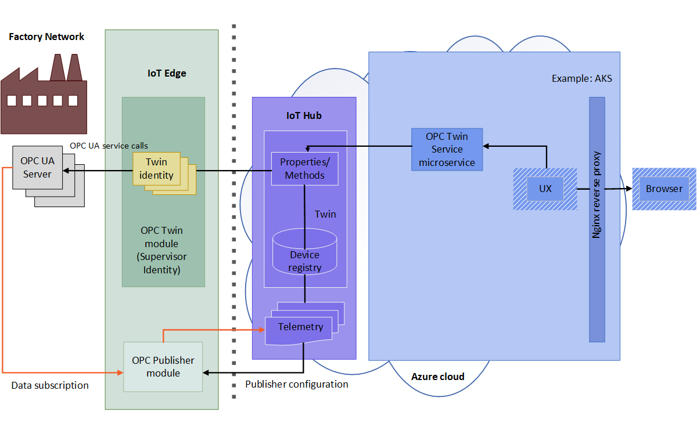

# OPC Twin のアーキテクチャ

> [!IMPORTANT]
> この記事を更新しますが、最新の内容については「[Azure Industrial IoT](https://azure.github.io/Industrial-IoT/)」を参照してください。

次の図に、OPC Twin のアーキテクチャを示します。

## 検出とアクティブ化

1. オペレーターが、モジュールでネットワーク スキャンを有効にするか、探索 URL を使用して 1 回限りの検出を行います。 検出されたエンドポイントとアプリケーションの情報は、処理のためにテレメトリを介してオンボーディング エージェントに送信されます。  OPC UA デバイス オンボーディング エージェントは、検出モードまたはスキャン モードのときに、OPC Twin IoT Edge モジュールによって送信された OPC UA サーバー検出イベントを処理します。 検出イベントの結果、OPC UA デバイス レジストリでのアプリケーションの登録と更新が行われます。

   

1. オペレーターが、検出されたエンドポイントの証明書を検査し、アクセスのために登録済みエンドポイント ツインをアクティブにします。 

   

## 参照と監視

1. アクティブ化が済むと、オペレーターは Twin サービス REST API を使用してサーバー情報モデルを参照または検査し、オブジェクト変数を読み書きし、メソッドを呼び出すことができます。  ユーザーは、HTTP および JSON で完全に表現された、簡略化された OPC UA API を使用します。

   

1. ツイン サービス REST インターフェイスを使用して、OPC Publisher で監視対象の項目とサブスクリプションを作成することもできます。 OPC Publisher では、OPC UA サーバー システムから IoT Hub にテレメトリを送信できます。 OPC Publisher の詳細については、「[What is OPC Publisher (OPC Publisher の概要)](overview-opc-publisher.md)」を参照してください。

   
