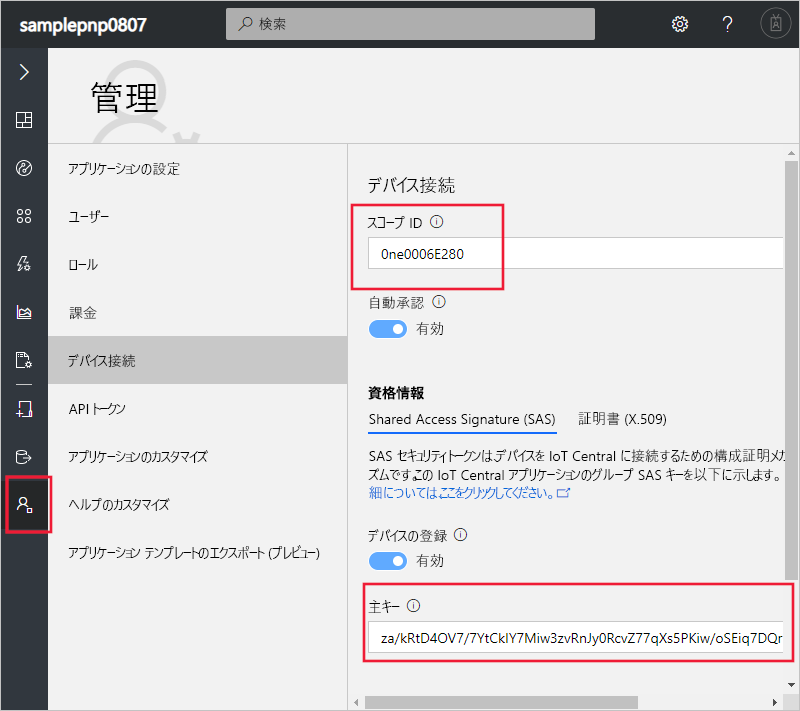
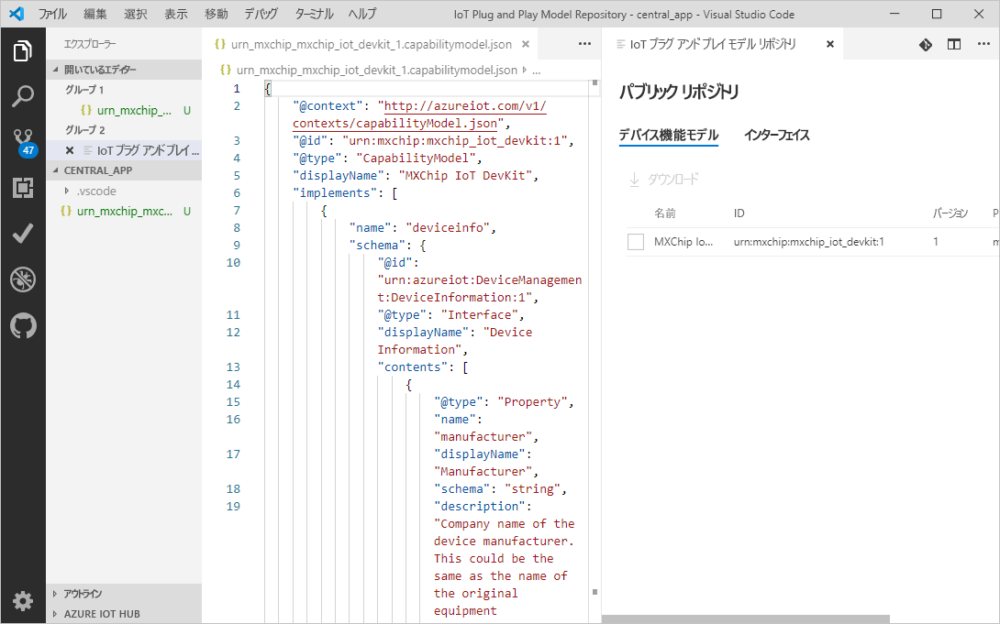
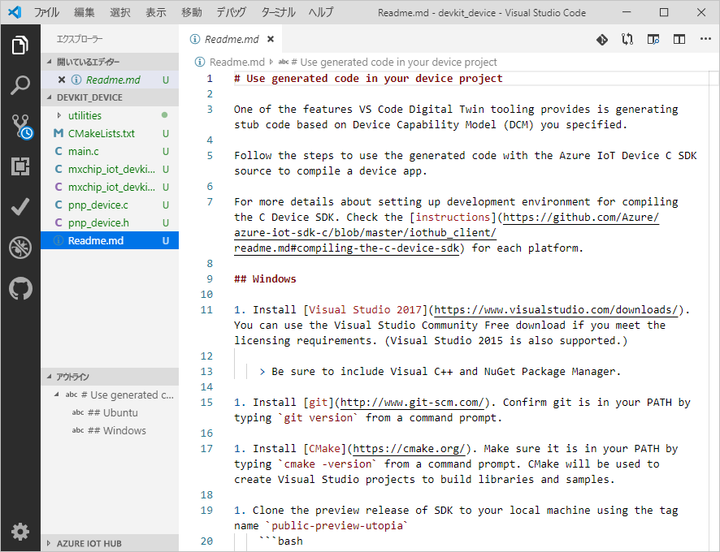

# <a name="quickstart-use-a-device-capability-model-to-create-an-iot-plug-and-play-device-and-connect-it-to-your-iot-central-application"></a>クイック スタート:デバイス機能モデルを使用して IoT プラグ アンド プレイ デバイスを作成し、ご利用の IoT Central アプリケーションに接続する

[!INCLUDE [iot-central-pnp-original](../../includes/iot-central-pnp-original-note.md)]

_デバイス機能モデル_ (DCM) には、[IoT プラグ アンド プレイ](../iot-pnp/overview-iot-plug-and-play.md) デバイスの機能が記述されています。 IoT Central では、デバイスが初めて接続されるときに、DCM の使用によりデバイスのテンプレートとデバイス用の視覚化を作成することができます。 このクイックスタートでは、次の方法について説明します。

* Visual Studio Code を使用して、DCM を使用する IoT プラグ アンド プレイ デバイスを作成する。
* デバイス コードを Windows で実行して、ご利用の IoT Central アプリケーションに接続することを確認する。
* デバイスが送信するシミュレートされたテレメトリを表示する。

## <a name="prerequisites"></a>前提条件

**プレビュー アプリケーション** テンプレートを使用して IoT Central アプリケーションを作成するには、「[Azure IoT Central アプリケーションを作成する (プレビュー機能)](./quick-deploy-iot-central-pnp.md?toc=/azure/iot-central-pnp/toc.json&bc=/azure/iot-central-pnp/breadcrumb/toc.json)」クイックスタートを完了します。

このクイックスタートを完了するには、ご利用のローカル コンピューター上に次のソフトウェアをインストールする必要があります。

* [Visual Studio (Community、Professional、または Enterprise)](https://visualstudio.microsoft.com/downloads/): Visual Studio のインストール時に、**NuGet パッケージ マネージャー** コンポーネントと **C++ によるデスクトップ開発**ワークロードを必ず含めるようにしてください。
* [Git](https://git-scm.com/download/)。
* [CMake](https://cmake.org/download/): **CMake** をインストールするときに、 **[Add CMake to the system PATH]\(CMake をシステム パスに追加する\)** オプションを選択します。
* [Visual Studio Code](https://code.visualstudio.com/)。
* [Node.JS](https://nodejs.org/)
* `dps-keygen` ユーティリティ:

    ```cmd/sh
    npm i -g dps-keygen
    ```

### <a name="install-azure-iot-tools"></a>Azure IoT Tools のインストール

VS Code で Azure IoT Tools 拡張機能パックをインストールするには、次の手順に従います。

1. VS Code で、 **[拡張機能]** タブを選択します。
1. **Azure IoT Tools** を検索します。
1. **[インストール]** を選択します。

## <a name="prepare-the-development-environment"></a>開発環境の準備

### <a name="get-azure-iot-device-sdk-for-c"></a>C 対応の Azure IoT device SDK を取得する

Azure IoT C device SDK をビルドするのに使用できる開発環境を準備します。

1. コマンド プロンプトを開きます。 次のコマンドを実行して、[Azure IoT C SDK](https://github.com/Azure/azure-iot-sdk-c) の GitHub リポジトリを複製します。

    ```cmd/sh
    git clone https://github.com/Azure/azure-iot-sdk-c --recursive -b public-preview
    ```

    この操作は、完了するまでに数分かかります。

1. リポジトリのローカル複製のルートに `central_app` フォルダーを作成します。 デバイス モデル ファイルとデバイス コード スタブには、このフォルダーを使用します。

    ```cmd/sh
    cd azure-iot-sdk-c
    mkdir central_app
    ```

## <a name="generate-device-key"></a>デバイス キーの生成

デバイスを IoT Central アプリケーションに接続するためには、デバイス キーが必要です。 デバイス キーを生成するには:

1. 前のクイックスタートで作成した IoT Central アプリケーションにサインインします。

1. **[管理]** ページに移動し、 **[デバイス接続]** を選択します。

1. **[スコープ ID]** と **[主キー]** の値をメモしておきます。 これらの値はこのクイック スタートの後の方で使用します。

    

1. コマンド プロンプトを開き、次のコマンドを実行してデバイス キーを生成します。

    ```cmd/sh
    dps-keygen  -di:mxchip-01 -mk:{Primary Key from previous step}
    ```

    生成された_デバイス キー_をメモしておきます。この値は、このクイックスタートの後の手順で使用します。

## <a name="download-your-model"></a>ご利用のモデルのダウンロード

このクイックスタートでは、MxChip IoT DevKit デバイス用のパブリック DCM を使用します。 コードを実行するために実際の DevKit デバイスは必要ありません。このクイックスタートでは、Windows で実行するコードをコンパイルします。

1. VS Code を使用して `azure-iot-sdk-c\central_app` フォルダーを開きます。

1. **Ctrl + Shift + P** キーを押してコマンド パレットを開き、「**IoT プラグ アンド プレイ**」と入力して、 **[Open Model Repository]\(モデル リポジトリを開く\)** を選択します。 **[Public repository]\(パブリック リポジトリ\)** を選択します。 VS Code に、パブリック モデル リポジトリ内の DCM の一覧が表示されます。

1. ID が `urn:mxchip:mxchip_iot_devkit:1`の **MXChip IoT DevKit** DCM を選択します。 次に、 **[ダウンロード]** を選択します。 これで、`central_app` フォルダーにその DCM のコピーが作成されました。



> [!NOTE]
> IoT Central で作業するには、デバイス機能モデルで、すべてのインターフェイスが同じファイル内にインラインで定義されている必要があります。

## <a name="generate-the-c-code-stub"></a>C コード スタブを生成する

**MXChip IoT DevKit** DCM とそれに関連するインターフェイスの用意ができたので、モデルを実装するデバイス コードを生成できます。 VS Code で C コード スタブを生成するには:

1. DCM ファイルが開いているフォルダーで、**Ctrl + Shift + P** キーを押してコマンド パレットを開き、「**IoT プラグ アンド プレイ**」と入力して、 **[Generate Device Code Stub]\(デバイス コード スタブを生成する\)** を選択します。

    > [!NOTE]
    > IoT プラグ アンド プレイ コード ジェネレーター ユーティリティを初めて使用するときは、ダウンロードに数秒かかります。

1. ダウンロードした **MXChip IoT DevKit** DCM ファイルを選択します。

1. プロジェクト名「**devkit_device**」を入力します。

1. 使用する言語として、 **[ANSI C]** を選択します。

1. 使用するプロジェクトの種類として **[CMake プロジェクト]** を選択します。 **[MXChip IoT DevKit Project]\(MXChip IoT DevKit プロジェクト\)** を選択しないでください。このオプションは、実際の DevKit デバイスがある場合に使用するものです。

1. 接続方法として、 **[Via DPS (Device Provisioning Service) symmetric key]\(DPS (デバイス プロビジョニング サービス) の対称キーを使用する\)** を選択します。

1. VS Code では新しいウィンドウが開き、`devkit_device` フォルダーに生成されたデバイス コード スタブ ファイルが表示されます。



生成されたデバイス コードに接続情報を追加するには:

1. 生成された C コードを含む VS Code ウィンドウで、 `main.c` ファイルを開きます。

1. `[DPS Id Scope]` を、前にメモした**スコープ ID** に置き換えます。

1. `[DPS symmetric key]` を、前の手順で生成したデバイス キーに置き換えます。

1. `[device registration Id]` を `mxchip-01` で置き換え

1. 変更を保存します。

## <a name="build-the-code"></a>コードのビルド

デバイス SDK を使用して、生成されたデバイス コード スタブをビルドします。 ビルドしたアプリケーションにより、**MXChip IoT DevKit** デバイスがシミュレートされ、ご利用の IoT Central アプリケーションに接続されます。 アプリケーションでは、テレメトリとプロパティが送信され、コマンドが受け取られます。

1. VS Code で、`azure-iot-sdk-c` フォルダー内の `CMakeLists.txt` ファイルを開きます。 必ず、`devkit_device` フォルダーではなく、`azure-iot-sdk-c` フォルダー内の `CMakeLists.txt` ファイルを開いてください。

1. コンパイル時にデバイス コード スタブ フォルダーが取り込まれるように、`CMakeLists.txt` ファイルの末尾に次の行を追加します。

    ```txt
    add_subdirectory(central_app/devkit_device)
    ```

1. `cmake` フォルダーを `azure-iot-sdk-c` フォルダー内に作成し、コマンド プロンプトでそのフォルダーに移動します。

    ```cmd\sh
    mkdir cmake
    cd cmake
    ```

1. 次のコマンドを実行して、デバイス SDK と生成されたコード スタブをビルドします。

    ```cmd\sh
    cmake .. -Duse_prov_client=ON -Dhsm_type_symm_key:BOOL=ON
    cmake --build . -- /m /p:Configuration=Release
    ```

1. ビルドが正常に完了したら、同じコマンド プロンプトでご利用のアプリケーションを実行します。

    ```cmd\sh
    .\central_app\devkit_device\Release\devkit_device.exe
    ```

1. そのデバイス アプリケーションによって IoT Central アプリケーションへのデータの送信が開始されます。

## <a name="view-the-device"></a>デバイスの表示

デバイス コードが IoT Central に接続された後、送信されたプロパティとテレメトリを表示できます。

1. ご利用の IoT Central アプリケーションで、 **[デバイス]** ページに移動し、 **[mxchip-01]** デバイスを選択します。 このデバイスは、デバイス コードが接続されたときに自動的に追加されたものです。

    ![[概要] ページ](./media/quick-create-pnp-device-pnp/overview-page.png)

    数分後に、デバイスから送信されているテレメトリのグラフがこのページに表示されます。

1. **[バージョン情報]** ページを選択して、デバイスから送信されたプロパティ値を確認します。

1. **[コマンド]** ページを選択して、デバイス上でコマンドを呼び出します。 デバイス コードを実行しているコマンド プロンプトで、デバイスが応答していることを確認できます。

1. **[デバイス テンプレート]** ページに移動して、IoT Central によりパブリック リポジトリ内の DCM から作成されたテンプレートを確認します。

    ![[デバイス テンプレート] ページ](./media/quick-create-pnp-device-pnp/device-template.png)

## <a name="next-steps"></a>次の手順

このクイックスタートでは、パブリック モデル リポジトリ内の DCM から生成された IoT プラグ アンド プレイ デバイスを接続する方法を学習しました。

DCM と独自のモデルの作成方法の詳細については、攻略ガイドに進んでください。

> [!div class="nextstepaction"]
> [デバイス テンプレートの設定および管理](./howto-set-up-template-pnp.md?toc=/azure/iot-central-pnp/toc.json&bc=/azure/iot-central-pnp/breadcrumb/toc.json)
