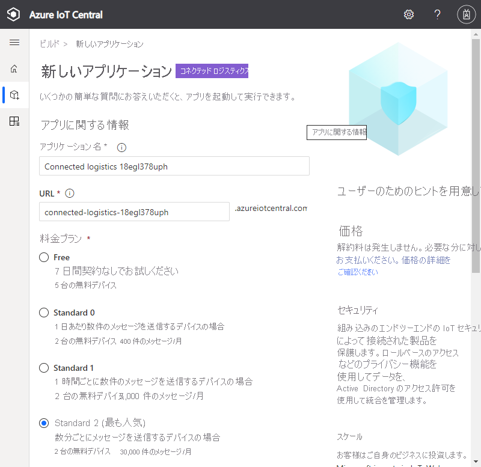

# チュートリアル:コネクテッド ロジスティクス アプリケーション テンプレートをデプロイして調べる

このチュートリアルでは、IoT Central の "*コネクテッド ロジスティクス*" アプリケーション テンプレートの基本的な使い方について説明します。 テンプレートをデプロイして使用する方法をご覧ください。

このチュートリアルでは、以下の内容を学習します。

> [!div class="checklist"]
> * コネクテッド ロジスティクス アプリケーションを作成する。
> * アプリケーションの主な機能を使用する。
> * ダッシュボードを使用して重要なロジスティクス デバイス操作アクティビティを表示する。
> * デバイス テンプレートを使用する
> * ルールに従う
> * ジョブを使用する

## 前提条件

* このアプリをデプロイするために必要な前提条件は特にありません。
* 無料価格プランを使用するか、Azure サブスクリプションを使用することができます。

## コネクテッド ロジスティクス アプリケーションを作成する

次の手順に従ってアプリケーションを作成します。

1. [Azure IoT Central ビルド](https://aka.ms/iotcentral) Web サイトに移動します。 次に、Microsoft 個人アカウントか、職場または学校アカウントを使用してサインインします。 左側のナビゲーションバーから **[ビルド]** を選択し、 **[Retail]\(小売り\)** タブを選択します。

    :::image type="content" source="media/tutorial-iot-central-connected-logistics/iotc-retail-homepage.png" alt-text="コネクテッド ロジスティクス テンプレート":::

1. **[Connected Logistics Application]\(コネクテッド ロジスティクス アプリケーション\)** の **[アプリの作成]** を選択します。

1. **[アプリの作成]** を選択すると、 **[新しいアプリケーション]** フォームが開きます。 次の詳細を入力します。

    * **[アプリケーション名]** : 既定の推奨名を使用するか、わかりやすいアプリケーション名を入力できます。
    * **[URL]** : 既定の推奨 URL を使用するか、わかりやすい一意の URL を入力できます。 次に、Azure サブスクリプションが既にある場合は、既定の設定をお勧めします。 7 日間の無料試用版料金プランから始め、無料試用版が期限切れになる前に、いつでも標準の料金プランに変換することもできます。
    * **課金情報**:リソースをプロビジョニングするには、ディレクトリ、Azure サブスクリプション、リージョンの詳細が必要です。
    * **作成**:ページの下部にある [作成] を選択して、アプリケーションをデプロイします。

    :::image type="content" source="media/tutorial-iot-central-connected-logistics/connected-logistics-app-create.png" alt-text="コネクテッド ロジスティクス アプリ テンプレート":::

    :::image type="content" source="media/tutorial-iot-central-connected-logistics/connected-logistics-app-create-billinginfo.png" alt-text="コネクテッド ロジスティクスの課金情報":::

## アプリケーションを調べる

以下に示したのは、コネクテッド ロジスティクス アプリケーション テンプレートの選択方法を示すスクリーンショットです。

> [!div class="mx-imgBorder"]
> 

以降のセクションでは、アプリケーションの主な機能について見ていきます。

### ダッシュボード

アプリケーション テンプレートがデプロイされると、既定のダッシュボードが、コネクテッド ロジスティクスのオペレーターを対象とするポータルになります。 Northwind Traders 社は、海上と陸上の貨物を管理する架空のロジスティクス プロバイダーです。 このダッシュボードには、出荷からのテレメトリを提供する 2 つの異なるゲートウェイと、関連コマンド、ジョブ、アクションが表示されます。

> [!div class="mx-imgBorder"]
> 

> [!div class="mx-imgBorder"]
> 

このダッシュボードは、重要なロジスティクス デバイス操作アクティビティが表示されるように事前に構成されています。

ダッシュボードでは、2 つの異なるゲートウェイ デバイス管理操作を行えます。

* トラック輸送の物流経路と海上輸送の場所の詳細を表示します。
* ゲートウェイの状態やその他の関連情報を表示します。

:::image type="content" source="media/tutorial-iot-central-connected-logistics/connected-logistics-dashboard1.png" alt-text="コネクテッド ロジスティクスのダッシュボード":::

* ゲートウェイ、アクティブなタグ、不明なタグの合計数を追跡できます。
* ファームウェアの更新、センサーの無効化、センサーの有効化、センサーしきい値の更新、テレメトリ間隔の更新、デバイス サービス コントラクトの更新などのデバイス管理操作を実行できます。
* デバイスのバッテリ消費量を表示します。

:::image type="content" source="media/tutorial-iot-central-connected-logistics/connected-logistics-dashboard2.png" alt-text="コネクテッド ロジスティクスのダッシュボードの状態":::

#### デバイス テンプレート

**[デバイス テンプレート]** を選択すると、ゲートウェイ機能モデルが表示されます。 機能モデルは、 **[Gateway Telemetry & Property]\(ゲートウェイ テレメトリとプロパティ\)** インターフェイスと **[Gateway Commands]\(ゲートウェイ コマンド\)** インターフェイスを中心に構成されています。

**[ゲートウェイのテレメトリとプロパティ]** - このインターフェイスでは、センサーに関連するすべてのテレメトリ、場所、デバイス情報が定義されます。 また、センサーのしきい値や更新間隔など、デバイス ツインのプロパティ機能もこのインターフェイスで定義されます。

:::image type="content" source="media/tutorial-iot-central-connected-logistics/connected-logistics-devicetemplate1.png" alt-text="テレメトリとプロパティのインターフェイス":::

**[Gateway Commands]\(ゲートウェイ コマンド\)** - このインターフェイスには、すべてのゲートウェイ コマンド機能が整理されています。

:::image type="content" source="media/tutorial-iot-central-connected-logistics/connected-logistics-devicetemplate2.png" alt-text="ゲートウェイ コマンド インターフェイス":::

### ルール

**[Rules]\(ルール\)** タブを選択すると、このアプリケーション テンプレートに含まれるルールが表示されます。 これらのルールは、詳細な調査のためオペレーターにメールで通知するように構成されています。

**[Gateway theft alert]\(ゲートウェイ盗難アラート\)** : このルールは、輸送中にセンサーによって予期しない光が検出された場合にトリガーされます。 オペレーターは、盗難の可能性を調査するためにすぐに通知を受け取る必要があります。

**[Unresponsive Gateway]\(応答しないゲートウェイ\)** : このルールは、長期間にわたってゲートウェイからクラウドへのレポートがない場合にトリガーされます。 バッテリ低下、接続喪失、デバイスの破損といった原因により、ゲートウェイが応答しないことがあります。

:::image type="content" source="media/tutorial-iot-central-connected-logistics/connected-logistics-rules.png" alt-text="ルールの定義":::

### ジョブ

**[ジョブ]** タブを選択すると、このアプリケーションに含まれるジョブが表示されます。

:::image type="content" source="media/tutorial-iot-central-connected-logistics/connected-logistics-jobs.png" alt-text="実行するジョブ":::

ジョブを使用して、アプリケーション全体の操作を実行できます。 このアプリケーション内のジョブでは、デバイス コマンドとツイン機能を使用して、すべてのゲートウェイでの特定のセンサーの無効化や、出荷モードとルートに応じたセンサーのしきい値の変更などのタスクが実行されます。

* 一般的な操作として、海上輸送中にバッテリーを節約するために感電センサーを無効にしたり、コールド チェーン輸送中に温度しきい値を下げたりすることがあります。

* ジョブを使うと、ゲートウェイでのファームウェアの更新やサービス コントラクトの更新など、システム全体の操作を実行して、メンテナンス アクティビティを最新の状態に保つことができます。

## リソースをクリーンアップする

このアプリケーションをもう使わない場合は、 **[管理]**  >  **[アプリケーションの設定]** に移動し、 **[削除]** を選択することによって、アプリケーション テンプレートを削除します。

:::image type="content" source="media/tutorial-iot-central-connected-logistics/connected-logistics-cleanup.png" alt-text="テンプレートのクリーンアップ":::

## 次のステップ

 の詳細情報: 

> [!div class="nextstepaction"]
> [コネクテッド ロジスティクスの概念](./architecture-connected-logistics.md)
