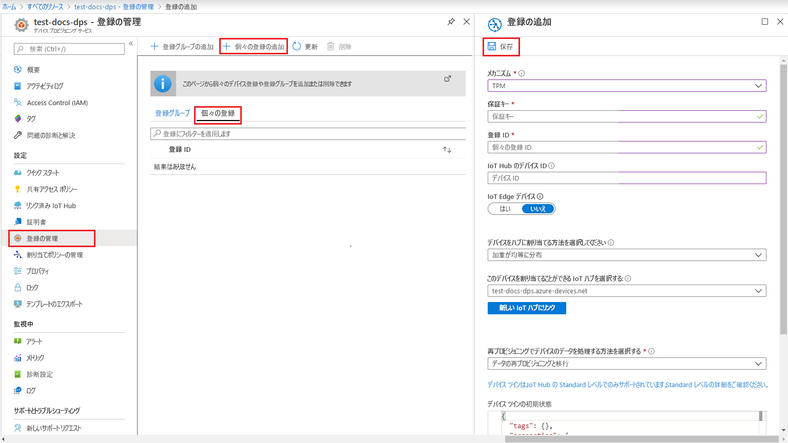
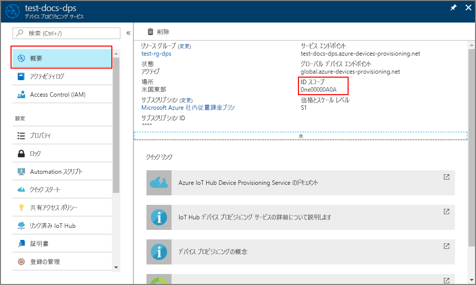

# <a name="quickstart-create-and-provision-a-simulated-tpm-device-using-nodejs-device-sdk-for-iot-hub-device-provisioning-service"></a>クイック スタート:IoT Hub Device Provisioning Service 対応の Node.js デバイス SDK を使用して、シミュレートされた TPM デバイスを作成してプロビジョニングする

[!INCLUDE [iot-dps-selector-quick-create-simulated-device-tpm](../../includes/iot-dps-selector-quick-create-simulated-device-tpm.md)]

このクイックスタートでは、シミュレートされた IoT デバイスを Windows コンピューターに作成します。 シミュレートされたデバイスには、ハードウェア セキュリティ モジュール (HSM) としての TPM シミュレーターが含まれます。 デバイス サンプル Node.js コードから、Device Provisioning Service (DPS) への個別登録を使用して、このシミュレートされたデバイスを IoT ハブに接続します。

## <a name="prerequisites"></a>前提条件

- [プロビジョニング](about-iot-dps.md#provisioning-process)の概念を理解していること。
- [Azure portal での IoT Hub Device Provisioning Service の設定](./quick-setup-auto-provision.md)が完了していること。
- アクティブなサブスクリプションが含まれる Azure アカウント。 [無料で作成できます](https://azure.microsoft.com/free/?ref=microsoft.com&utm_source=microsoft.com&utm_medium=docs&utm_campaign=visualstudio)。
- [Node.js v4.0 以上](https://nodejs.org)。
- [Git](https://git-scm.com/download/).

[!INCLUDE [IoT Device Provisioning Service basic](../../includes/iot-dps-basic.md)]

## <a name="prepare-the-environment"></a>環境の準備 

1. マシンに [Node.js v4.0 以降](https://nodejs.org)がインストールされていることを確認します。

1. マシンに `git` がインストールされ、コマンド ウィンドウからアクセスできる環境変数に追加されていることを確認します。 **Git Bash** (ローカル Git リポジトリと対話する際に使用するコマンドライン アプリ) など、インストールする各種 `git` ツールの最新バージョンについては、[Software Freedom Conservancy の Git クライアント ツール](https://git-scm.com/download/)に関するページを参照してください。 


## <a name="simulate-a-tpm-device"></a>TPM デバイスのシミュレート

1. コマンド プロンプトまたは Git Bash を開きます。 `azure-utpm-c` GitHub レポジトリを複製します。
    
    ```cmd/sh
    git clone https://github.com/Azure/azure-utpm-c.git --recursive
    ```

1. GitHub ルート フォルダーに移動し、シミュレートされたデバイスの [HSM](https://azure.microsoft.com/blog/azure-iot-supports-new-security-hardware-to-strengthen-iot-security/) として [TPM](/windows/device-security/tpm/trusted-platform-module-overview) シミュレーターを実行します。 これは、ソケットでポート 2321 とポート 2322 をリッスンします。 このコマンド ウィンドウを閉じないでください。このクイック スタート ガイドの終了まで、このシミュレーターを実行状態にしておく必要があります。 

    ```cmd/sh
    .\azure-utpm-c\tools\tpm_simulator\Simulator.exe
    ```

1. **registerdevice** という名前の新しい空のフォルダーを作成します。 コマンド プロンプトで次のコマンドを使用して、**registerdevice** フォルダー内に新しい package.json ファイルを作成します。 `npm` からのすべての質問に回答するか、既定値が適切であればそのまま使用します。
   
    ```cmd/sh
    npm init
    ```

1. 次の前段階パッケージをインストールします。

    ```cmd/sh
    npm install node-gyp -g
    npm install ffi -g
    ```

    > [!NOTE]
    > 上記のパッケージのインストールには、いくつかの既知の問題があります。 これらの問題を解決するには、 **[管理者として実行]** モードのコマンド プロンプトで `npm install --global --production windows-build-tools` を実行し、インストールしたバージョンにパスを置き換えて `SET VCTargetsPath=C:\Program Files (x86)\MSBuild\Microsoft.Cpp\v4.0\V140` を実行します。その後、上のインストール コマンドを再実行します。
    >

1. 登録時に使用されるコンポーネントが含まれている以下のパッケージをインストールします。

   - TPM と連係するセキュリティ クライアント: `azure-iot-security-tpm`
   - デバイスが Device Provisioning Service に接続するためのトランスポート: `azure-iot-provisioning-device-http` または `azure-iot-provisioning-device-amqp`
   - トランスポートおよびセキュリティ クライアントを使用するクライアント: `azure-iot-provisioning-device`

     デバイスが登録されると、通常の IoT Hub Device Client パッケージを使用して、登録時に指定した資格情報でデバイスを接続できます。 以下のものが必要になります。

   - デバイス クライアント: `azure-iot-device`
   - トランスポート: `azure-iot-device-amqp`、`azure-iot-device-mqtt`、`azure-iot-device-http` のいずれか
   - 既にインストール済みのセキュリティ クライアント: `azure-iot-security-tpm`

     > [!NOTE]
     > 以下のサンプルでは、`azure-iot-provisioning-device-http` および `azure-iot-device-mqtt` トランスポートを使用します。
     > 

     コマンド プロンプトで、**registerdevice** フォルダーから次のコマンドを実行することで、これらすべてのパッケージを一度にインストールできます。

       ```cmd/sh
       npm install --save azure-iot-device azure-iot-device-mqtt azure-iot-security-tpm azure-iot-provisioning-device-http azure-iot-provisioning-device
       ```

1. テキスト エディターを使用して、**registerdevice** フォルダーに新しい **ExtractDevice.js** ファイルを作成します。

1. **ExtractDevice.js** ファイルの先頭に、次の `require` ステートメントを追加します。
   
    ```
    'use strict';

    var tpmSecurity = require('azure-iot-security-tpm');
    var tssJs = require("tss.js");

    var myTpm = new tpmSecurity.TpmSecurityClient(undefined, new tssJs.Tpm(true));
    ```

1. メソッドを実装するために、次の関数を追加します。
   
    ```
    myTpm.getEndorsementKey(function(err, endorsementKey) {
      if (err) {
        console.log('The error returned from get key is: ' + err);
      } else {
        console.log('the endorsement key is: ' + endorsementKey.toString('base64'));
        myTpm.getRegistrationId((getRegistrationIdError, registrationId) => {
          if (getRegistrationIdError) {
            console.log('The error returned from get registration id is: ' + getRegistrationIdError);
          } else {
            console.log('The Registration Id is: ' + registrationId);
            process.exit();
          }
        });
      }
    });
    ```

1. **ExtractDevice.js** ファイルを保存して閉じます。 サンプルを実行します。

    ```cmd/sh
    node ExtractDevice.js
    ```

1. デバイス登録に必要な **_保証キー_** と **_登録 ID_** が出力ウィンドウに表示されます。 これらの値を書き留めておいてください。 


## <a name="create-a-device-entry"></a>デバイス エントリの作成

Azure IoT Device Provisioning Service では、次の 2 種類の登録がサポートされています。

- [登録グループ](concepts-service.md#enrollment-group)：複数の関連するデバイスを登録するために使用します。
- [個別登録](concepts-service.md#individual-enrollment): 単一デバイスを登録するために使用します。

この記事では、個別登録の使用方法を示します。

1. Azure portal にサインインし、左側のメニューの **[すべてのリソース]** を選択して、Device Provisioning Service を開きます。

1. Device Provisioning Service のメニューで、 **[登録を管理します]** を選択します。 **[個々の登録]** タブを選択したうえで、上部にある **[個別登録の追加]** を選択します。 

1. **[登録の追加]** パネルで、次の情報を入力します。
   - ID 構成証明の "*メカニズム*" として **[TPM]** を選択します。
   - 前にメモしておいた値を基に、TPM デバイスの "*登録 ID*" と "*保証キー*" を入力します。
   - プロビジョニング サービスにリンクされた IoT ハブを選択します。
   - 必要に応じて、次の情報を入力することができます。
       - 一意の "*デバイス ID*" を入力します。 デバイスに名前を付ける際に機密データを含めないようにしてください。 指定しない場合には、デバイスを識別するために登録 ID が代わりに使用されます。
       - **[Initial device twin state]\(初期のデバイス ツインの状態\)** をデバイスの目的の初期構成で更新します。
   - 作業が完了したら、 **[保存]** を押します。 

       

   登録に成功すると、 *[個々の登録]* タブの一覧に、対象デバイスの "*登録 ID*" が表示されます。 


## <a name="register-the-device"></a>デバイスの登録

1. Azure portal で、Device Provisioning サービスの **[概要]** ブレードを選択し、 **_[グローバル デバイス エンドポイント]_** と **_[ID スコープ]_** の値を書き留めます。

     

1. テキスト エディターを使用して、**registerdevice** フォルダーに新しい **RegisterDevice.js** ファイルを作成します。

1. **RegisterDevice.js** ファイルの先頭に、次の `require` ステートメントを追加します。
   
    ```
    'use strict';

    var ProvisioningTransport = require('azure-iot-provisioning-device-http').Http;
    var iotHubTransport = require('azure-iot-device-mqtt').Mqtt;
    var Client = require('azure-iot-device').Client;
    var Message = require('azure-iot-device').Message;
    var tpmSecurity = require('azure-iot-security-tpm');
    var ProvisioningDeviceClient = require('azure-iot-provisioning-device').ProvisioningDeviceClient;
    ```

    > [!NOTE]
    > **Node.js 用 Azure IoT SDK** では、_AMQP_、_AMQP WS_、_MQTT WS_ などの追加プロトコルがサポートされています。  詳細については、「[Device Provisioning Service SDK for Node.js samples (Node.js 用 Device Provisioning Service SDK のサンプル)](https://github.com/Azure/azure-iot-sdk-node/tree/master/provisioning/device/samples)」を参照してください。
    > 

1. **globalDeviceEndpoint** と **idScope** 変数を追加し、それらを使用して **ProvisioningDeviceClient** インスタンスを作成します。 **{globalDeviceEndpoint}** と **{idScope}** を、**手順 1.** の " **_グローバル デバイス エンドポイント_** " と " **_ID スコープ_** " の値に置き換えます。
   
    ```
    var provisioningHost = '{globalDeviceEndpoint}';
    var idScope = '{idScope}';

    var tssJs = require("tss.js");
    var securityClient = new tpmSecurity.TpmSecurityClient('', new tssJs.Tpm(true));
    // if using non-simulated device, replace the above line with following:
    //var securityClient = new tpmSecurity.TpmSecurityClient();

    var provisioningClient = ProvisioningDeviceClient.create(provisioningHost, idScope, new ProvisioningTransport(), securityClient);
    ```

1. デバイスにメソッドを実装する次の関数を追加します。
   
    ```
    provisioningClient.register(function(err, result) {
      if (err) {
        console.log("error registering device: " + err);
      } else {
        console.log('registration succeeded');
        console.log('assigned hub=' + result.registrationState.assignedHub);
        console.log('deviceId=' + result.registrationState.deviceId);
        var tpmAuthenticationProvider = tpmSecurity.TpmAuthenticationProvider.fromTpmSecurityClient(result.registrationState.deviceId, result.registrationState.assignedHub, securityClient);
        var hubClient = Client.fromAuthenticationProvider(tpmAuthenticationProvider, iotHubTransport);

        var connectCallback = function (err) {
          if (err) {
            console.error('Could not connect: ' + err.message);
          } else {
            console.log('Client connected');
            var message = new Message('Hello world');
            hubClient.sendEvent(message, printResultFor('send'));
          }
        };

        hubClient.open(connectCallback);

        function printResultFor(op) {
          return function printResult(err, res) {
            if (err) console.log(op + ' error: ' + err.toString());
            if (res) console.log(op + ' status: ' + res.constructor.name);
            process.exit(1);
          };
        }
      }
    });
    ```

1. **RegisterDevice.js** ファイルを保存して閉じます。 サンプルを実行します。

    ```cmd/sh
    node RegisterDevice.js
    ```

1. デバイスが起動して Device Provisioning Service に接続し、IoT ハブの情報を取得する動作がシミュレートされるので、そのメッセージに注目してください。 プロビジョニング サービスにリンクされた IoT ハブに対してシミュレートされたデバイスが正常にプロビジョニングされると、ハブの **[IoT デバイス]** ブレードにデバイス ID が表示されます。 

     

    *[Initial device twin state]\(初期のデバイス ツインの状態\)* をデバイスの登録エントリの既定値から変更した場合、デバイスはハブから目的のツインの状態をプルし、それに従って動作することができます。 詳細については、「[IoT Hub のデバイス ツインの理解と使用](../iot-hub/iot-hub-devguide-device-twins.md)」を参照してください。


## <a name="clean-up-resources"></a>リソースをクリーンアップする

引き続きデバイス クライアント サンプルを使用する場合は、このクイックスタートで作成したリソースをクリーンアップしないでください。 使用する予定がない場合は、次の手順を使用して、このクイックスタートで作成したすべてのリソースを削除してください。

1. マシンに表示されているデバイス クライアント サンプルの出力ウィンドウを閉じます。
1. マシンに表示されている TPM シミュレーター ウィンドウを閉じます。
1. Azure portal の左側のメニューで **[すべてのリソース]** を選択し、Device Provisioning Service を選択します。 サービスの **[登録を管理します]** ブレードを開き、 **[個々の登録]** タブを選択します。このクイックスタートで登録したデバイスの "*登録 ID*" の隣にあるチェック ボックスをオンにして、ペイン上部の **[削除]** を押します。 
1. Azure portal の左側のメニューにある **[すべてのリソース]** を選択し、IoT ハブを選択します。 ハブの **[IoT デバイス]** ブレードを開き、このクイックスタートで登録したデバイスの "*デバイス ID*" の隣にあるチェック ボックスをオンにして、ペイン上部の **[削除]** を押します。


## <a name="next-steps"></a>次のステップ

このクイックスタートでは、TPM のシミュレートされたデバイスをマシン上に作成し、IoT Hub Device Provisioning Service を使用して IoT ハブにプロビジョニングしました。 TPM デバイスをプログラムで登録する方法については、プログラムによる TPM デバイスの登録のクイックスタートに進みます。 

> [!div class="nextstepaction"]
> [Azure クイック スタート - TPM デバイスを Azure IoT Hub Device Provisioning Service に登録する](quick-enroll-device-tpm-node.md)