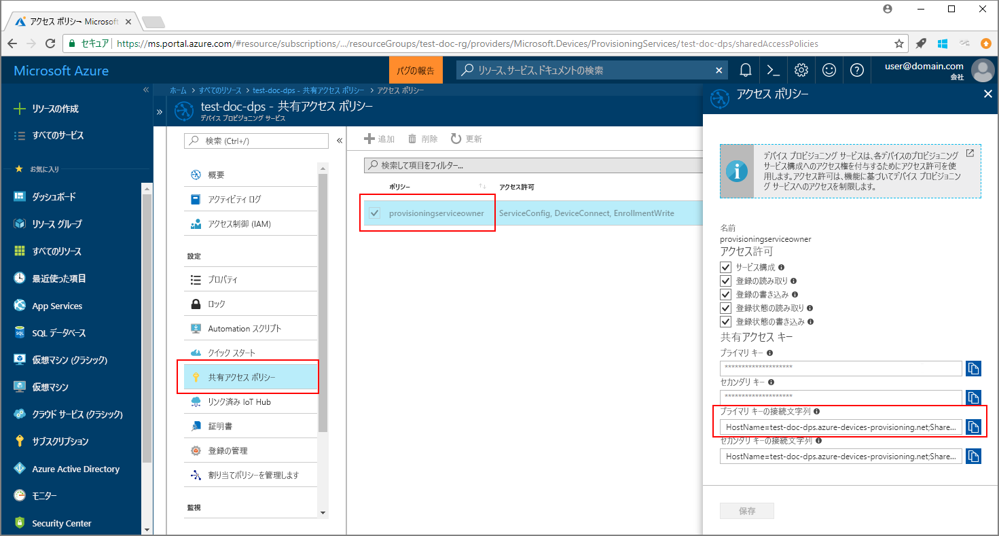

# <a name="enroll-tpm-device-to-iot-hub-device-provisioning-service-using-java-service-sdk"></a>Java Service SDK を使用して TPM デバイスを IoT Hub Device Provisioning Service に登録する

[!INCLUDE [iot-dps-selector-quick-enroll-device-tpm](../../includes/iot-dps-selector-quick-enroll-device-tpm.md)]


以下の手順では、[Java Service SDK](https://azure.github.io/azure-iot-sdk-java/service/) とサンプル Java アプリケーションを使用して、Azure IoT Hub Device Provisioning Service へのシミュレートされた TPM デバイスの個別登録をプログラムで作成する方法について説明します。 Java Service SDK は Windows および Linux マシンの両方で動作しますが、この記事では、Windows 開発マシンを使用して登録プロセスの手順を説明します。

事前に、[Azure Portal での IoT Hub Device Provisioning Service の設定](./quick-setup-auto-provision.md)と [TPM デバイスのシミュレート](quick-create-simulated-device.md#simulatetpm)を済ませておいてください。

<a id="setupdevbox"></a>

## <a name="prepare-the-development-environment"></a>開発環境の準備 

1. [Java SE Development Kit 8](https://aka.ms/azure-jdks) がマシンにインストールされていることを確認します。 

2. Java インストールの環境変数を設定します。 `PATH` 変数には、*jdk1.8.x\bin* ディレクトリの完全なパスを含めます。 初めて Java をインストールするマシンの場合は、`JAVA_HOME` という新しい環境変数を作成し、*jdk1.8.x* ディレクトリの完全なパスに指定します。 Windows マシンでは、このディレクトリは *C:\\Program Files\\Java\\* フォルダーにあります。Windows マシンの **[コントロール パネル]** で **[システム環境変数の編集]** を探し、環境変数を作成または編集することができます。 

   コマンド ウィンドウで次のコマンドを実行して、マシンに Java が正常に設定されたことを確認できます。

    ```cmd\sh
    java -version
    ```

3. マシンに [Maven 3](https://maven.apache.org/download.cgi) をダウンロードして抽出します。 

4. Maven が抽出されたフォルダー内にある *apache-maven-3.x.x\\bin* フォルダーを指すように環境変数 `PATH` を編集します。 コマンド ウィンドウで次のコマンドを実行して、Maven が正常にインストールされたことを確認できます。

    ```cmd\sh
    mvn --version
    ```

5. [git](https://git-scm.com/download/) がマシンにインストールされ、環境変数 `PATH` に追加されていることを確認します。 


<a id="javasample"></a>

## <a name="download-and-modify-the-java-sample-code"></a>Java サンプル コードをダウンロードして変更する

ここでは、TPM デバイスのプロビジョニングの詳細をサンプル コードに追加する方法について説明します。 

1. コマンド プロンプトを開きます。 Java Service SDK を使用して、デバイス登録コード サンプルの GitHub リポジトリを複製します。
    
    ```cmd\sh
    git clone https://github.com/Azure/azure-iot-sdk-java.git --recursive
    ```

2. ダウンロードしたソース コードで、サンプル フォルダー **_azure-iot-sdk-java/provisioning/provisioning-samples/service-enrollment-sample_** に移動します。 任意のエディターでファイル **_/src/main/java/samples/com/microsoft/azure/sdk/iot/ServiceEnrollmentSample.java_** を開き、次の詳細を追加します。

    1. 次のように、ポータルからプロビジョニング サービスの `[Provisioning Connection String]` を追加します。
        1. [Azure Portal](https://portal.azure.com) でプロビジョニング サービスに移動します。 
        2. **[共有アクセス ポリシー]** を開き、*EnrollmentWrite* アクセス許可を持つポリシーを選択します。
        3. **主キーの接続文字列**をコピーします。 

              

        4. サンプル コード ファイル **_ServiceEnrollmentSample.java_** の `[Provisioning Connection String]` を**主キーの接続文字列**に置き換えます。
    
            ```Java
            private static final String PROVISIONING_CONNECTION_STRING = "[Provisioning Connection String]";
            ```

    2. TPM デバイスの詳細を追加します。
        1. 「[Simulate TPM device](quick-create-simulated-device.md#simulatetpm)」(TPM デバイスのシミュレート) に続く手順に従って、TPM デバイス シミュレーションの*登録 ID* と *TPM 保証キー*を取得します。
        2. 前の手順の出力の**_登録 ID_** と**_保証キー_** を使用し、サンプル コード ファイル **_ServiceEnrollmentSample.java_** の `[RegistrationId]` と `[TPM Endorsement Key]` を置き換えます。
        
            ```Java
            private static final String REGISTRATION_ID = "[RegistrationId]";
            private static final String TPM_ENDORSEMENT_KEY = "[TPM Endorsement Key]";
            ```

    3. 必要に応じて、サンプル コードでプロビジョニング サービスを構成することができます。
        - この構成をサンプルに追加するには、次の手順を実行します。
            1. [Azure Portal](https://portal.azure.com) でプロビジョニング サービスにリンクされている IoT Hub に移動します。 ハブの **[概要]** タブを開き、**[ホスト名]** をコピーします。 この **[ホスト名]** を *IOTHUB_HOST_NAME* パラメーターに割り当てます。
                ```Java
                private static final String IOTHUB_HOST_NAME = "[Host name].azure-devices.net";
                ```
            2. *DEVICE_ID* パラメーターにフレンドリ名を割り当て、*PROVISIONING_STATUS* を既定の *ENABLED* 値のままにします。 
    
        - または、プロビジョニング サービスを構成しない場合は、_ServiceEnrollmentSample.java_ ファイル内の次のステートメントをコメント アウトするか削除します。
            ```Java
            // The following parameters are optional. Remove it if you don't need.
            individualEnrollment.setDeviceId(DEVICE_ID);
            individualEnrollment.setIotHubHostName(IOTHUB_HOST_NAME);
            individualEnrollment.setProvisioningStatus(PROVISIONING_STATUS);
            ```

    4. サンプル コードの内容を確認します。 このコードでは、個々の TPM デバイス登録を作成、更新、照会、および削除しています。 ポータルで登録が成功したことを確認するには、_ServiceEnrollmentSample.java_ ファイルの末尾にある次のコード行を一時的にコメント アウトします。
    
        ```Java
        // *********************************** Delete info of individualEnrollment ************************************
        System.out.println("\nDelete the individualEnrollment...");
        provisioningServiceClient.deleteIndividualEnrollment(REGISTRATION_ID);
        ```

    5. ファイル _ServiceEnrollmentSample.java_ を保存します。

<a id="runjavasample"></a>

## <a name="build-and-run-the-java-sample-code"></a>Java サンプル コードをビルドして実行する

1. コマンド ウィンドウを開き、フォルダー **_azure-iot-sdk-java/provisioning/provisioning-samples/service-enrollment-sample_** に移動します。

2. 次のコマンドを使用して、サンプル コードをビルドします。

    ```cmd\sh
    mvn install -DskipTests
    ```

   このコマンドで、Maven パッケージ [`com.microsoft.azure.sdk.iot.provisioning.service`](https://www.mvnrepository.com/artifact/com.microsoft.azure.sdk.iot.provisioning/provisioning-service-client) がマシンにダウンロードされます。 このパッケージには、サンプル コードのビルドに必要な Java Service SDK のバイナリが含まれています。 

3. コマンド ウィンドウで次のコマンドを使用してサンプルを実行します。

    ```cmd\sh
    cd target
    java -jar ./service-enrollment-sample-{version}-with-deps.jar
    ```

4. 出力ウィンドウで、登録が正常に完了したことを確認します。 

5. Azure Portal でプロビジョニング サービスに移動します。 **[登録を管理します]** をクリックし、**[個々の登録]** タブを選択します。シミュレートされた TPM デバイスの*登録 ID* が一覧表示されます。 

      

## <a name="clean-up-resources"></a>リソースのクリーンアップ
Java Service のサンプルを調べる予定の場合は、このクイックスタートで作成したリソースをクリーンアップしないでください。 使用する予定がない場合は、次の手順を使用して、このクイックスタートで作成したすべてのリソースを削除してください。

1. マシンに表示されている Java サンプルの出力ウィンドウを閉じます。
1. TPM デバイスをシミュレートするために作成した TPM シミュレーター ウィンドウが表示されている場合は閉じます。
1. Azure Portal で Device Provisioning サービスに移動し、**[登録を管理します]** をクリックし、**[個々の登録]** タブを選択します。このクイックスタートで登録したデバイスの*登録 ID* を選択し、ブレードの上部の **[削除]** ボタンをクリックします。 

## <a name="next-steps"></a>次の手順
このクイックスタートでは、シミュレートされた TPM デバイスを Device Provisioning Service に登録しました。 Device Provisioning に関する理解をさらに深めるには、Azure Portal における Device Provisioning Service の設定に関するチュートリアルに進んでください。 

> [!div class="nextstepaction"]
> [Azure IoT Hub Device Provisioning Service のチュートリアル](./tutorial-set-up-cloud.md)
