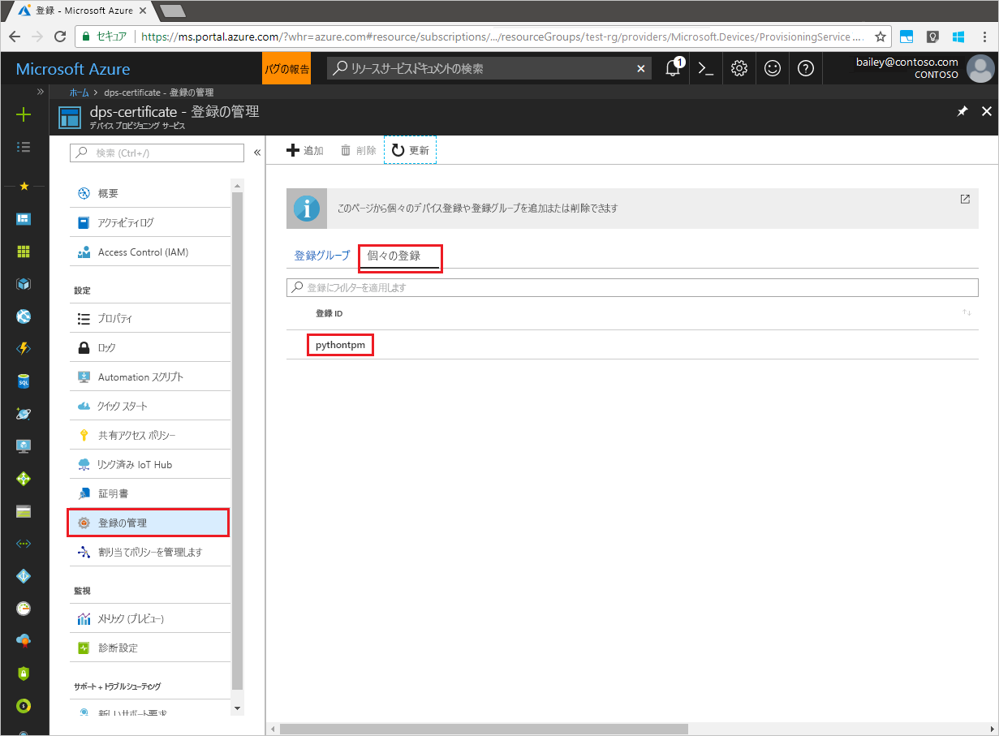

# <a name="quickstart-enroll-tpm-device-to-iot-hub-device-provisioning-service-using-python-provisioning-service-sdk"></a>クイック スタート:Python Provisioning Service SDK を使用して TPM デバイスを IoT Hub Device Provisioning Service に登録する

[!INCLUDE [iot-dps-selector-quick-enroll-device-tpm](../../includes/iot-dps-selector-quick-enroll-device-tpm.md)]

このクイックスタートでは、Python Provisioning Service SDK とサンプル Python アプリケーションを使用して、Azure IoT Hub Device Provisioning Service への TPM デバイスの個別登録をプログラムで作成する方法について説明します。

## <a name="prerequisites"></a>前提条件

- [Azure portal での IoT Hub Device Provisioning Service の設定](./quick-setup-auto-provision.md)が完了していること。
- アクティブなサブスクリプションが含まれる Azure アカウント。 [無料で作成できます](https://azure.microsoft.com/free/?ref=microsoft.com&utm_source=microsoft.com&utm_medium=docs&utm_campaign=visualstudio)。
- [Python 2.x または 3.x](https://www.python.org/downloads/)。 このクイックスタートの中で、後から [Python Provisioning Service SDK](https://github.com/Azure/azure-iot-sdk-python/tree/v1-deprecated/provisioning_service_client) をインストールします。
- [pip](https://pip.pypa.io/en/stable/installing/) (Python のディストリビューションに含まれていない場合)。
- 保証キー。 [シミュレートされたデバイスの作成とプロビジョニング](quick-create-simulated-device.md)に関するページの手順に従うか、SDK に付属の保証キーを使用します。下記の説明を参照してください。

> [!IMPORTANT]
> この記事は、非推奨となっている V1 Python SDK にのみ適用されます。 V2 では、Iot Hub Device Provisioning Service 用のデバイス クライアントとサービス クライアントはまだ利用できません。 チームは現在、V2 を機能パリティに移行する作業に取り組んでいます。

<a id="prepareenvironment"></a>

## <a name="prepare-the-environment"></a>環境の準備 

1. [Python 2.x または 3.x](https://www.python.org/downloads/) をダウンロードしてインストールします。 必ず、セットアップに必要な 32 ビットまたは 64 ビットのインストールを使用してください。 インストール中に求められた場合は、プラットフォーム固有の環境変数に Python を追加します。 

1. [Python Provisioning Service SDK](https://github.com/Azure/azure-iot-sdk-python/tree/v1-deprecated/provisioning_service_client) については、次のいずれかの方法を選択します。

    - **Azure IoT Python SDK** をビルドしてコンパイルします。 [これらの手順](https://github.com/Azure/azure-iot-sdk-python/blob/v1-deprecated/doc/python-devbox-setup.md)に従って、Python パッケージをビルドします。 Windows OS を使用している場合は、Python からネイティブ DLL を使用できるように [Visual C++ 再配布可能パッケージ](https://support.microsoft.com/help/2977003/the-latest-supported-visual-c-downloads)もインストールします。

    - [Python パッケージ管理システムである *pip* をインストールまたはアップグレードし](https://pip.pypa.io/en/stable/installing/)、次のコマンドを使用してパッケージをインストールします。

        ```cmd/sh
        pip install azure-iothub-provisioningserviceclient
        ```

1. デバイスの保証キーが必要です。 [シミュレートされたデバイスの作成とプロビジョニング](quick-create-simulated-device.md)のクイックスタートに従ってシミュレートされた TPM デバイスを作成した場合は、そのデバイス用に作成されたキーを使用します。 それ以外の場合は、SDK に付属している次の保証キーを使用できます。

    ```
    AToAAQALAAMAsgAgg3GXZ0SEs/gakMyNRqXXJP1S124GUgtk8qHaGzMUaaoABgCAAEMAEAgAAAAAAAEAtW6MOyCu/Nih47atIIoZtlYkhLeCTiSrtRN3q6hqgOllA979No4BOcDWF90OyzJvjQknMfXS/Dx/IJIBnORgCg1YX/j4EEtO7Ase29Xd63HjvG8M94+u2XINu79rkTxeueqW7gPeRZQPnl1xYmqawYcyzJS6GKWKdoIdS+UWu6bJr58V3xwvOQI4NibXKD7htvz07jLItWTFhsWnTdZbJ7PnmfCa2vbRH/9pZIow+CcAL9mNTNNN4FdzYwapNVO+6SY/W4XU0Q+dLMCKYarqVNH5GzAWDfKT8nKzg69yQejJM8oeUWag/8odWOfbszA+iFjw3wVNrA5n8grUieRkPQ==
    ```


## <a name="modify-the-python-sample-code"></a>Python のサンプル コードの変更

ここでは、TPM デバイスのプロビジョニングの詳細をサンプル コードに追加する方法について説明します。 

1. テキスト エディターを使用して、新しい **TpmEnrollment.py** ファイルを作成します。

1. **TpmEnrollment.py** ファイルの先頭に次の `import` ステートメントと変数を追加します。 その後、`dpsConnectionString` は、**Azure portal** の **[Device Provisioning Service]** にある **[共有アクセス ポリシー]** で見つかった接続文字列に置き換えます。 `endorsementKey` は、「[環境の準備](quick-enroll-device-tpm-python.md#prepareenvironment)」で既にメモした値に置き換えます。 最後に、一意の `registrationid` を作成し、それが小文字の英数字とハイフンのみで構成されていることを確認します。  
   
    ```python
    from provisioningserviceclient import ProvisioningServiceClient
    from provisioningserviceclient.models import IndividualEnrollment, AttestationMechanism

    CONNECTION_STRING = "{dpsConnectionString}"

    ENDORSEMENT_KEY = "{endorsementKey}"

    REGISTRATION_ID = "{registrationid}"
    ```

1. 次の関数と関数呼び出しを追加して、グループ登録の作成を実装します。
   
    ```python
    def main():
        print ( "Starting individual enrollment..." )

        psc = ProvisioningServiceClient.create_from_connection_string(CONNECTION_STRING)

        att = AttestationMechanism.create_with_tpm(ENDORSEMENT_KEY)
        ie = IndividualEnrollment.create(REGISTRATION_ID, att)

        ie = psc.create_or_update(ie)
    
        print ( "Individual enrollment successful." )
    
    if __name__ == '__main__':
        main()
    ```

1. **TpmEnrollment.py** ファイルを保存して閉じます。
 

## <a name="run-the-sample-tpm-enrollment"></a>サンプルの TPM 登録の実行

1. コマンド プロンプトを開き、スクリプトを実行します。

    ```cmd/sh
    python TpmEnrollment.py
    ```

1. 登録が成功したかどうか、出力を確認します。

1. Azure Portal でプロビジョニング サービスに移動します。 **[登録を管理します]** を選択します。 TPM デバイスが **[個々の登録]** タブに、前に作成した `registrationid` という名前で表示されていることがわかります。 

      


## <a name="clean-up-resources"></a>リソースをクリーンアップする
Java サービスのサンプルを調べる予定の場合は、このクイックスタートで作成したリソースをクリーンアップしないでください。 使用する予定がない場合は、次の手順を使用して、このクイックスタートで作成したすべてのリソースを削除してください。

1. マシンに表示されている Python サンプルの出力ウィンドウを閉じます。
1. シミュレートされた TPM デバイスを作成した場合は、TPM シミュレーター ウィンドウを閉じます。
1. Azure portal で Device Provisioning サービスに移動し、 **[登録を管理します]** を選択し、 **[個々の登録]** タブを選択します。このクイックスタートを使用して作成した登録エントリの "*登録 ID*" の横にあるチェック ボックスをオンにして、ペイン上部の **[削除]** を押します。


## <a name="next-steps"></a>次のステップ
このクイックスタートでは、TPM デバイスの個々の登録エントリをプログラムで作成し、TPM のシミュレートされたデバイスをマシンに作成し、Azure IoT Hub Device Provisioning Service を使って IoT ハブにプロビジョニングしました。 Device Provisioning に関する理解をさらに深めるには、Azure Portal における Device Provisioning Service の設定に関するチュートリアルに進んでください。

> [!div class="nextstepaction"]
> [Azure IoT Hub Device Provisioning Service のチュートリアル](./tutorial-set-up-cloud.md)
