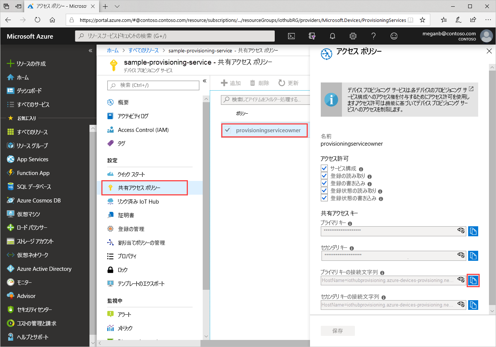
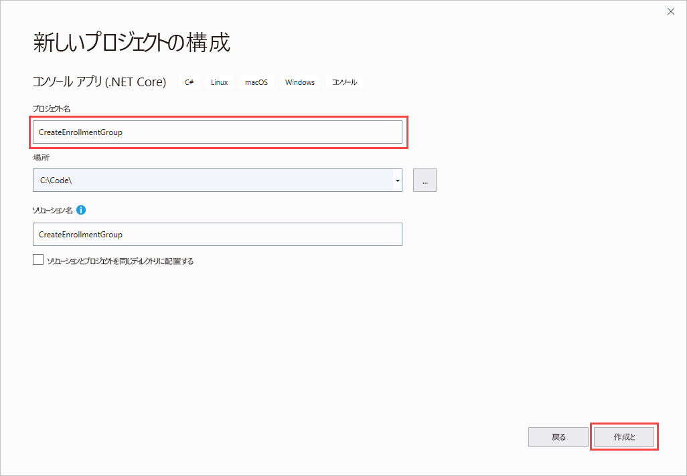
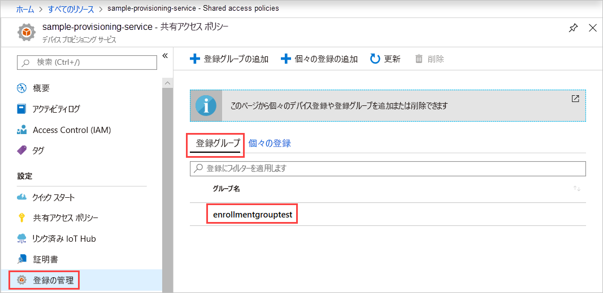

# <a name="quickstart-enroll-x509-devices-to-the-device-provisioning-service-using-c"></a>クイック スタート: C# を使用して X.509 デバイスを Device Provisioning Service に登録する

[!INCLUDE [iot-dps-selector-quick-enroll-device-x509](../../includes/iot-dps-selector-quick-enroll-device-x509.md)]

このクイック スタートは、C# を使用して中間またはルートの CA の X.509 証明書を使用する[登録グループ](concepts-service.md#enrollment-group)をプログラムで作成する方法を示します。 登録グループは、[Microsoft Azure IoT SDK for .NET](https://github.com/Azure/azure-iot-sdk-csharp) と C# .NET Core のサンプル アプリケーションを使用して作成されます。 登録グループでは、証明書チェーン内の共通の署名証明書を共有するデバイスに関してプロビジョニング サービスへのアクセスを制御します。 詳細については、「[X.509 証明書を使用してプロビジョニング サービスへのデバイスのアクセスを制御する](./concepts-x509-attestation.md#controlling-device-access-to-the-provisioning-service-with-x509-certificates)」を参照してください。 Azure IoT Hub と Device Provisioning Service と共に X.509 証明書ベースの公開キー基盤 (PKI) を使用する方法について詳しくは、[X.509 CA 証明書セキュリティの概要](../iot-hub/iot-hub-x509ca-overview.md)に関するページを参照してください。 

このクイックスタートでは、IoT ハブと Device Provisioning Service インスタンスを既に作成していることを前提としています。 これらのリソースをまだ作成していない場合は、この記事を進める前に「[Azure portal で IoT Hub Device Provisioning Service を設定する](./quick-setup-auto-provision.md)」のクイックスタートを完了してください。

この記事の手順は Windows コンピューターと Linux コンピューターの両方に利用できますが、この記事では Windows 開発コンピューターを使用します。

[!INCLUDE [quickstarts-free-trial-note](../../includes/quickstarts-free-trial-note.md)]

## <a name="prerequisites"></a>前提条件

* [Visual Studio 2019](https://www.visualstudio.com/vs/) をインストールします。
* [.NET Core SDK](https://www.microsoft.com/net/download/windows) のインストール。
* [Git](https://git-scm.com/download/) のインストール。

## <a name="prepare-test-certificates"></a>テスト証明書を準備する

このクイック スタートでは、中間またはルートの CA の X.509 証明書の公開部分が含まれる .pem ファイルまたは .cer が必要です。 この証明書はプロビジョニング サービスにアップロードされ、サービスによって検証される必要があります。

[Azure IoT C SDK](https://github.com/Azure/azure-iot-sdk-c) には、X.509 証明書チェーンを作成し、そのチェーンからルートまたは中間証明書をアップロードし、サービスで所有証明を行って証明書を検証するために役立つテスト ツールが含まれています。

> [!CAUTION]
> 開発テスト専用の SDK ツールで作成された証明書を使用します。
> 運用環境ではこれらの証明書を使用しないでください。
> これらには 30 日後に有効期限が切れるハード コーディングされたパスワード (*1234* など) が含まれます。
> 運用環境での使用に適した証明書の取得について詳しくは、Azure IoT Hub ドキュメントの「[X.509 CA 証明書の入手方法](../iot-hub/iot-hub-x509ca-overview.md#how-to-get-an-x509-ca-certificate)」をご覧ください。
>

このテスト ツールを使用して証明書を生成するには、次の手順を実行します。

1. Azure IoT C SDK の[最新リリース](https://github.com/Azure/azure-iot-sdk-c/releases/latest)のタグ名を見つけます。

2. コマンド プロンプトまたは Git Bash シェルを開き、お使いのコンピューターの作業フォルダーに変更します。 次のコマンドを実行して、最新リリースの [Azure IoT C SDK](https://github.com/Azure/azure-iot-sdk-c) GitHub リポジトリを複製します。 `-b` パラメーターの値として、前の手順で見つけたタグを使用します。

    ```cmd/sh
    git clone -b <release-tag> https://github.com/Azure/azure-iot-sdk-c.git
    cd azure-iot-sdk-c
    git submodule update --init
    ```

    この操作は、完了するまでに数分かかります。

   テスト ツールは複製したリポジトリの *azure-iot-sdk-c/tools/CACertificates* にあります。

3. 「[Managing test CA certificates for samples and tutorials](https://github.com/Azure/azure-iot-sdk-c/blob/master/tools/CACertificates/CACertificateOverview.md)」(サンプルおよびチュートリアルのためのテスト用 CA 証明書の管理) の手順に従います。

C SDK のツールに加えて、*Microsoft Azure IoT SDK for .NET* に含まれている [グループ証明書の検証のサンプル](https://github.com/Azure-Samples/azure-iot-samples-csharp/tree/master/provisioning/Samples/service/GroupCertificateVerificationSample)では、既存の X.509 中間またはルート CA 証明書で C# の所有証明を実行する方法について説明されています。

## <a name="get-the-connection-string-for-your-provisioning-service"></a>プロビジョニング サービスの接続文字列を取得する

このクイック スタートのサンプルには、プロビジョニング サービスの接続文字列が必要です。

1. Azure portal にサインインし、 **[すべてのリソース]** を選択してから、ご利用の Device Provisioning Service を選択します。

1. **[共有アクセス ポリシー]** を選択して、プロパティを開くために使用するアクセス ポリシーを選択します。 **[アクセス ポリシー]** で、主キーの接続文字列をコピーして保存します。

    

## <a name="create-the-enrollment-group-sample"></a>登録グループのサンプルを作成する 

このセクションでは、登録グループをプロビジョニング サービスに追加する .NET Core コンソール アプリを作成する方法について説明します。 これらの手順を一部変更して実行し、登録グループを追加する [Windows IoT Core](https://developer.microsoft.com/en-us/windows/iot) コンソール アプリを作成することもできます。 IoT Core での開発について詳しくは、[Windows IoT Core の開発者ドキュメント](/windows/iot-core/)に関するページを参照してください。

1. Visual Studio を開き、 **[新しいプロジェクトの作成]** を選択します。 **[新しいプロジェクトの作成]** で、C# プロジェクト テンプレート用の **[コンソールアプリ (.NET Cor)]** を選択し、 **[次へ]** を選択します。

1. プロジェクトに *CreateEnrollmentGroup* という名前を付け、 **[作成]** を押します。

    

1. Visual Studio でソリューションを開き、 **[ソリューション エクスプローラー]** ペインで **CreateEnrollmentGroup** プロジェクトを右クリックし、 **[NuGet パッケージの管理]** を選択します。

1. **[NuGet パッケージ マネージャー]** で **[参照]** を選択し、**Microsoft.Azure.Devices.Provisioning.Service** を検索して選択してから、 **[インストール]** を押します。

    

   この手順では、ダウンロードとインストールが行われ、[Azure IoT Provisioning Service クライアント SDK](https://www.nuget.org/packages/Microsoft.Azure.Devices.Provisioning.Service/) NuGet パッケージへの参照とその依存関係が追加されます。

1. 次の `using` ステートメントを、`Program.cs` の先頭にある他の `using` ステートメントの後ろに追加します。

   ```csharp
   using System.Security.Cryptography.X509Certificates;
   using System.Threading.Tasks;
   using Microsoft.Azure.Devices.Provisioning.Service;
   ```

1. `Program` クラスに次のフィールドを追加し、一覧された変更を行います。  

   ```csharp
   private static string ProvisioningConnectionString = "{ProvisioningServiceConnectionString}";
   private static string EnrollmentGroupId = "enrollmentgrouptest";
   private static string X509RootCertPath = @"{Path to a .cer or .pem file for a verified root CA or intermediate CA X.509 certificate}";
   ```

   * `ProvisioningServiceConnectionString` プレースホルダーの値を、登録を作成したいプロビジョニング サービスの接続文字列に置き換えます。

   * プレースホルダー `X509RootCertPath` の値は、.pem ファイルまたは .cer ファイルへのパスに置き換えます。 このファイルは、プロビジョニング サービスで以前、アップロードされて検証されている中間証明書またはルート CA x.509 証明書の公開部分を表します。

   * `EnrollmentGroupId` の値は、必要に応じて変更することができます。 文字列に含めることができるのは、小文字とハイフンのみです。

   > [!IMPORTANT]
   > 運用コードでは、セキュリティに関する次の考慮事項に注意してください。
   >
   > * プロビジョニング サービス管理者の接続文字列のハードコーディングは、セキュリティのベスト プラクティスに反しています。 代わりに、接続文字列は安全な方法で保持する必要があります (例: セキュリティ保護された構成ファイル内またはレジストリ内)。
   > * 必ず署名証明書の公開部分のみをアップロードしてください。 プロビジョニング サービスへの秘密キーが含まれた .pfx (PKCS12) ファイルまたは .pem ファイルは、決してアップロードしないでください。

1. `Program` クラスに次のメソッドを追加します。 このコードでは、登録グループのエントリを作成してから、`ProvisioningServiceClient` 上で `CreateOrUpdateEnrollmentGroupAsync` メソッドを呼び出して、登録グループをプロビジョニング サービスに追加します。

   ```csharp
   public static async Task RunSample()
   {
       Console.WriteLine("Starting sample...");
 
       using (ProvisioningServiceClient provisioningServiceClient =
               ProvisioningServiceClient.CreateFromConnectionString(ProvisioningConnectionString))
       {
           #region Create a new enrollmentGroup config
           Console.WriteLine("\nCreating a new enrollmentGroup...");
           var certificate = new X509Certificate2(X509RootCertPath);
           Attestation attestation = X509Attestation.CreateFromRootCertificates(certificate);
           EnrollmentGroup enrollmentGroup =
                   new EnrollmentGroup(
                           EnrollmentGroupId,
                           attestation)
                   {
                       ProvisioningStatus = ProvisioningStatus.Enabled
                   };
           Console.WriteLine(enrollmentGroup);
           #endregion
 
           #region Create the enrollmentGroup
           Console.WriteLine("\nAdding new enrollmentGroup...");
           EnrollmentGroup enrollmentGroupResult =
               await provisioningServiceClient.CreateOrUpdateEnrollmentGroupAsync(enrollmentGroup).ConfigureAwait(false);
           Console.WriteLine("\nEnrollmentGroup created with success.");
           Console.WriteLine(enrollmentGroupResult);
           #endregion
 
       }
   }
   ```

1. 最後に、`Main` メソッドを次の行に置き換えます。

   ```csharp
    static async Task Main(string[] args)
    {
        await RunSample();
        Console.WriteLine("\nHit <Enter> to exit ...");
        Console.ReadLine();
    }
   ```

1. ソリューションをビルドします。

## <a name="run-the-enrollment-group-sample"></a>登録グループのサンプルを実行する
  
Visual Studio でサンプルを実行して登録グループを作成します。 コマンド プロンプト ウィンドウが表示され、確認メッセージの表示が開始されます。 作成が正常に完了すると、コマンド プロンプト ウィンドウに新しい登録グループのプロパティが表示されます。

登録グループが作成されていることを確認できます。 Device Provisioning Service の概要に進み、 **[登録の管理]** を選択してから、 **[登録グループ]** を選択します。 サンプルで使用した登録 ID に対応する新しい登録エントリが表示されます。



エントリを選択して、証明書の拇印とエントリの他のプロパティを確認します。

## <a name="clean-up-resources"></a>リソースをクリーンアップする

C# サービスのサンプルを調べる予定の場合は、このクイックスタートで作成したリソースをクリーンアップしないでください。 それ以外の場合は、次の手順を使用して、このクイックスタートで作成したすべてのリソースを削除してください。

1. ご利用のコンピューターに表示されている C# サンプルの出力ウィンドウを閉じます。

1. Azure portal で [デバイス プロビジョニング サービス] に移動し、 **[登録を管理します]** を選択して、 **[登録グループ]** を選択します。 このクイックスタートを使用して作成した登録エントリの *[登録 ID]* を選択し、 **[削除]** を押します。

1. Azure portal の Device Provisioning サービスから、**[証明書]** を選択し、このクイックスタート用にアップロードした証明書を選択し、**[証明書の詳細]** の上部にある **[削除]** を押します。  

## <a name="next-steps"></a>次のステップ

このクイックスタートでは、Azure IoT Hub Device Provisioning Service を使用して X.509 中間またはルート CA 証明書の登録グループを作成しました。 Device Provisioning に関する理解をさらに深めるには、Azure Portal における Device Provisioning Service の設定に関するチュートリアルに進んでください。

> [!div class="nextstepaction"]
> [Azure IoT Hub Device Provisioning Service のチュートリアル](./tutorial-set-up-cloud.md)