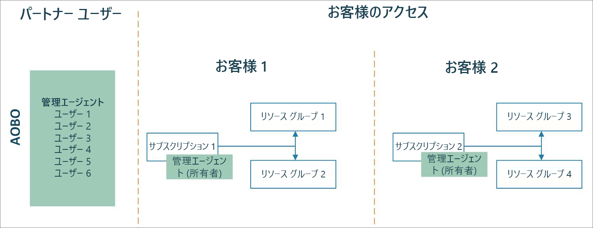
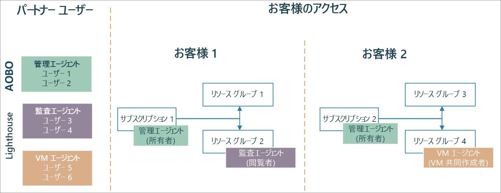

# Azure Lighthouse と Cloud Solution Provider プログラム

[CSP (クラウド ソリューション プロバイダー)](/partner-center/csp-overview) パートナーである場合、CSP プログラムを通じて顧客用に作成された Azure サブスクリプションには、[代理で管理 (AOBO)](https://channel9.msdn.com/Series/cspdev/Module-11-Admin-On-Behalf-Of-AOBO) 機能を使用してあらかじめアクセスできるようになっています。 このアクセスにより、顧客のサブスクリプションを直接サポートし、構成し、管理することができます。

[Azure Lighthouse](../overview.md) では、Azure の委任されたリソース管理と AOBO を併用できます。 より粒度の細かいアクセス許可をユーザーに使用できるようになるため、セキュリティが向上すると共に、不要なアクセスを減らすことにつながります。 また、ユーザーは、テナントに対する 1 つのログインを使用して、複数の顧客サブスクリプションにまたがって作業できるため、効率とスケーラビリティも向上します。

> [!TIP]
> 顧客のリソースを効果的に保護するため、Microsoft の[推奨セキュリティ プラクティス](recommended-security-practices.md)と[パートナーのセキュリティ要件](/partner-center/partner-security-requirements)を確認し、それらに従うようにしてください。

## 代理で管理 (AOBO)

AOBO を使用すると、テナント内の[管理エージェント](/partner-center/permissions-overview#manage-commercial-transactions-in-partner-center-azure-ad-and-csp-roles) ロールを持つすべてのユーザーが、CSP プログラムを通じて貴社が作成した Azure サブスクリプションへの AOBO アクセス権を持つことになります。 顧客のサブスクリプションにアクセスする必要のあるすべてのユーザーは、このグループのメンバーである必要があります。 AOBO では、異なる顧客と共同作業を行う別々のグループを柔軟に作成したり、グループやユーザーに対して個別のロールを有効にしたりすることはできません。

## Azure の委任されたリソース管理

Azure Lighthouse を使用すると、次の図に示すように、さまざまなグループをさまざまな顧客またはロールに割り当てることができます。 ユーザーは Azure の委任されたリソース管理によって適切なレベルのアクセス権を持つことになるため、管理エージェント ロールを持つ (つまり、完全な AOBO アクセス権を持つ) ユーザーの数を減らすことができます。 これにより、顧客のリソースへの不要なアクセスが制限されるので、セキュリティの強化につながります。 また、より柔軟に、複数の顧客を大規模に管理できます。

CSP プログラムを使用して作成したサブスクリプションをオンボードするには、[Azure Lighthouse へのサブスクリプションのオンボード](../how-to/onboard-customer.md)に関する記事で説明されている手順に従ってください。 テナント内に管理エージェント ロールを持つすべてのユーザーが、このオンボードを実行できます。

> [!TIP]
> プライベート プランを含む[マネージド サービス オファー](managed-services-offers.md)は、クラウド ソリューション プロバイダー (CSP) プログラムのリセラーを通じて確立されたサブスクリプションではサポートされません。 [Azure Resource Manager テンプレートを使用する](../how-to/onboard-customer.md)ことで、これらのサブスクリプションを Azure Lighthouse にオンボードできます。

> [!NOTE]
> [Azure portal の **[マイ カスタマー]** ページ](../how-to/view-manage-customers.md)に、 **[クラウド ソリューション プロバイダー (プレビュー)]** セクションが含まれるようになり、[Microsoft 顧客契約 (MCA) に署名](/partner-center/confirm-customer-agreement)し、[Azure プランに含まれている](/partner-center/azure-plan-get-started) CSP のお客様の課金情報とリソースが表示されます。 詳しくは、「[Microsoft Partner Agreement の課金アカウントの概要](../../cost-management-billing/understand/mpa-overview.md)」をご覧ください。
>
> CSP のお客様は、Azure の委任されたリソース管理にもオンボードされているかどうかにかかわらず、このセクションに表示されることがあります。 オンボードされている場合は、「[顧客と委任されたリソースを表示し、管理する](../how-to/view-manage-customers.md)」に説明されているように、 **[顧客]** セクションにも表示されます。 同様に、CSP のお客様は、Azure の委任されたリソース管理にオンボードされるために、 **[マイ カスタマー]** の **[クラウド ソリューション プロバイダー (プレビュー)]** セクションに表示される必要はありません。

## 次のステップ

- [テナント間の管理エクスペリエンス](cross-tenant-management-experience.md)について学習します。
- [サブスクリプションを Azure Lighthouse にオンボードする](../how-to/onboard-customer.md)方法について学習します。
- [Cloud Solution Provider プログラム](/partner-center/csp-overview)について学習します。
