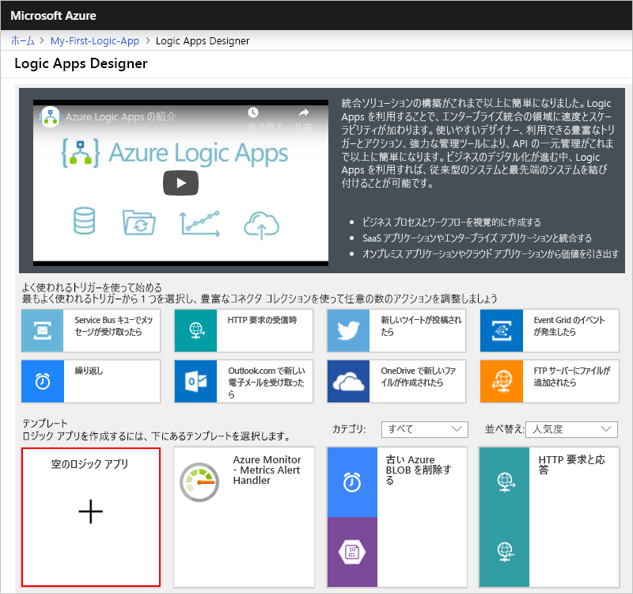

# クイックスタート: 初めての Logic Apps ワークフローを作成する - Azure portal

このクイックスタートでは、[Azure portal](https://portal.azure.com) を使用して [Azure Logic Apps](logic-apps-overview.md) で初めてのワークフローを構築する方法について説明します。 また、この入門ガイドでは、新しいロジック アプリを作成する方法、ロジック アプリにトリガーとアクションを追加する方法、ロジック アプリをテストする方法など、Logic Apps サービスの基本的な概念についても説明します。 このクイックスタートに従って、RSS フィードを定期的にチェックし、新しい項目に関する電子メール通知を送信するサンプル ロジック アプリを作成します。 次のスクリーンショットは、このサンプル ロジック アプリの大まかなワークフローを示しています。

他のインターフェイスとアプリを使用して初めてのロジック アプリを作成および管理する方法については、Logic Apps に関する他のクイックスタートを参照してください。 

* [Azure コマンド ライン インターフェイス (Azure CLI) を使用してロジック アプリを作成および管理する](quickstart-logic-apps-azure-cli.md)
* [Visual Studio Code でロジック アプリを作成および管理する](quickstart-create-logic-apps-visual-studio-code.md)
* [Visual Studio でロジック アプリを作成および管理する](quickstart-create-logic-apps-with-visual-studio.md)

## 前提条件

* Azure アカウントとサブスクリプション。 お持ちでない場合は、[無料の Azure アカウント](https://azure.microsoft.com/free/?WT.mc_id=A261C142F)にサインアップしてください。

* Logic Apps によってサポートされているサービス (Office 365 Outlook、Outlook.com など) の電子メール アカウント。 サポートされているその他の電子メール プロバイダーについては、[コネクタの一覧を確認](/connectors/)してください。

    > [!IMPORTANT]
    > [Gmail コネクタ](/connectors/gmail/)を使用している場合、Logic Apps で制限なしにこのコネクタを使用できるのは G Suite アカウントのみであることに注意してください。 コンシューマー Gmail アカウントを持っている場合は、[Gmail コネクタでの認証に使用する Google クライアント アプリを作成](/connectors/gmail/#authentication-and-bring-your-own-application)しない限り、Google によって承認された特定のサービスでのみこのコネクタを使用できます。 詳細については、「[Azure Logic Apps での Google コネクタのデータ セキュリティとプライバシー ポリシー](../connectors/connectors-google-data-security-privacy-policy.md)」を参照してください。

* ロジック アプリが特定の IP アドレスへのトラフィックを制限するファイアウォールを経由して通信する必要がある場合、そのファイアウォールは、Logic Apps サービスまたはロジック アプリが存在する Azure リージョンのランタイムが使用する [インバウンド](logic-apps-limits-and-config.md#inbound)と [アウトバウンド](logic-apps-limits-and-config.md#outbound)の IP アドレスの "*両方*" のアクセスを許可する必要があります。 また、ロジック アプリが Office 365 Outlook コネクタや SQL コネクタなどの [マネージド コネクタ](../connectors/apis-list.md#managed-api-connectors)を使用している場合、または [カスタム コネクタ](/connectors/custom-connectors/)を使用している場合、そのファイアウォールでは、ロジック アプリの Azure リージョン内の "*すべて*" の[マネージド コネクタ アウトバウンド IP アドレス](logic-apps-limits-and-config.md#outbound)へのアクセスを許可する必要もあります。

## ロジック アプリを作成する

1. Azure アカウントの資格情報で [Azure Portal](https://portal.azure.com) にサインインします。

1. Azure portal の検索ボックスに「`logic apps`」と入力し、**[Logic Apps]** を選択します。

   

1. **[Logic Apps]** ページで **[追加]** を選択します。

   ![Azure portal の Logic Apps サービス ページのスクリーンショット。ロジック アプリの一覧と選択された [追加] ボタンが示されています。](./media/quickstart-create-first-logic-app-workflow/add-new-logic-app.png)

1. **[Logic App]** ペインで、ご自分のロジック アプリの基本的な詳細と設定を入力します。 このサンプル ロジック アプリ用に、新しい[リソース グループ](../azure-resource-manager/management/overview.md#terminology)を作成します。

   | プロパティ | 値 | 説明 |
   |----------|-------|-------------|
   | **名前** | <*ロジック アプリ名*> | ロジック アプリの名前。リージョン全体で一意である必要があります。 名前に含めることができるのは、文字、数字、ハイフン (`-`)、アンダースコア (`_`)、かっこ (`(`、`)`)、ピリオド (`.`) のみです。 この例では、"My-First-Logic-App" を使用します。 |
   | **サブスクリプション** | <*Azure サブスクリプション名*> | お使いの Azure サブスクリプションの名前。 |
   | **リソース グループ** | <*Azure-resource-group-name*> | ロジック アプリを作成する [Azure リソース グループ](../azure-resource-manager/management/overview.md#terminology)の名前。 リソース グループの名前は、リージョン全体で一意である必要があります。 この例では、"My-First-LA-RG" を使用します。 |
   | **場所** | <*Azure-region*> | ロジック アプリの情報の保存先となる Azure リージョン。 この例では "米国西部" を使用します。 |
   | **Log Analytics** | オフ | 診断ログの設定。既定では **[オフ]** になっています。 この例では、 **[オフ]** の設定のままにします。 |
   ||||

   

1. 準備ができたら、**[確認および作成]** を選択します。 入力した詳細を確認し、**[作成]** を選択します。

1. Azure によってアプリが正常にデプロイされたら、**[リソースに移動]** を選択します。 または、検索ボックスに名前を入力して、目的のロジック アプリを見つけて選択することもできます。

   ![リソースのデプロイ ページのスクリーンショット。選択された [リソースに移動] ボタンが示されています。](./media/quickstart-create-first-logic-app-workflow/go-to-new-logic-app-resource.png)

   ロジック アプリ デザイナーが開き、紹介ビデオとよく使用されるトリガーが含まれたページが表示されます。 **[テンプレート]** で **[空のロジック アプリ]** を選択します。

   

次に、[ロジック アプリにトリガーを追加](#add-rss-trigger)します。

## RSS トリガーを追加する

すべてのロジック アプリは[トリガー](../logic-apps/logic-apps-overview.md#how-do-logic-apps-work)で始まる必要があります。これは、特定のイベントが発生するか特定の条件が満たされたときに起動します。 新しい項目が検出され、トリガーが起動するたびに、Logic Apps エンジンによって、ワークフローを開始および実行するロジック アプリ インスタンスが作成されます。 新しい項目が検出されない場合はトリガーが起動せず、このチェックでインスタンスの作成やワークフローの実行が行われません。

このクイックスタートの例では、[ロジック アプリを作成](#create-your-logic-app)した後、RSS フィード内の新しい項目をチェックし、新しい項目があるときに起動するトリガーを追加します。 また、[承認ベースの自動化されたワークフローを作成する](tutorial-process-mailing-list-subscriptions-workflow.md)方法のチュートリアルのように、さまざまな種類のトリガーを使用してロジック アプリを作成することもできます。

1. **ロジック アプリ デザイナー** の検索ボックスの下で、**[すべて]** を選択します。

1. RSS コネクタを見つけるために、検索ボックスに「`rss`」と入力します。 **[トリガー]** の一覧から、RSS トリガー **[フィード項目が発行される場合]** を選択します。

   ![検索ボックスに入力した "rss" と、選択された RSS トリガー [フィード項目が発行される場合] が表示されている Logic Apps デザイナーを示すスクリーンショット。](./media/quickstart-create-first-logic-app-workflow/add-rss-trigger-new-feed-item.png)

1. トリガーの RSS フィード URL を指定します。 次に、間隔と頻度を設定して、トリガーのスケジュールを定義します。

   | プロパティ | 値 | 説明 |
   | -------- | ----- | ----------- |
   | **RSS フィードの URL** | <*RSS-feed-URL*> | 監視したい RSS フィードの URL。 この例では、`https://feeds.a.dj.com/rss/RSSMarketsMain.xml` のウォール ストリート ジャーナルの RSS フィードを使用しています。 ただし、この例の目的のためには、HTTP 認証を必要としない任意の RSS フィードを使用することができます。 頻繁に発行される RSS フィードを選択すると、後でロジック アプリをテストするのが簡単になります。 |
   | **間隔** | 1 | RSS フィード チェックの間隔 (単位数)。 この例では、1 分間隔を使用しています。 |
   | **頻度** | 分 | RSS フィード チェックの間隔に使う時間の単位。 この例では、1 分間隔を使用しています。 |
   ||||

   

1. タイトル バー内をクリックして、トリガーの詳細を一時的に折りたたみます。

   

1. デザイナー ツール バーの **[保存]** を選択して、ロジック アプリを保存します。

ロジック アプリは現在稼働していますが、RSS フィードをチェックすること以外は何もしていません。 次に、[アクションを追加](#add-email-action)して、トリガーが起動したときの動作を定義します。

## "電子メールの送信" アクションを追加する

[ロジック アプリのトリガーを追加](#add-rss-trigger)した後は、[アクション](../logic-apps/logic-apps-overview.md#logic-app-concepts)を追加して、ロジック アプリで RSS フィードをチェックしたときに新しい項目が検出された場合の反応を指定する必要があります。 また、[Logic Apps、Azure Functions、および Azure Storage を使用して電子メールを処理する](./tutorial-process-email-attachments-workflow.md)方法のチュートリアルのように、はるかに複雑なアクションを含むロジック アプリを作成することもできます。

> [!NOTE]
> この例では、Office 365 Outlook を電子メール サービスとして使います。 別のサポートされている電子メール サービスを自分のロジック アプリで使用している場合、ユーザー インターフェイスの外観が異なる場合があります。 ただし、別の電子メール サービスに接続するための基本的な概念は同じです。

1. **[フィード項目が発行される場合]** トリガーの下の **[新しいステップ]** を選択します。

   ![Logic Apps デザイナーのスクリーンショット。ワークフローと選択された [新しいステップ] ボタンが示されています。](./media/quickstart-create-first-logic-app-workflow/add-new-step-under-trigger.png)

1. **[アクションを選択してください]** と検索ボックスの下の **[すべて]** を選択します。

1. 検索ボックスに「`send an email`」と入力すると、このアクションを提供するコネクタが見つかります。 アクションの一覧にフィルターをかけて特定のアプリまたはサービスに絞り込むには、最初にそのアプリまたはサービスを選択できます。

   たとえば、Microsoft の職場または学校アカウントを使用していて、Office 365 Outlook を使用する場合は、**[Office 365 Outlook]** を選択します。 また、個人用の Microsoft アカウントを使用している場合は、Outlook.com を選択することもできます。 この例では、Office 365 Outlook が引き続き使用されます。

   

   これで、`send an email` など、使用するアクションをより簡単に見つけて選択できるようになりました。

   

1. 選択した電子メール コネクタによって ID の認証を求められた場合は、その手順をすぐに完了します。 この例を機能させるには、ロジック アプリと電子メール サービスの間に接続を作成する必要があります。 

    > [!NOTE]
    > この例では、Office 365 Outlook コネクタに対する手動認証を示します。 ただし、コネクタによっては異なる種類の認証がサポートされる場合があります。
    > ユース ケースに応じて、さまざまな方法でロジック アプリの認証を処理することもできます。 たとえば、デプロイに Azure Resource Manager テンプレートを使用する場合、接続の詳細など、頻繁に変更される入力をパラメーター化してセキュリティを向上させることができます。 詳細については、以下のトピックを参照してください。
   > * [デプロイ用のテンプレート パラメーター](../logic-apps/logic-apps-azure-resource-manager-templates-overview.md#template-parameters)
   > * [OAuth 接続を承認する](../logic-apps/logic-apps-deploy-azure-resource-manager-templates.md#authorize-oauth-connections)
   > * [マネージド ID を利用してアクセスを認証する](../logic-apps/create-managed-service-identity.md)
   > * [ロジック アプリのデプロイ用の接続を認証する](../logic-apps/logic-apps-azure-resource-manager-templates-overview.md#authenticate-connections)

1. **[電子メールの送信]** アクションで、電子メール通知に含める情報を指定します。

   1. **[宛先]** ボックスに、受信者の電子メール アドレスを入力します。 この例では、自分のメール アドレスを使用します。

        > [!NOTE]
        > Logic Apps デザイナーの **[宛先]** ボックス内、および他の特定の入力ボックス内をクリックすると、 **[動的なコンテンツの追加]** リストが表示されます。 この例では、後のステップで動的コンテンツを使用します。 **[動的なコンテンツの追加]** リストに、現在のアクションの入力として使用できる、前のステップからの使用可能な出力がすべて表示されます。

   1. **[件名]** ボックスに、電子メール通知の件名を入力します。 この例では、「`New RSS item: `」と入力します (末尾に空白スペースを含めます)。

      ![Logic Apps デザイナーのスクリーンショット。[電子メールの送信] アクションと、[件名] プロパティ ボックス内のカーソルが示されています。](./media/quickstart-create-first-logic-app-workflow/send-email-subject.png)

   1. **[動的なコンテンツの追加]** リストから、 **[フィード項目が発行される場合]** トリガーからの出力である **[フィード タイトル]** を選択します。 電子メール通知でこの出力を使用して、RSS 項目のタイトルを取得します。

      ![Logic Apps デザイナーのスクリーンショット。[電子メールの送信] アクション、[件名] プロパティ ボックス内のカーソル、開かれた動的なコンテンツのリスト、および選択された出力の [フィード タイトル] が示されています。](./media/quickstart-create-first-logic-app-workflow/send-email-subject-dynamic-content.png)

      > [!TIP]
      > 動的なコンテンツのリストで、 **[フィード項目が発行される場合]** トリガーからの出力が表示されない場合は、アクションのヘッダーの横にある **[See more]\(もっと見る\)** を選択します。
      > 
      > ![Logic Apps デザイナーのスクリーンショット。開かれた動的なコンテンツのリストと、トリガーに対して選択された [See more]\(もっと見る\) が示されています。](./media/quickstart-create-first-logic-app-workflow/dynamic-content-list-see-more-actions.png)

      操作を終了すると、電子メールの件名は、次の例のようになります。

      ![Logic Apps デザイナーのスクリーンショット。[電子メールの送信] アクションと、[フィード タイトル] プロパティが含まれるサンプルのメールの件名が示されています。](./media/quickstart-create-first-logic-app-workflow/send-email-feed-title.png)

      デザイナーに "For each" ループが表示される場合、 **[categories-item]\(カテゴリ-項目\)** トークンなど、配列のトークンを選択したことが原因です。 この種のトークンを参照するアクションの前後には、デザイナーによってこのループが自動的に追加されます。 そうすることで個々の配列項目に同じアクションが実行されます。 ループを削除するには、ループのタイトル バーの **省略記号** (**...**) を選択し、**[削除]** を選択します。

   1. **[本文]** ボックスに、電子メールの本文の内容を入力します。 この例では、`Title:` ( **[フィード タイトル]** プロパティ)、`Date published:` ( **[フィードの公開日付]** プロパティ)、`Link:` ( **[プライマリ フィード リンク]** プロパティ) のように、それぞれに説明テキストが含まれる 3 つのプロパティがコンテンツに含まれています。 編集ボックスで空白行を追加するには、Shift + Enter キーを押します。

      | プロパティ | 説明 |
      |----------|-------------|
      | **フィード タイトル** | 項目のタイトル |
      | **フィードの公開日付** | 項目の公開日時 |
      | **プライマリ フィード リンク** | 項目の URL |
      |||

      ![Logic Apps デザイナーのスクリーンショット。[電子メールの送信] アクションと、[本文] ボックス内で選択されたプロパティが示されています。](./media/quickstart-create-first-logic-app-workflow/send-email-body.png)

1. ロジック アプリを保存します。 デザイナー メニューの **[保存]** を選択します。

次に、[ロジック アプリが機能するかどうかをテストします](#test-logic-app)。

## ロジック アプリを実行する

サンプル ロジック アプリを作成したら、ワークフローが正しく構成されていることを確認します。 指定したスケジュールに従ってロジック アプリが RSS フィードをチェックするのを待ちます。 または、次のスクリーンショットに示すように、Logic Apps デザイナーのツール バーの **[実行]** を選択して、ロジック アプリを手動で実行することもできます。 

RSS フィードに新しい項目がある場合、ロジック アプリは新しい項目ごとに電子メールを送信します。 それ以外の場合、ロジック アプリは、次の間隔まで待ってから RSS フィードをもう一度チェックします。 

![Logic Apps デザイナーのスクリーンショット。デザイナーのツール バーの選択された [実行] ボタンが示されています。](./media/quickstart-create-first-logic-app-workflow/run-logic-app-test.png)

次のスクリーンショットは、このサンプルのロジック アプリからのサンプルの電子メール通知を示しています。 この電子メールには、デザイナーで選択された各 RSS フィード項目の詳細と、それぞれに対して追加された説明テキストが含まれています。

ロジック アプリから期待どおりに通知電子メールが届かない場合:

* 該当の電子メール アカウントの迷惑メールまたはスパム フォルダーを確認してください。メッセージが誤ってフィルター処理されている可能性があります。
* 使用している RSS フィードに、前回のスケジュールされたチェックまたは手動チェック以降に発行された項目があることを確認してください。

## リソースをクリーンアップする

このサンプル ロジック アプリのテストが完了したら、この例のために作成したリソース グループを削除して、ロジック アプリと関連リソースをクリーンアップします。

> [!NOTE]
> [ロジック アプリを削除](manage-logic-apps-with-azure-portal.md#delete-logic-apps)すると、新しい実行はインスタンス化されません。 すべての進行中および保留中の実行は取り消されます。 何千もの実行がある場合、取り消しが完了するまでかなりの時間がかかる場合があります。

1. Azure の検索ボックスに「`resource groups`」と入力し、**[リソース グループ]** を選択します。

   

1. 目的のロジック アプリのリソース グループを見つけて選択します。 **[概要]** ウィンドウで、 **[リソース グループの削除]** を選択します。

   ![選択したリソース グループと [リソース グループの削除] ボタンが表示されている Azure portal を示すスクリーンショット。](./media/quickstart-create-first-logic-app-workflow/delete-resource-group.png)

1. 確認ウィンドウが表示されたら、リソース グループ名を入力して、 **[削除]** を選択します。

   

## 次のステップ

このクイックスタートでは、スケジュールに基づいて RSS フィードの更新をチェックし、新しいフィード項目ごとに電子メール通知を送信する初めてのロジック アプリを Azure portal で作成しました。 

Logic Apps でより高度なスケジュールベースのワークフローを作成する方法については、次のチュートリアルを参照してください。

> [!div class="nextstepaction"]
> [スケジュールに基づいたロジック アプリでトラフィックをチェックする](../logic-apps/tutorial-build-schedule-recurring-logic-app-workflow.md)