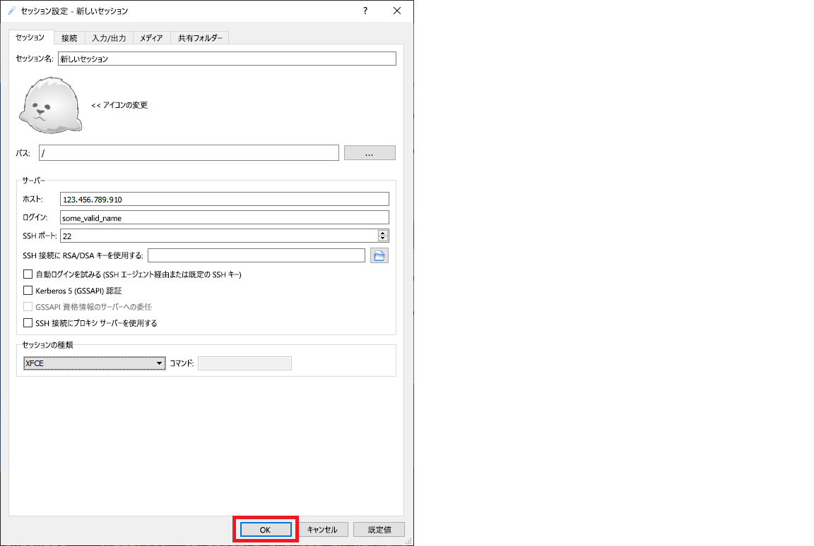

# <a name="quickstart-set-up-the-data-science-virtual-machine-for-linux-ubuntu"></a>クイック スタート:Linux (Ubuntu) Data Science Virtual Machine を設定する

Ubuntu 18.04 Data Science Virtual Machine を起動して実行します。

## <a name="prerequisites"></a>前提条件

Ubuntu 18.04 Data Science Virtual Machine を作成するには、Azure サブスクリプションが必要です。 [Azure を無料で試す](https://azure.com/free)。

>[!NOTE]
>Azure 無料アカウントでは、GPU 対応の仮想マシン SKU がサポートされません。

## <a name="create-your-data-science-virtual-machine-for-linux"></a>Linux データ サイエンス仮想マシンの作成

Data Science Virtual Machine Ubuntu 18.04 のインスタンスを作成する手順は以下のとおりです。

1. [Azure ポータル](https://portal.azure.com)にアクセスします。 まだサインインしていない場合は、Azure アカウントへのサインインを求めるメッセージが表示される可能性があります。
1. 「Data Science Virtual Machine」と入力して仮想マシンの一覧を検索し、[Data Science Virtual Machine - Ubuntu 18.04] を選択します。

1. 次のウィンドウで **[作成]** を選択します。

1. [仮想マシンの作成] ブレードにリダイレクトされます。
   
1. ウィザードの各手順を構成するために、次の情報を入力します。

    1. **[基本]** :
    
       * **サブスクリプション**:複数のサブスクリプションがある場合は、マシンが作成されて課金されるサブスクリプションを選択します。 そのサブスクリプションに対するリソース作成権限が必要です。
       * **[リソース グループ]** :新しいグループを作成するか、既存のグループを使用します。
       * **[仮想マシン名]** : 仮想マシンの名前を入力します。 この名前は Azure portal で使用されます。
       * **[リージョン]** :最適なデータ センターを選択します。 ネットワーク アクセスを最速にするために、データの大半が存在するデータセンターか、物理的に最も近くにあるデータセンターを選びます。 詳細については、[Azure リージョン](https://azure.microsoft.com/global-infrastructure/regions/)に関する記事を参照してください。
       * **イメージ**:既定値をそのまま使用します。
       * **Size**:このオプションには、一般的なワークロードに適したサイズが自動的に設定されます。 詳細については、[Azure の Linux VM のサイズ](../../virtual-machines/linux/sizes.md)に関する記事を参照してください。
       * **[認証の種類]** : 設定を迅速に行うには、[パスワード] を選択します。 
         
         > [!NOTE]
         > JupyterHub を使用する場合は、JupyterHub は SSH 公開キーを使用するように構成されて "*いない*" ため、必ず [パスワード] を選択します。

       * **[ユーザー名]** : 管理者のユーザー名を入力します。 このユーザー名を使用して、仮想マシンにログインします。 このユーザー名は Azure ユーザー名と同じである必要はありません。 大文字は使用 "*しない*" でください。
         
         > [!IMPORTANT]
         > ユーザー名に大文字を使用すると、JupyterHub が機能しなくなり、500 内部サーバー エラーが発生します。

       * **パスワード**:仮想マシンへのログインに使用するパスワードを入力します。    
    
   1. **[Review + create]\(レビュー + 作成\)** を選択します。
   1. **[レビュー + 作成]**
      * 入力したすべての情報が正しいことを確認します。 
      * **［作成］** を選択します
    
    プロビジョニングには 5 分くらいかかります。 この状態は Azure portal に表示されます。

## <a name="how-to-access-the-ubuntu-data-science-virtual-machine"></a>Ubuntu Data Science Virtual Machine にアクセスする方法

Ubuntu DSVM には、次の 3 つの方法のいずれかでアクセスできます。

  * ターミナル セッションの場合の SSH
  * グラフィカル セッションの場合の X2Go
  * Jupyter Notebook の場合の JupyterHub と JupyterLab

また、Data Science Virtual Machine を Azure Notebooks に接続して、VM で Jupyter Notebook を実行し、無料のサービス レベルの制限をバイパスすることもできます。 詳細については、[Azure Notebooks プロジェクトの管理と構成](../../notebooks/configure-manage-azure-notebooks-projects.md#compute-tier)に関するページを参照してください。

### <a name="ssh"></a>SSH

SSH 認証を使用して VM を構成した場合、テキスト シェル インターフェイスの手順 3 の **[基本]** セクションで作成したアカウント資格情報を使用してログオンできます。 Windows では、[PuTTY](https://www.putty.org) などの SSH クライアント ツールをダウンロードできます。 グラフィカル デスクトップ (X ウィンドウ システム) を使用する場合は、PuTTY で X11 転送を使用できます。

> [!NOTE]
> テストでは、パフォーマンスは、X11 転送よりも、X2Go クライアントの方が優れていました。 グラフィカル デスクトップ インターフェイスでは、X2Go クライアントを使用することをお勧めします。

### <a name="x2go"></a>X2Go

Linux VM は、既に X2Go サーバーでプロビジョニングされており、クライアント接続を受け入れる準備ができています。 Linux VM のグラフィカル デスクトップに接続するには、クライアントで次の手順を実行します。

1. [X2Go](https://wiki.x2go.org/doku.php/doc:installation:x2goclient)のページから、お使いのクライアント プラットフォーム向けの X2Go クライアントをダウンロードしてインストールします。
1. 仮想マシンのパブリック IP アドレスをメモしておきます。これは、作成した仮想マシンを開いて Azure portal で確認できます。

   

1. X2Go クライアントを実行します。 [新しいセッション] ウィンドウが自動的にポップアップ表示されない場合は、[セッション] > [新しいセッション] に移動します。

1. 結果の構成ウィンドウで、次の構成パラメーターを入力します。
   * **[Session] \(セッション) タブ**:
     * **[Host]\(ホスト\)** : 前にメモした VM の IP アドレスを入力します。
     * **[Login]\(ログイン\)** : Linux VM 上のユーザー名を入力します。
     * **[SSH Port]\(SSH ポート\)** : 既定値の 22 のままにします。
     * **[Session Type]\(セッションの種類\)** : 値を **XFCE** に変更します。 現在、Linux VM でサポートされるのは XFCE デスクトップのみです。
   * **[Media]\(メディア\) タブ**: 音声のサポートとクライアントの印刷を使用しない場合は、それらをオフにできます。
   * **[Shared folders]\(共有フォルダー\)** : このタブを使用して、VM にマウントするクライアント マシン ディレクトリを追加します。 

   
1. **[OK]** を選択します。
1. VM のログイン画面を表示するには、X2Go ウィンドウの右側のウィンドウにあるボックスをクリックします。
1. VM のパスワードを入力します。
1. **[OK]** を選択します。
1. ファイアウォールをバイパスして接続を完了するには、X2Go アクセス許可の付与が必要な場合があります。
1. これで、Ubuntu DSVM のグラフィカル インターフェイスが表示されます。 


### <a name="jupyterhub-and-jupyterlab"></a>JupyterHub と JupyterLab

Ubuntu DSVM は、マルチユーザーの Jupyter サーバーである [JupyterHub](https://github.com/jupyterhub/jupyterhub) を実行します。 接続するには、次の手順を実行します。

   1. Azure portal で VM を検索して選択し、VM のパブリック IP アドレスをメモしておきます。
      

   1. ローカル コンピューターから Web ブラウザーを開き、https:\//your-vm-ip:8000 に移動します。"your-vm-ip" は、前にメモした IP アドレスに置き換えます。
   1. ブラウザーにより、証明書エラーが発生したことが報告され、ページを直接開けなくなる場合があります。 DSVM では、自己署名証明書を使用してセキュリティを提供しています。 ほとんどのブラウザーでは、この警告の後にクリック スルーすることができます。 多くのブラウザーでは、Web セッション全体の証明書に関する何らかの視覚的な警告が引き続き提供されます。
   1. VM を作成するときに使ったユーザー名とパスワードを入力してサインインしてください。 

      

>[!NOTE]
> この段階で 500 エラーが発生した場合、ユーザー名に大文字を使用した可能性があります。 これは、JupyterHub と、それが使用する PAMAuthenticator の間の既知の相互作用です。 

   1. 入手できる多くのサンプル ノートブックを参照します。

次世代の Jupyter Notebook と JupyterHub である JupyterLab も利用できます。 これにアクセスするには、JupyterHub にサインインし、URL https:\//your-vm-ip:8000/user/your-username/lab を参照します。"your-username" は VM の構成時に選択したユーザー名に置き換えます。 この場合も、証明書のエラーが原因で、最初はサイトへのアクセスがブロックされることがあります。

次の行を `/etc/jupyterhub/jupyterhub_config.py` に追加すれば、JupyterLab を既定のノートブック サーバーとして設定できます。

```python
c.Spawner.default_url = '/lab'
```

## <a name="next-steps"></a>次のステップ

学習と調査をどのように続ければよいかを以下に示します。

* [Linux Data Science Virtual Machine でのデータ サイエンス](linux-dsvm-walkthrough.md)に関するチュートリアルでは、ここでプロビジョニングされた Linux DSVM を使用して、一般的なデータ サイエンス タスクをいくつか実行する方法を示します。 
* この記事で説明しているツールを試して、DSVM 上のさまざまなデータ サイエンス ツールを確認します。 VM にインストールされているツールの基本的な概要と詳細情報を入手できる場所は、仮想マシン内のシェルで `dsvm-more-info` を実行して確認することもできます。  
* [Team Data Science Process](https://aka.ms/tdsp)を使用して、分析ソリューションを体系的に構築する方法を確認します。
* Azure AI サービスを使用する機械学習とデータ分析のサンプルについては、[Azure AI Gallery](https://gallery.azure.ai/) を参照してください。
* この仮想マシンに適した[リファレンス ドキュメント](./reference-ubuntu-vm.md)を参照してください。
