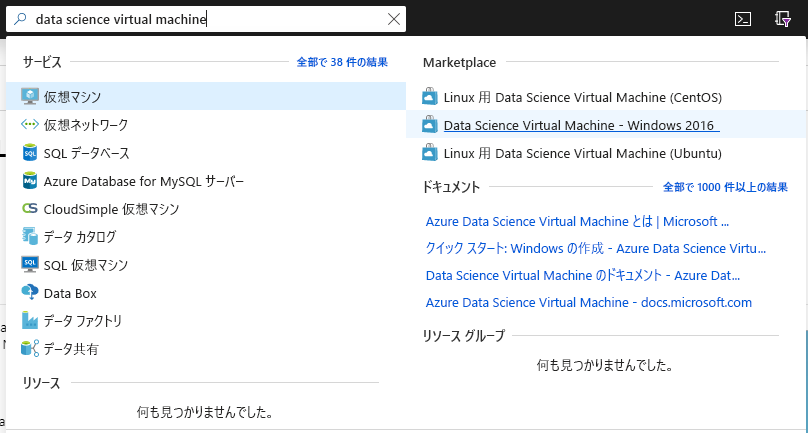
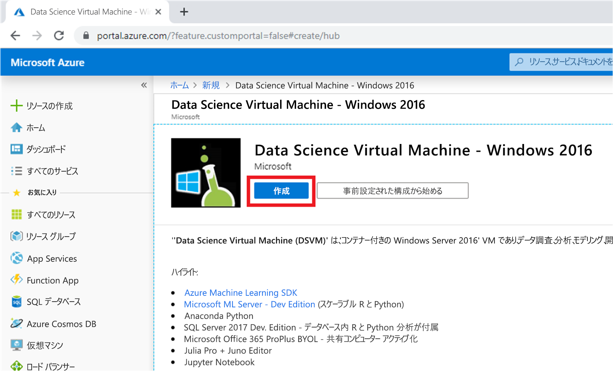

# クイック スタート:Windows 用データ サイエンス仮想マシンを設定する

Windows データ サイエンス仮想マシンを起動して実行します。

## 前提条件

Windows データ サイエンス仮想マシンを作成するには、Azure サブスクリプションが必要です。 [Azure を無料で試す](https://azure.com/free)。
Azure 無料アカウントでは、GPU 対応の仮想マシン SKU がサポートされないので注意してください。

## DSVM を作成する

DSVM インスタンスを作成するには:

1. [Azure portal](https://portal.azure.com) にアクセスします。まだサインインしていない場合は、Azure アカウントへのサインインを求めるメッセージが表示される可能性があります。
1. 「データ サイエンス仮想マシン」と入力して仮想マシンの一覧を検索し、[データ サイエンス仮想マシン - Windows Server 2016] を選択します。

    

1. 下部にある **[作成]** ボタンを選択します。

    

1. [仮想マシンの作成] ブレードにリダイレクトされます。
   ![Windows 仮想マシンに対応する [基本] タブ](./media/provision-vm/review-create-windows.png)

1. **[基本]** タブに次のように入力します。
      * **サブスクリプション**:複数のサブスクリプションがある場合は、マシンが作成されて課金されるサブスクリプションを選択します。 そのサブスクリプションに対するリソース作成権限が必要です。
      * **[リソース グループ]** :新しいグループを作成するか、既存のグループを使用します。
      * **[仮想マシン名]** : 仮想マシンの名前を入力します。 これは Azure portal に表示される名前です。
      * **[場所]** :最適なデータ センターを選択します。 ネットワーク アクセスを最速にするために、データの大半が存在するデータセンターか、物理的に最も近くにあるデータセンターを選びます。 詳細については、[Azure リージョン](https://azure.microsoft.com/global-infrastructure/regions/)に関する記事を参照してください。
      * **イメージ**:既定値をそのまま使用します。
      * **[サイズ]** :これには、一般的なワークロードに適したサイズが自動的に設定されます。 詳細については、[Azure の Windows VM のサイズ](../../virtual-machines/windows/sizes.md)に関する記事を参照してください。
      * **[ユーザー名]** : 管理者のユーザー名を入力します。 これは、仮想マシンへのログインに使用するユーザー名であり、Azure ユーザー名と同じにする必要はありません。
      * **Password**:仮想マシンへのログインに使用するパスワードを入力します。    
1. **[Review + create]\(レビュー + 作成\)** を選択します。
1. **[レビュー + 作成]**
   * 入力したすべての情報が正しいことを確認します。 
   * **作成** を選択します。

> [!NOTE]
> * 仮想マシンに事前に読み込まれているソフトウェアのライセンス料金はかかりません。 **[サイズ]** の手順で選択したサーバー サイズのコンピューティング コストがかかります。
> * プロビジョニングには 10 から 20 分かかります。 Azure portal で VM の状態を表示できます。

## DSVM にアクセスする

VM の作成とプロビジョニングが完了したら、「[Azure ベースの仮想マシンに接続する](../../marketplace/cloud-partner-portal/virtual-machine/cpp-connect-vm.md)」の手順を実行します。 仮想マシン作成の **[基本]** ステップで構成した、管理者アカウントの資格情報を使用します。 

VM にインストールされて構成されたツールを使い始めることができます。 多くのツールには、**スタート** メニューのタイルとデスクトップ アイコンからアクセスできます。

また、DSVM を Azure Notebooks に接続して、VM で Jupyter Notebook を実行し、無料のサービス レベルの制限をバイパスすることもできます。 詳細については、[Notebooks プロジェクトの管理と構成](../../notebooks/configure-manage-azure-notebooks-projects.md#manage-and-configure-projects)に関するページを参照してください。

## 次の手順

* **[スタート]** メニューを開いて DSVM 上のツールを調べます。
* Azure Machine Learning service については、「[Azure Machine Learning サービスの概要](../service/overview-what-is-azure-ml.md)」を参照し、[チュートリアル](../index.yml)をお試しください。
* エクスプローラーで C:\Program Files\Microsoft\ML Server\R_SERVER\library\RevoScaleR\demoScripts に移動し、エンタープライズ規模でのデータ分析をサポートする RevoScaleR ライブラリを R で使用するサンプルを入手します。 
* [Data Science Virtual Machine でできる 10 のこと](https://aka.ms/dsvmtenthings)に関する記事を読みます。
* [Team Data Science Process](../team-data-science-process/index.yml)を使用して、エンド ツー エンドの分析ソリューションを体系的に構築する方法を確認します。
* Azure Machine Learning および関連する Azure 上のデータ サービスを使用した機械学習および Data Analytics については、[Azure AI Gallery](https://gallery.cortanaintelligence.com) をご覧ください。 仮想マシンのデスクトップと **[スタート]** メニューに、このギャラリーへのアイコンも用意されています。

