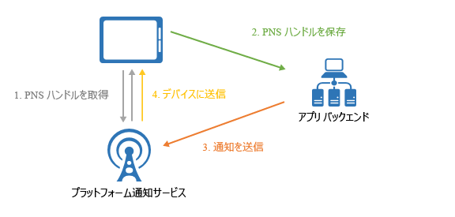

# Azure Notification Hubs とは

Azure Notification Hubs は、任意のバックエンド (クラウドまたはオンプレミス) から任意のプラットフォーム (iOS、Android、Windows、Kindle、Baidu など) に通知を送信できる、使いやすく、かつスケールアウトされたプッシュ エンジンを提供します。 Notification Hubs は、エンタープライズ向けとコンシューマー向けのどちらのシナリオにも適しています。 いくつかのシナリオの例を次に示します。

- ニュース速報の通知を数百万台のデバイスに速やかに送信する。
- 場所に基づいたクーポンを対象のユーザー セグメントに送信する。
- イベント関連の通知を、メディア/スポーツ/金融/ゲーム アプリケーションのユーザーまたはグループに送信する。
- 注意を引いて顧客に販売するために、プロモーション コンテンツをアプリケーションにプッシュする。
- 新着メッセージや作業項目などのエンタープライズ イベントをユーザーに通知する。
- 多要素認証のコードを送信する。

## プッシュ通知とは

プッシュ通知は、アプリからユーザーへの通信手段の 1 つで、モバイル アプリのユーザーが関心を持っている情報について、モバイル デバイス上のポップアップやダイアログ ボックスなどで通知を受け取ることができる機能です。 通常、ユーザーはメッセージを表示するか無視するかを選択することができます。表示を選択した場合は、その通知を伝えたモバイル アプリケーションが開きます。 一部の通知はサイレントで、アプリがバックグラウンドで処理し、操作を決定するためにバックグラウンドで配信されます。

プッシュ通知は、コンシューマー アプリにとってはアプリの関与や使用率を向上させるために、またエンタープライズ アプリにとっては最新のビジネス情報を通信するために不可欠です。 モバイル デバイスにとってはエネルギー効率が良く、通知の送信者にとっては柔軟であり、対応するアプリケーションがアクティブでない場合にも使用できるため、これはアプリからユーザーへの最適な通信方法です。

いくつかの一般的なプラットフォームでのプッシュ通知の詳細については、次のトピックを参照してください。

- [Android](https://developer.android.com/guide/topics/ui/notifiers/notifications.html)
- [iOS](https://developer.apple.com/notifications/)
- [Windows](https://msdn.microsoft.com/library/windows/apps/hh779725.aspx)

## プッシュ通知のしくみ

プッシュ通知は、"*プラットフォーム通知システム*" (PNS: Platform Notification System) と呼ばれるプラットフォーム独自のインフラストラクチャを利用して配信されます。 これらは、用意されたハンドルを使用してデバイスにメッセージを配信する最小限のプッシュ機能を提供しており、共通のインターフェイスは備えていません。 アプリの Android、iOS、Windows バージョンにまたがるすべての顧客に通知を送信するには、開発者は Apple Push Notification Service (APNS)、Firebase Cloud Messaging (FCM)、Windows 通知サービス (WNS) を個別に操作する必要があります。

次の図に、プッシュ機能の概要を示します。

1. アプリケーションは、通知を受信することを決定します。そのため、アプリが実行されているターゲット プラットフォームの PNS にアクセスし、一意であり、かつ一時的なプッシュ ハンドルを要求します。 ハンドルの種類は、システムによって異なります (たとえば、WNS では URI を使用するのに対して、APNS ではトークンを使用します)。
2. クライアント アプリは、このハンドルをアプリのバックエンドまたはプロバイダーに格納します。
3. プッシュ通知を送信する際には、アプリのバックエンドがハンドルを使用して PNS にアクセスし、特定のクライアント アプリを対象として指定します。
4. PNS はハンドルで指定されたデバイスに通知を転送します。

## プッシュ通知の課題

PNS は強力です。 ただし、一般的なプッシュ通知シナリオ (セグメント化されたユーザーへのプッシュ通知のブロードキャストなど) を実装するためでさえ、多くの作業がアプリ開発者に残されます。

プッシュ通知を送信するには、アプリケーションのメインのビジネス ロジックには関連のない複雑なインフラストラクチャが必要です。 インフラストラクチャの課題には、次のようなものがあります。

- **プラットフォームへの依存**
  - PNS が統一されていないので、さまざまなプラットフォームのデバイスに通知を送信するためには、複雑で保守が難しい、プラットフォームに依存するロジックをバックエンドで用意する必要があります。
- **スケール**
  - PNS のガイドラインに従って、アプリが起動するたびにデバイス トークンを更新する必要があります。 バックエンドは、トークンを最新の状態に維持するためにのみ、大量のトラフィックやデータベース アクセスを処理します。 デバイスの数が数百台や、数千台、数百万台に増加すると、このインフラストラクチャの作成と保守にかかるコストも膨大になります。
  - ほとんどの PNS は、複数のデバイスに対するブロードキャストをサポートしていません。 100 万台のデバイスへの単純なブロードキャストによって、PNS の 100 万回の呼び出しが発生します。 この量のトラフィックを最小限の遅延でスケーリングするのは簡単なことではありません。
- **ルーティング**
  - PNS はデバイスにメッセージを送信する機能を備えていますが、ほとんどのアプリの通知はユーザーや特定のグループを対象としています。 バックエンドは、デバイスを対象のグループ、ユーザー、プロパティなどに関連付けるためのレジストリを保持する必要があります。この対策を行うことで、市場投入までの開発期間が長引き、アプリケーションの保守コストも増大します。

## Azure Notification Hubs を使用する理由

Notification Hubs により、お使いのアプリ バックエンドから独自にプッシュ通知を送信することに関連した複雑さがすべて排除されます。 そのマルチプラットフォーム対応の、スケールアウトされたプッシュ通知インフラストラクチャによって、プッシュ関連のコーディングが削減され、バックエンドが簡略化されます。 Notification Hubs では、次の図に示すように、デバイス側の処理は PNS ハンドルをハブに登録するだけであり、バックエンドによってメッセージがユーザーまたは対象グループに送信されます。

Notification Hubs はすぐに利用できるプッシュ エンジンであり、次のメリットがあります。

- **クロス プラットフォーム**
  - iOS、Android、Windows のほか、Kindle や Baidu を含むすべての主要なプッシュ プラットフォームをサポートします。
  - すべてのプラットフォームに通知を送信する共通のインターフェイスを備えており、通知をプラットフォームの独自形式で送信することも、プラットフォームに依存しない形式で送信することもできます。プラットフォーム固有の対応は必要ありません。
  - デバイス ハンドルの管理は 1 か所で行えます。
- **クロス バックエンド**
  - クラウドまたはオンプレミスの
  - .NET、Node.js、Java、Python など。
- **豊富な一連の配信パターン**
  - 1 つまたは複数のプラットフォームへのブロードキャスト: プラットフォームにまたがる数百万台のデバイスに 1 回の API 呼び出しで直ちにブロードキャストできます。
  - デバイスへのプッシュ: 通知を個々のデバイスに送信できます。
  - ユーザーへのプッシュ: タグおよびテンプレート機能は、ユーザーのすべてのクロスプラットフォーム デバイスに到達するのに役立ちます。
  - 動的タグを使用したセグメントへのプッシュ: タグ機能は、デバイスをセグメント化し、1 つのセグメントまたはセグメントの式 (たとえば、アクティブ AND シアトルに在住 NOT 新規ユーザー) のどちらに送信しているかにかかわらず、ニーズに応じてそれらのデバイスにプッシュするのに役立ちます。 パブリッシャー/サブスクライバー間に制限されず、デバイス タグはいつでもどこでも更新することができます。
  - ローカライズされたプッシュ: テンプレート機能は、バックエンド コードに影響を与えることなくローカライズを実現するのに役立ちます。
  - サイレント プッシュ: デバイスにサイレント通知を送信し、それらをトリガーして特定のプルまたはアクションを完了することによって、push-to-pull パターンを有効にできます。
  - スケジュールされたプッシュ: いつでも通知の送信をスケジュールできます。
  - ダイレクト プッシュ: Notification Hubs サービスへのデバイスの登録を省略し、デバイス ハンドルの一覧に直接バッチでプッシュできます。
  - 個人用に設定されたプッシュ: デバイスのプッシュ変数は、カスタマイズされたキーと値のペアを使用して、デバイス固有の個人用に設定されたプッシュ通知を送信するのに役立ちます。
- **豊富なテレメトリ**
  - 一般的なプッシュ、デバイス、エラー、および操作テレメトリは、Azure Portal とプログラムで使用できます。
  - メッセージごとのテレメトリは、最初の要求呼び出しから Notification Hubs サービスがプッシュの送信を正常にバッチ処理するまで各プッシュを追跡します。
  - プラットフォーム通知システムのフィードバックは、デバッグを支援するために、プラットフォーム通知システムからのすべてのフィードバックを通信します。
- **拡張性**
  - 再設計やデバイス シャーディングなしで、数百万台のデバイスに高速なメッセージを送信します。
- **セキュリティ**
  - 共有アクセス シークレット (SAS) またはフェデレーション認証。

## 次の手順

通知ハブの作成および使用を開始してください。その手順は、[モバイル アプリケーションにプッシュ通知を送信するチュートリアル](notification-hubs-android-push-notification-google-fcm-get-started.md)に説明されています。

[0]: ./media/notification-hubs-overview/registration-diagram.png
[1]: ./media/notification-hubs-overview/notification-hub-diagram.png

[How customers are using Notification Hubs]: https://azure.microsoft.com/services/notification-hubs
[Notification Hubs tutorials and guides]: https://azure.microsoft.com/documentation/services/notification-hubs
[iOS]: https://azure.microsoft.com/documentation/articles/notification-hubs-ios-get-started
[Android]: https://azure.microsoft.com/documentation/articles/notification-hubs-android-get-started
[Windows Universal]: https://azure.microsoft.com/documentation/articles/notification-hubs-windows-store-dotnet-get-started
[Windows Phone]: https://azure.microsoft.com/documentation/articles/notification-hubs-windows-phone-get-started
[Kindle]: https://azure.microsoft.com/documentation/articles/notification-hubs-kindle-get-started
[Xamarin.iOS]: https://azure.microsoft.com/documentation/articles/partner-xamarin-notification-hubs-ios-get-started
[Xamarin.Android]: https://azure.microsoft.com/documentation/articles/partner-xamarin-notification-hubs-android-get-started
[Microsoft.WindowsAzure.Messaging.NotificationHub]: https://msdn.microsoft.com/library/microsoft.windowsazure.messaging.notificationhub.aspx
[Microsoft.ServiceBus.Notifications]: https://msdn.microsoft.com/library/microsoft.servicebus.notifications.aspx
[App Service Mobile Apps]: https://azure.microsoft.com/documentation/articles/app-service-mobile-value-prop/
[templates]: notification-hubs-templates-cross-platform-push-messages.md
[Azure portal]: https://portal.azure.com
[tags]: (https://msdn.microsoft.com/library/azure/dn530749.aspx)
