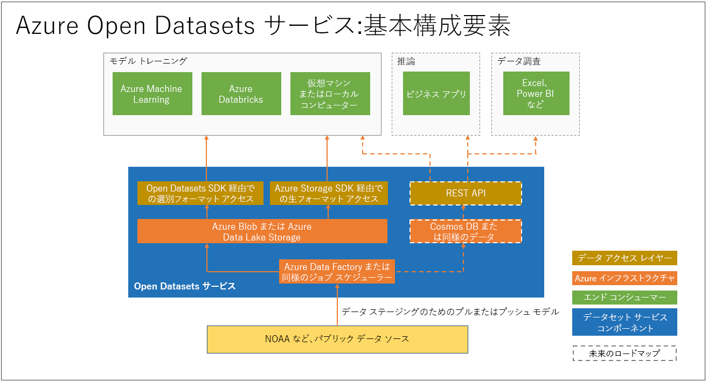

# Azure オープン データセット (プレビュー) とその使用方法

[Azure オープン データセット](https://azure.microsoft.com/services/open-datasets/)は選別されたパブリック データセットであり、機械学習ソリューションにシナリオ固有の機能を追加してモデルの精度を上げるために使用できます。 オープン データセットは Microsoft Azure 上のクラウド内にあり、Azure Databricks、Machine Learning service、および Machine Learning Studio ですぐに利用できます。 API を介してデータセットにアクセスすることもでき、Power BI や Azure Data Factory などの他の製品内でも使用できます。

データセットには、機械学習モデルのトレーニングと予測ソリューションのエンリッチメントに役立つ天気、国勢調査、祝日、公共の安全、場所に関するパブリック ドメイン データが含まれます。 Azure オープン データセット上でパブリック データセットを共有することもできます。 

## 選別されて準備されたデータセット
Azure オープン データセット内の選別されたオープン パブリック データセットは、機械学習ワークフロー内で使用するために最適化されています。 

データ サイエンティストは、多くの場合、高度な分析のためのデータのクリーニングと準備に時間の大半を費やしています。 オープン データセットは、ユーザーの時間を節約するために Azure クラウドにコピーされ、前処理されます。 米国海洋大気庁 (NOAA) への FTP 接続などによってソースから定期的な間隔でデータがプルされ、構造化形式に解析されてから、郵便番号や最寄りの測候所の場所などの特徴によって適宜エンリッチメントされます。

データセットは、Azure 内のクラウド コンピューティングと共同ホスティングされるので、アクセスと操作が簡単になります。  

使用可能なデータセットの例を次に示します。 

### 気象データ
 
|Dataset         | Notebooks     | 説明                                    |
|----------------|---------------|------------------------------------------------|
|[NOAA Integrated Surface Data (ISD)](https://azure.microsoft.com/services/open-datasets/catalog/noaa-integrated-surface-data/) | [Azure Notebooks](https://azure.microsoft.com/services/open-datasets/catalog/noaa-integrated-surface-data/?tab=data-access#AzureNotebooks)   [Azure Databricks](https://azure.microsoft.com/services/open-datasets/catalog/noaa-integrated-surface-data/?tab=data-access#AzureDatabricks) | 北米、ヨーロッパ、オーストラリア、およびアジアの一部の空間を最適にカバーする、NOAA から 1 時間ごとに取得される世界各地の気象データ。 毎日更新されます。 |
|[NOAA Global Forecast System (GFS)](https://azure.microsoft.com/services/open-datasets/catalog/noaa-global-forecast-system/) | [Azure Notebooks](https://azure.microsoft.com/services/open-datasets/catalog/noaa-global-forecast-system/?tab=data-access#AzureNotebooks)   [Azure Databricks](https://azure.microsoft.com/services/open-datasets/catalog/noaa-global-forecast-system/?tab=data-access#AzureDatabricks) | NOAA から取得される 15 日間の米国の 1 時間ごとの天気予報。 毎日更新されます。 |

### カレンダー データ

|Dataset         | Notebooks     | 説明                                    |
|----------------|---------------|------------------------------------------------|
|[祝日](https://azure.microsoft.com/services/open-datasets/catalog/public-holidays/) | [Azure Notebooks](https://azure.microsoft.com/services/open-datasets/catalog/public-holidays/?tab=data-access#AzureNotebooks)   [Azure Databricks](https://azure.microsoft.com/services/open-datasets/catalog/public-holidays/?tab=data-access#AzureDatabricks) | 1970 年から 2099 年までの 41 の国または地域をカバーする、世界各地の祝日データ。 国と、ほとんどの人に有給休暇があるかどうかが含まれています。 |

## データセットへのアクセス  
Azure アカウントでは、コードを使用するか Azure サービス インターフェイスを通じてオープン データセットにアクセスできます。 データは、機械学習ソリューション内で使用するために Azure クラウド コンピューティング リソースと併置されます。  

オープン データセットでは、Azure Machine Learning service と Azure Databricks にデータを接続するために使用できる Azure Notebooks と Azure Databricks ノートブックが提供されます。 データセットには、Python SDK を通じてアクセスすることもできます。 

ただし、オープン データセットにアクセスするために Azure アカウントは必要ありません。Spark の有無に関係なく、任意の Python 環境内からアクセスできます。

## データセットの要求または投稿

必要なデータが見つからない場合は、[データセットを要求](mailto:aod@microsoft.com?Subject=Request%20dataset%3A%20%3Creplace%20with%20dataset%20name%3E&Body=%0AYour%20name%20and%20institution%3A%20%0A%0ADataset%20name%3A%0A%20%0ADataset%20description%3A%20%0A%3Cfill%20in%20a%20brief%20description%20and%20share%20any%20web%20links%20of%20the%20dataset%3E%20%0A%0ADataset%20size%3A%20%0A%3Chow%20much%20space%20does%20the%20dataset%20need%20today%20and%20how%20much%20is%20it%20expected%20to%20grow%20each%20year%3E%20%0A%0ADataset%20file%20formats%3A%20%0A%3Ccurrent%20dataset%20file%20formats%2C%20and%20optionally%2C%20any%20formats%20that%20the%20dataset%20must%20be%20transformed%20to%20for%20easy%20access%3E%0A%0ALicense%3A%20%0A%3Cwhat%20is%20the%20license%20or%20terms%20and%20conditions%20governing%20the%20distribution%20of%20this%20dataset%3E%0A%0AUse%20cases%3A%20%0A%3CExplain%20some%20common%20use%20of%20the%20dataset.%20E.g.%20weather%20dataset%20can%20be%20useful%20in%20demand%20forecasting%20and%20predictive%20maintenance%20scenarios%3E%20%0A%0AAny%20additional%20information%20you%20want%20us%20to%20know%3A%0A)または[データセットを投稿](mailto:aod@microsoft.com?Subject=Contribute%20dataset%3A%20%3Creplace%20with%20dataset%20name%3E&Body=%0AYour%20name%20and%20institution%3A%20%0A%0ADataset%20name%3A%0A%20%0ADataset%20description%3A%20%0A%3Cfill%20in%20a%20brief%20description%20and%20share%20any%20web%20links%20of%20the%20dataset%3E%20%0A%0ADataset%20size%3A%20%0A%3Chow%20much%20space%20does%20the%20dataset%20need%20today%20and%20how%20much%20is%20it%20expected%20to%20grow%20each%20year%3E%20%0A%0ADataset%20file%20formats%3A%20%0A%3Ccurrent%20dataset%20file%20formats%2C%20and%20optionally%2C%20any%20formats%20that%20the%20dataset%20must%20be%20transformed%20to%20for%20easy%20access%3E%0A%0ALicense%3A%20%0A%3Cwhat%20is%20the%20license%20or%20terms%20and%20conditions%20governing%20the%20distribution%20of%20this%20dataset%3E%0A%0AUse%20cases%3A%20%0A%3CExplain%20some%20common%20use%20of%20the%20dataset.%20E.g.%20weather%20dataset%20can%20be%20useful%20in%20demand%20forecasting%20and%20predictive%20maintenance%20scenarios%3E%20%0A%0AAny%20additional%20information%20you%20want%20us%20to%20know%3A%0A)します。 

## 次の手順
* [サンプル ノートブック](samples.md)
* [チュートリアル:ニューヨークのタクシー データでの回帰モデリング](tutorial-opendatasets-automl.md)
* [オープン データセット用 Python SDK](/python/api/azureml-opendatasets/?view=azure-ml-py)
