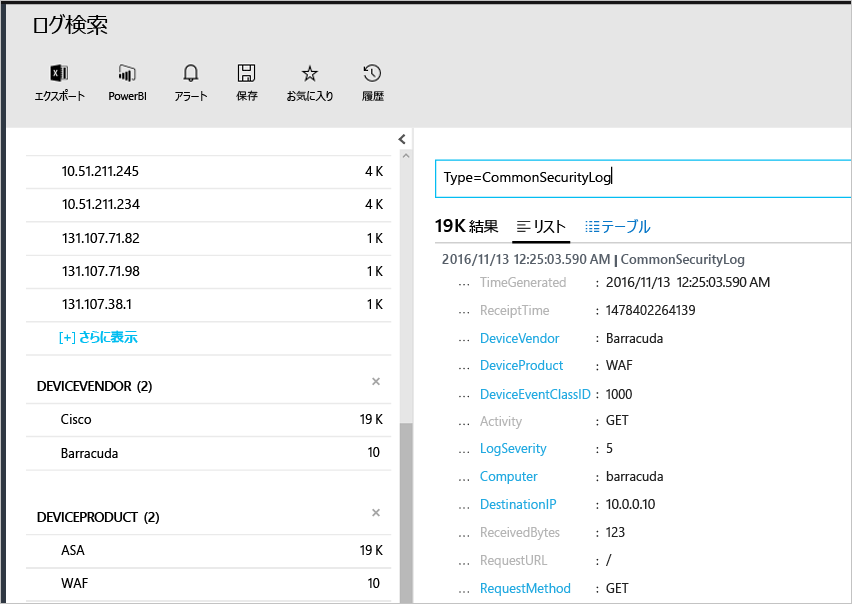

# <a name="connecting-your-security-products-to-the-operations-management-suite-oms-security-and-audit-solution"></a>Operations Management Suite (OMS) のセキュリティと監査ソリューションへのセキュリティ製品の接続 
このドキュメントでは、お使いのセキュリティ製品を OMS のセキュリティと監査ソリューションに接続する方法について説明します。 次のソースがサポートされています。

- Common Event Format (CEF) イベント
- Cisco ASA イベント


## <a name="what-is-cef"></a>CEF とは
Common Event Format (CEF) は、Syslog メッセージをベースにした、業界標準フォーマットの 1 つで、さまざまなプラットフォームにおけるイベントの相互運用を実現するために多くのセキュリティ ベンダーで使用されています。 OMS のセキュリティと監査ソリューションでは、CEF を使用したデータの取り込みがサポートされているため、お使いのセキュリティ製品を OMS セキュリティに接続することができます。 

データ ソースを OMS に接続すれば、このプラットフォームが備える次の機能を利用することができます。

- 検索と関連付け
- 監査
- アラート:
- [脅威インテリジェンス]
- Notable Issues (注目すべき問題)

## <a name="collection-of-security-solution-logs"></a>セキュリティ ソリューション ログの収集

OMS セキュリティでは、Syslog と [Cisco ASA](https://blogs.technet.microsoft.com/msoms/2016/08/25/add-your-cisco-asa-logs-to-oms-security/) ログに対して、CEF を使用したログの収集がサポートされています。 このサポートでは、ソース (ログを生成するコンピューター) は Syslog-ng デーモンを実行している Linux コンピューターで、ターゲットが OMS セキュリティになります。 Linux コンピューターを準備するには、次のタスクを実行する必要があります。

- OMS Agent for Linux (バージョン 1.2.0-25 以降) をダウンロードします。
- [こちらの記事](https://github.com/Microsoft/OMS-Agent-for-Linux/blob/master/docs/OMS-Agent-for-Linux.md#steps-to-install-the-oms-agent-for-linux)の**クイック インストールの手順**に関するセクションの指示に従って、エージェントをワークスペースにインストールして登録します。

一般的に、エージェントは、ログが生成されるコンピューターとは別のコンピューターにインストールします。 エージェント コンピューターにログを転送するには、通常、次の手順を実行する必要があります。

- 必要なイベントをエージェント コンピューターの Syslog デーモン (Rsyslog または Syslog-ng) に転送するようログ管理製品またはログ生成コンピューターを構成する。
- エージェント コンピューターの Syslog デーモンがリモート システムからメッセージを受信できるようにする。

エージェント コンピューターでは、イベントを Syslog デーモンからローカルの UDP ポート 25226 に送信する必要があります。 エージェントはこのポートで受信イベントをリッスンします。 ローカル システムからエージェントにすべてのイベントを送信するための構成例を、次に示します (ローカルの設定に合わせて構成を変更できます)。

1. ターミナル ウィンドウを開き、ディレクトリ */etc/syslog-ng/* に移動します。 
2. 新しいファイル *security-config-omsagent.conf* を作成し、コンテンツ OMS_facility = local4 を追加します。
    
    filter f_local4_oms { facility(local4); };

    destination security_oms { tcp("127.0.0.1" port(25226)); };

    log { source(src); filter(f_local4_oms); destination(security_oms); };
    
3. ファイル *security_events.conf* をダウンロードし、OMS エージェント コンピューターの */etc/opt/microsoft/omsagent/conf/omsagent.d/* に配置します。
4. 次のコマンドを入力し、Syslog デーモンを再起動します。 *Syslog-ng が実行されている場合:*
    
    ```
    sudo service rsyslog restart
    ```

    *Rsyslog が実行されている場合:*
    
    ```
    /etc/init.d/syslog-ng restart
    ```
5. 次のコマンドを入力し、OMS エージェントを再起動します。

    *Syslog-ng が実行されている場合:*
    
    ```
    sudo service omsagent restart
    ```

    *Rsyslog が実行されている場合:*
    
    ```
    systemctl restart omsagent
    ```
6. 次のコマンドを入力し、結果を調べて、OMS エージェント ログにエラーがないことを確認します。

    ``` 
    tail /var/opt/microsoft/omsagent/log/omsagent.log
    ```

## <a name="reviewing-collected-security-events"></a>収集したセキュリティ イベントの確認

[!include[log-analytics-log-search-nextgeneration](../../includes/log-analytics-log-search-nextgeneration.md)]

構成が完了したら、OMS セキュリティによるセキュリティ イベントの取り込みが開始されます。 取り込んだイベントを視覚化するには、ログ検索を開き、検索フィールドに「*Type=CommonSecurityLog*」と入力して、Enter キーを押します。 次の例は、このコマンドの結果を示しています。この例では既に OMS セキュリティによって複数のベンダーからセキュリティ ログが取り込まれています。
   


この検索結果を 1 つのベンダーに絞り込むことができます。たとえば、Cisco のオンライン ログを視覚化するには、「*Type=CommonSecurityLog DeviceVendor=Cisco*」と入力します。 "CommonSecurityLog" には、基本的な拡張機能など、CEF ヘッダーに対応した事前構成済みのフィールドがあります。それ以外の拡張機能は、"カスタムの拡張機能" であるかどうかにかかわらず、"AdditionalExtensions" フィールドに挿入されます。 カスタム フィールド機能を使用すれば、そのフィールドから専用のフィールドを取得できます。 

### <a name="accessing-computers-missing-baseline-assessment"></a>ベースライン アセスメントがないコンピューターの評価
OMS は、Windows Server 2008 R2 から Windows Server 2012 R2 まででドメイン メンバーのベースライン プロファイルをサポートします。 Windows Server 2016 のベースラインはまだ確定していませんが、発行されるとすぐに追加される予定です。 OMS のセキュリティと監視のベースラインの評価でスキャンされたその他すべてのオペレーティング システムは、**[ベースライン アセスメントがないコンピューター]** セクションに表示されます。

## <a name="see-also"></a>関連項目
このドキュメントでは、お使いの CEF ソリューションを OMS に接続する方法について説明しました。 OMS セキュリティの詳細については、次の記事を参照してください。

* [Operations Management Suite (OMS) overview (Operations Management Suite (OMS) の概要)](operations-management-suite-overview.md)
* [Operations Management Suite のセキュリティと監査ソリューションでのセキュリティの警告に対する監視と対応](oms-security-responding-alerts.md)
* [Operations Management Suite のセキュリティと監査ソリューションでのリソースの監視](oms-security-monitoring-resources.md)


