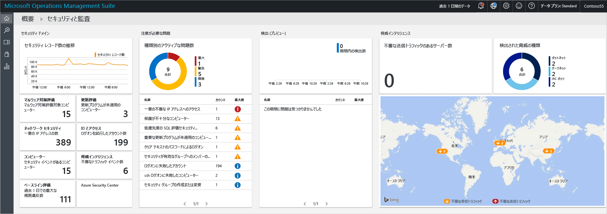
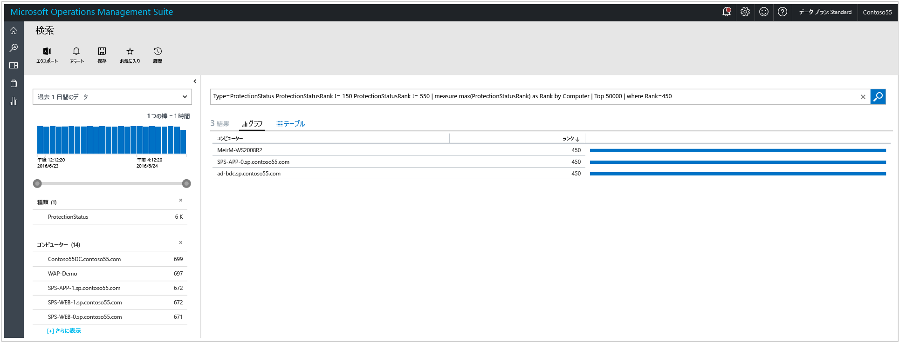
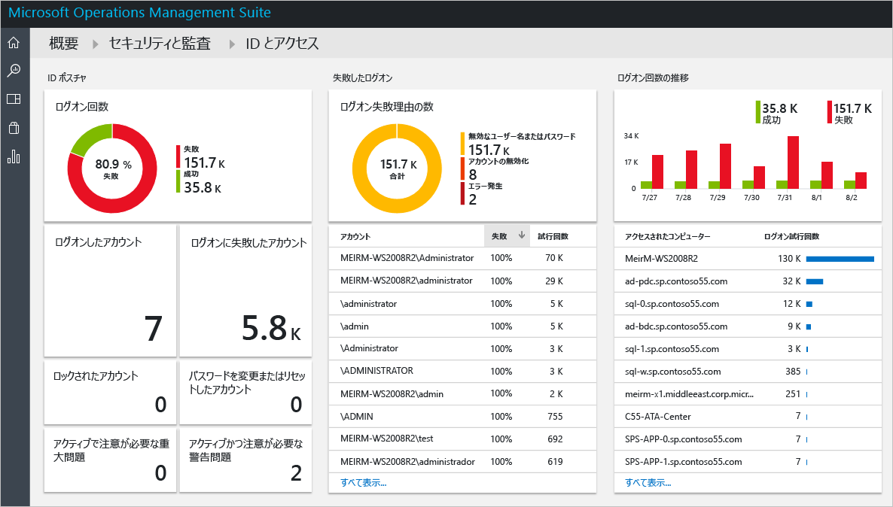
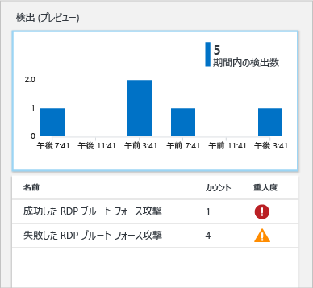
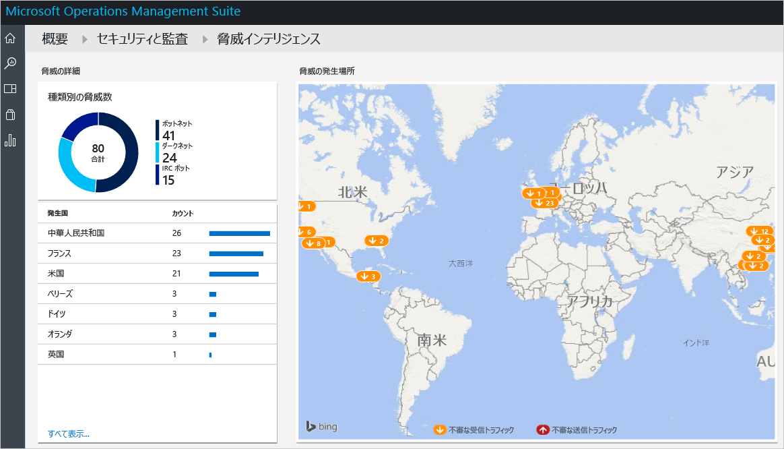

# Operations Management Suite のセキュリティと監査ソリューションの概要
このドキュメントでは、Operations Management Suite (OMS) のセキュリティと監査ソリューションの機能をすぐに利用できるように、各オプションについて詳しく説明します。

## OMS とは
Microsoft Operations Management Suite (OMS) は、Microsoft のクラウドベースの IT 管理ソリューションです。OMS を使用して、オンプレミスとクラウドのインフラストラクチャを管理し、保護することができます。 OMS の詳細については、[Operations Management Suite](https://technet.microsoft.com/library/mt484091.aspx)に関する記事を参照してください。

## OMS Security and Audit dashboard
OMS のセキュリティと監査ソリューションでは、注意を必要とする重要な問題向けの組み込みの検索クエリと共に、組織の IT セキュリティ対策への包括的な視点が提供されます。 **[Security and Audit]** \(セキュリティと監査) ダッシュボードは、OMS におけるすべてのセキュリティ関連機能のホーム画面です。 この画面では、コンピューターのセキュリティの状態について大まかな情報を得ることができます。 また、過去の 24 時間、7 日間、またはそれ以外のカスタム期間に発生したすべてのイベントを表示する機能も含まれています。 **[セキュリティおよび監視]** ダッシュボードにアクセスするには、次の手順に従います。

1. **Microsoft Operations Management Suite** のメイン ダッシュボードで、左側にある **[設定]** タイルをクリックします。
2. **[設定]** ブレードで、**[ソリューション]** の下にある **[セキュリティおよび監視]** オプションをクリックします。
3. **[セキュリティおよび監査]** ダッシュボードが表示されます。
   
    

このダッシュボードにアクセスするのが初めてで、OMS によって監視されているデバイスがない場合、タイルにはエージェントからの取得データが設定されません。 エージェントをインストールすると、データが設定されるまでに多少の時間がかかります。そのため、最初に表示される情報には、クラウドにアップロード中の一部のデータが不足していることがあります。  この場合は、一部のタイルに具体的な情報が含まれていなくても異常ではありません。 OMS エージェントを Windows システムにインストールする方法の詳細については、[OMS への Windows コンピューターの直接接続](https://technet.microsoft.com/library/mt484108.aspx)に関する記事を参照し、このタスクを Linux システムで実行する方法の詳細については、[OMS への Linux コンピューターの接続](https://technet.microsoft.com/library/mt622052.aspx)に関する記事を参照してください。

> [!NOTE]
> エージェントは、現在有効になっているイベントに基づいて情報 (インスタンス コンピューター名、IP アドレス、ユーザー名など) を収集します。 ただし、ドキュメントやファイル、データベース名、個人データは収集されません。   
> 
> 

ソリューションには、お客様が直面している重要な課題を解決するためのロジック、視覚化、データ取得の規則が集約されています。 セキュリティと監査はそのようなソリューションの 1 つであり、その他のソリューションは個別に追加することができます。 新しいソリューションを追加する方法の詳細については、「 [ソリューションの追加](https://technet.microsoft.com/library/mt674635.aspx) 」を参照してください。

OMS のセキュリティと監査ダッシュボードは、次の 4 つの主要カテゴリで構成されています。

* **セキュリティ ドメイン**: この領域では、時間の経過に伴うセキュリティ レコードを詳しく調査したり、マルウェアの評価、更新プログラムの評価、ネットワーク セキュリティ、ID とアクセスの情報、セキュリティ イベントが発生したコンピューターにアクセスしたりできます。また、Azure Security Center のダッシュボードにも簡単にアクセスできます。
* **注目に値する問題**: このオプションでは、アクティブな問題の数と重要度をすばやく特定することができます。
* **検出 (プレビュー)**: ここでは、リソースに対して攻撃が発生したときにセキュリティの警告を視覚化することで、攻撃パターンを特定できます。
* **Threat Intelligence (脅威インテリジェンス)**: 悪意のある送信側 IP トラフィックを持つサーバーの総数、悪意のある脅威の種類、このような IP の発信元を示すマップを視覚化することで、攻撃パターンを特定することができます。 
* **Common security queries (一般的なセキュリティ クエリ)**: このオプションでは、環境を監視するために使用できる最も一般的なセキュリティ クエリの一覧が示されます。 これらのクエリの 1 つをクリックすると、**[検索]** ブレードが開き、そのクエリの結果が表示されます。

> [!NOTE]
> OMS でデータをセキュリティで保護された状態に保つ方法の詳細については、「OMS によってデータをセキュリティで保護する方法」を参照してください。
> 
> 

## [Security Domains] \(セキュリティ ドメイン)
リソースを監視する場合は、現在の環境の状態にすばやくアクセスできるようにする必要があります。 しかし、過去に発生したイベントをさかのぼって追跡できることも重要であり、これによって特定の時点で環境内に発生したイベントを詳細に把握できるようになります。 

> [!NOTE]
> データの保持期間は、OMS の価格プランに応じて決まります。 詳細については、 [Microsoft Operations Management Suite](https://www.microsoft.com/server-cloud/operations-management-suite/pricing.aspx) の価格に関するページを参照してください。
> 
> 

インシデント対応とフォレンジクス調査のシナリオでは、 **[Security Records over Time]** \(時間別のセキュリティ レコード) タイルに表示される結果をそのまま活用できます。

このタイルをクリックすると、**[検索]** ブレードが開き、次のように過去 7 日間のデータを含む**セキュリティ イベント** (Type=SecurityEvents) のクエリ結果が表示されます。

[!include[log-analytics-log-search-nextgeneration](../../includes/log-analytics-log-search-nextgeneration.md)]

検索結果は 2 つのウィンドウに分割されます。左側のウィンドウには、検出されたセキュリティ イベントの数、それらのイベントが検出されたコンピューター、それらのコンピューターで検出されたアカウントの数、およびアクティビティの種類の詳細が表示されます。 右側のウィンドウには、セキュリティ イベントの結果の総数と、コンピューター名およびイベント アクティビティを含む時系列ビューが表示されます。 また、**[表示数を増やす]** をクリックすると、イベント データ、イベント ID、イベント ソースなど、このイベントの詳細を表示することもできます。

> [!NOTE]
> OMS 検索クエリの詳細については、「 [OMS 検索リファレンス](https://technet.microsoft.com/library/mt450427.aspx)」を参照してください。
> 
> 

### マルウェア対策評価
このオプションでは、十分に保護されていないコンピューターやマルウェアによって侵害されているコンピューターをすばやく特定することができます。 監視対象サーバーのマルウェアの評価状態と検出された脅威が読み取られ、そのデータがクラウド上の OMS サービスに送信されて処理されます。 脅威が検出されたサーバーと十分に保護されていないサーバーは、マルウェア対策評価ダッシュボードに表示されます。このダッシュボードには、**[マルウェア対策評価]** タイルをクリックするとアクセスできます。 

OMS のダッシュボードに表示されているその他のライブ タイルと同様に、このタイルをクリックすると、**[検索]** ブレードが開いてクエリ結果が表示されます。 このオプションの場合、**[保護の状態]** の下にある **[レポートなし]** オプションをクリックすると、次のように、コンピューターの名前と順位が含まれた単一のエントリを示すクエリ結果が表示されます。

> [!NOTE]
> "*順位*" とは保護の状態 (オン、オフ、更新済みなど) と検出された脅威を反映するために与えられるグレードです。 これを番号として付与することで集計がしやすくなります。
> 
> 

コンピューターの名前をクリックすると、このコンピューターの保護の状態についての時系列ビューが表示されます。 この機能は、過去にマルウェア対策がインストールされていて、ある時点でそれが削除されたようなケースを把握する必要がある場合に、非常に役に立ちます。   

### [Update Assessment] \(更新の評価)
このオプションでは、潜在的なセキュリティの問題に全体でどの程度さらされているか、これらの更新プログラムが環境にとって重要かどうか、その重要度はどの程度かをすばやく判断することができます。 OMS のセキュリティと監査ソリューションで提供されるのは、これらの更新プログラムの視覚化機能のみで、実際のデータは OMS 内の別のモジュールである[更新管理ソリューション](oms-solution-update-management.md)から提供されます。 次に更新プログラムの例を示します。

> [!NOTE]
> 更新管理ソリューションの詳細については、「[OMS の更新管理ソリューション](oms-solution-update-management.md)」を参照してください。
> 
> 

### ID とアクセス
ID は企業のコントロール プレーンであり、ID の保護は最優先事項である必要があります。 以前は組織の周りには境界が存在し、その境界が主な防衛線の 1 つとなっていましたが、最近ではクラウドに移行するデータやアプリが増加しているため、ID が新たな境界線となっています。 

> [!NOTE]
> 現在のところ、データはセキュリティ イベントのログイン データ (イベント ID 4624) のみを基にしていますが、今後は Office365 ログインと Azure AD データも含まれる予定です。
> 
> 

ID アクティビティを監視することにより、インシデントが発生する前に事前対応型のアクションを実行するか、攻撃が試みられた場合にそれを阻止する事後対応型のアクションを実行することができます。 **[ID およびアクセス]** ダッシュボードには、失敗したログオン試行の回数、そのログオン試行の際に使用されたユーザー アカウント、ロックアウトされたアカウント、パスワードが変更またはリセットされたアカウント、現在ログインしているアカウントの数など、ID の状態の概要が表示されます。 

**[ID およびアクセス]** タイルをクリックすると、次のようなダッシュボードが表示されます。

このダッシュボードに表示される情報は、潜在的な疑わしいアクティビティを特定するのにすぐに役立ちます。 たとえば、**管理者**としてのログオンを 338 回試し、その 100% が失敗したとします。 これは、このアカウントに対するブルート フォース攻撃が原因である可能性があります。 このアカウントをクリックすると、この潜在的な攻撃のターゲット リソースの特定に役立つ詳細情報を得ることができます。

詳細レポートには、このイベントに関する重要な情報として、ターゲット コンピューター、ログオンの種類 (この場合は Network ログオン)、アクティビティ (この場合はイベント 4625)、各ログオン試行の包括的なタイムラインなどが表示されます。 

### [Computers (コンピューター)]
このタイルを使用すると、実際にセキュリティ イベントを持つすべてのコンピューターにアクセスできます。 このタイルをクリックすると、セキュリティ イベントが発生したコンピューターの一覧と各コンピューター上のイベントの数が表示されます。

![[Computers (コンピューター)]](./media/oms-security-getting-started/oms-getting-started-fig9.JPG)

各コンピューターをクリックするとさらに詳細が表示され、フラグが設定されたセキュリティ イベントを確認することができます。

### [脅威インテリジェンス]

IT 管理者は、OMS の [セキュリティおよび監査] で利用できる [脅威インテリジェンス] オプションを利用することで、特定のコンピューターがボットネットの一部であるかどうかを確認するなど、環境に対するセキュリティの脅威を特定することができます。 コンピューターをひそかにコマンド アンド コントロール サーバーに接続するマルウェアが攻撃者によって不正にインストールされた場合、そのコンピューターはボットネットのノードになる可能性があります。 また、ダークネットのようなアンダーグラウンド通信チャネルに由来する潜在的な脅威を特定することもできます。 脅威インテリジェンスの詳細については、「[Operations Management Suite のセキュリティと監査ソリューションでのセキュリティの警告に対する監視と応答](oms-security-responding-alerts.md)」を参照してください。

シナリオによっては、監視対象コンピューターからアクセスされた潜在的な悪意のある IP に気付くことがあります。

このアラートおよび同じカテゴリの他のアラートは、[Microsoft 脅威インテリジェンス](https://youtu.be/O4WtxgUrDc8)を利用して OMS Security によって生成されます。 脅威インテリジェンス データは、Microsoft によって収集されるだけでなく、大手の脅威インテリジェンス プロバイダーから購入されます。 このデータは頻繁に更新され、刻々と進化する脅威に適応されます。 その性質上、セキュリティ アラートを[調査](https://blogs.technet.microsoft.com/msoms/2016/12/08/investigating-suspicious-activity-in-a-hybrid-cloud-with-oms-security/)するときは、他のセキュリティ情報ソースと組み合わせる必要があります。 

### ベースライン評価

Microsoft は、世界中の業界団体や政府機関と協力して、安全性の高いサーバー全世界と共に安全性の高いサーバーのデプロイを表す Windows 構成を定義しています。 この構成は、レジストリ キー、監査ポリシーの設定、セキュリティ ポリシーの設定のセットで、これらの設定には Microsoft が推奨する値があります。 この規則のセットがセキュリティ ベースラインと呼ばれます。 このオプションの詳細については、「[Operations Management Suite のセキュリティと監査ソリューションでのベースライン評価](oms-security-baseline.md)」を参照してください。

### [Azure Security Center] \(Azure Security Center)
このタイルは、基本的には Azure Security Center のダッシュボードにアクセスするためのショートカットです。 このソリューションの詳細については、 [Azure Security Center の概要](../security-center/security-center-get-started.md) に関するページを参照してください。

## [Notable Issues] \(注目すべき問題)
複数のオプションから成るこのグループの主な目的は、環境内で発生している問題を、重大、警告、情報に分類して簡単に確認できるようにすることです。 これらの問題を視覚化したものが [Active issue type] \(アクティブな問題の種類) タイルですが、このタイルでは問題ごとの詳細を確認することはできません。詳細を確認するには、このタイルの下部の、問題の名前 ([NAME] \(名前))、問題によって発生したオブジェクトの数 ([COUNT] \(カウント))、問題の重大度 ([SEVERITY] \(重要度)) が表示されている部分を使用する必要があります。

![[Notable Issues] \(注目すべき問題)](./media/oms-security-getting-started/oms-getting-started-fig10.JPG)

ご存じのとおり、これらの問題は既に **[セキュリティ ドメイン]** グループのさまざまな領域で取り上げられていました。このことからも、利用する環境において最も重要な問題を 1 つの場所で視覚化するという、このビューの目的が明確になっています。

## [検出 (プレビュー)]
このオプションの主な目的は、IT が、利用する環境に対する潜在的な脅威とこの脅威の重要度をすばやく特定できるようにすることです。

また、このオプションを[インシデント対応調査](https://blogs.msdn.microsoft.com/azuresecurity/2016/11/30/investigating-suspicious-activity-in-a-hybrid-cloud-with-oms-security/)中に使用すると、評価を実行し、攻撃に関する詳細を入手できます。

> [!NOTE]
> インシデント対応に OMS を使用する方法の詳細については、ビデオ「[How to Leverage the Azure Security Center & Microsoft Operations Management Suite for an Incident Response (インシデント対応に Azure Security Center と Microsoft Operations Management Suite を利用する方法)](https://channel9.msdn.com/Blogs/Taste-of-Premier/ToP1703)」を参照してください。
> 
> 

## [脅威インテリジェンス]
セキュリティと監査ソリューションの新しい [脅威インテリジェンス] セクションでは、悪意のある送信側 IP トラフィックを持つサーバーの総数、悪意のある脅威の種類、およびこのような IP の発信元を示すマップという複数の方法で、予測される攻撃パターンを視覚化します。 マップを対話形式で操作することが可能で、IP をクリックすると詳細を確認できます。

マップ上の黄色のプッシュピンは、悪意のある IP からの受信トラフィックを示しています。 インターネットに公開されているサーバーにとって悪意のある受信トラフィックが検出されることは珍しくありませんが、このような試みについては、その目的が達成されていないことを確認するようお勧めします。 これらのインジケーターは、IIS ログ、WireData、Windows ファイアウォール ログに基づいています。  

## Common security queries (一般的なセキュリティ クエリ)
一般的なセキュリティ クエリの一覧は、リソースの情報にすばやくアクセスするために役立つほか、環境のニーズに基づきカスタマイズすることもできます。 これらの一般的なクエリを次に示します。

* All Security Activities (すべてのセキュリティ アクティビティ)
* Security Activities on the computer "computer01.contoso.com" (コンピューター "computer01.contoso.com" でのセキュリティ アクティビティ。お使いのコンピューター名に置き換えてください)
* Security Activities on the computer "computer01.contoso.com" for account "Administrator" (コンピューター "computer01.contoso.com" でのアカウント "Administrator" に関するセキュリティ アクティビティ。お使いのコンピューター名とアカウント名に置き換えてください)
* コンピューターごとのログオン アクティビティ
* Accounts who terminated Microsoft antimalware on any computer (任意のコンピューターで Microsoft マルウェア対策を終了したアカウント)
* Computers where the Microsoft antimalware process was terminated (Microsoft マルウェア対策プロセスが終了したコンピューター)
* Computers where "hash.exe" was executed ("hash.exe" が実行されたコンピューター。別のプロセス名に置き換えてください)
* All Process names that were executed (実行されたすべてのプロセス名)
* アカウントごとのログオン アクティビティ
* Accounts who remotely logged on the computer "computer01.contoso.com" (コンピューター "computer01.contoso.com" にリモートでログオンしたアカウント。お使いのコンピューター名に置き換えてください)

## 関連項目
このドキュメントでは、OMS のセキュリティと監査ソリューションについて紹介しました。 OMS セキュリティの詳細については、次の記事を参照してください。

* [Operations Management Suite (OMS) overview (Operations Management Suite (OMS) の概要)](operations-management-suite-overview.md)
* [Operations Management Suite のセキュリティと監査ソリューションでのセキュリティの警告に対する監視と対応](oms-security-responding-alerts.md)
* [Operations Management Suite のセキュリティと監査ソリューションでのリソースの監視](oms-security-monitoring-resources.md)

