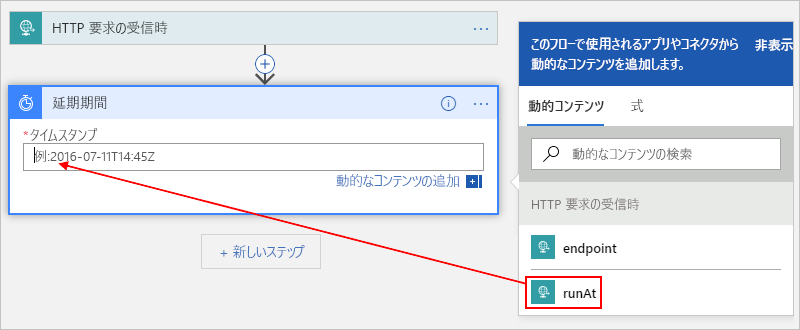

# Azure Scheduler ジョブを Azure Logic Apps に移行する

> [!IMPORTANT]
> Azure Logic Apps は、廃止予定の Azure Scheduler の後継です。 ジョブのスケジュールを設定するには、代わりに Azure Logic Apps に移行するためのこの記事に従います。

この記事では、Azure Scheduler ではなく Azure Logic Apps を使用して自動化されたワークフローを作成することで、1 回限りのジョブと定期的なジョブをスケジュール設定する方法を示します。 Logic Apps を使用してスケジュールされたジョブを作成すると、次のメリットが得られます。

* 各ロジック アプリは個別の Azure リソースであるため、*ジョブ コレクション*の概念について心配する必要はありません。

* 1 つのロジック アプリを使用して、複数の 1 回限りのジョブを実行できます。

* Azure Logic Apps サービスでは、タイム ゾーンと夏時間 (DST) をサポートしています。

詳細については、「[Azure Logic Apps とは](../logic-apps/logic-apps-overview.md)」を参照するか、 または[初めてのロジック アプリを作成する](../logic-apps/quickstart-create-first-logic-app-workflow.md)のクイック スタートで初めてのロジック アプリを作成してみてください。

## 前提条件

* Azure サブスクリプション。 Azure サブスクリプションがない場合は、<a href="https://azure.microsoft.com/free/" target="_blank">無料の Azure アカウントにサインアップ</a>してください。

* HTTP 要求を送信することでロジック アプリをトリガーするには、[Postman デスクトップ アプリ](https://www.getpostman.com/apps)などのツールを使用します。

## 1 回限りのジョブをスケジュール設定する

ロジック アプリを 1 つだけ作成して、複数の 1 回限りのジョブを実行できます。 

### ロジック アプリを作成する

1. [Azure portal](https://portal.azure.com) のロジック アプリ デザイナーで空のロジック アプリを作成します。 

   基本的な手順については、[クイック スタート: 初めてのロジック アプリの作成](../logic-apps/quickstart-create-first-logic-app-workflow.md)に関するページを参照してください。

1. 検索ボックスに、フィルターとして「HTTP 要求の」と入力します。 トリガーの一覧から、**HTTP 要求の受信時** 

   

1. 要求トリガーに対して、必要に応じて JSON スキーマを指定できます。これは、ロジック アプリ デザイナーが、受信要求からの入力の構造を理解するのに役立ち、出力をこの後のワークフローで選択しやすくします。

   スキーマを指定するには、 **[要求本文の JSON スキーマ]** ボックスにスキーマを入力します。その例を次に示します。 

   

   スキーマはなくても JSON 形式のサンプル ペイロードがあれば、そのペイロードからスキーマを生成することができます。

   1. 要求トリガーで **[サンプルのペイロードを使用してスキーマを生成する]** を選択します。

   1. 次の例のように、 **[サンプルの JSON ペイロードを入力するか、貼り付けます]** でサンプル ペイロードを指定し、 **[完了]** を選択します。

      

1. トリガーで、 **[次のステップ]** を選択します。 

1. 検索ボックスに、フィルターとして「延期期限」と入力します。 アクションの一覧で、アクション **[延期期限]**

   このアクションは、指定した日時までロジック アプリ ワークフローを一時停止します。

   

1. ロジック アプリのワークフローを開始するタイムスタンプを入力します。 

   **[タイムスタンプ]** ボックス内をクリックすると、動的コンテンツ リストが表示され、必要に応じてトリガーから出力を選択できます。

   

1. [200 を超えるコネクタ](../connectors/apis-list.md)から選択して、実行したいその他のアクションを追加することができます。 

   たとえば、URL に要求を送信する HTTP アクションや、Storage キュー、Service Bus キューまたは Service Bus トピックを使用するアクションを含めることができます。 

   

1. 完了したら、ロジック アプリを保存します。

   

   初めてロジック アプリを保存するときに、そのロジック アプリの要求トリガーの URL エンドポイントが **[HTTP POST の URL]** ボックスに表示されます。 
   ロジック アプリを呼び出して入力を処理するためにロジック アプリに送信する場合に、呼び出し先としてこの URL を使用します。

   

1. 後で手動でロジック アプリをトリガーする要求を送信できるように、このエンドポイント URL をコピーして保存します。 

## 1 回限りのジョブを開始する

1 回限りのジョブを手動で実行またはトリガーするには、ロジック アプリの要求トリガーのエンドポイント URL への呼び出しを送信します。 この呼び出しでは、送信する入力またはペイロードを指定します。これはスキーマを指定することで既に記述している可能性があります。 

たとえば、Postman アプリを使用して、このサンプルと同じような設定で POST 要求を作成し、 **[送信]** を選択して要求を行うことができます。

| 要求メソッド | URL | 本文 | headers |
|----------------|-----|------|---------| 
| **POST** | <*endpoint-URL*> | **raw** 
**JSON(application/json)** 
**[raw]** ボックスに、要求で送信するペイロードを入力します。 
**メモ**:この設定により、 **[ヘッダー]** 値が自動的に構成されます。 | **[キー]** :Content-Type  **値**: application/json
 |||| 

呼び出しを送信すると、ロジック アプリからの応答が **[本文]** タブの **[raw]** ボックスの下に表示されます。 

> [!IMPORTANT]
>
> 後でジョブをキャンセルする場合は、 **[ヘッダー]** タブを選択します。応答で **x-ms-workflow-run-id** ヘッダー値を見つけてコピーします。 
>
> 

## 1 回限りのジョブをキャンセルする

Logic Apps では、1 回限りのジョブはそれぞれ 1 つのロジック アプリの実行インスタンスとして実行されます。 1 回限りのジョブをキャンセルするには、Logic Apps REST API で[ワークフロー実行 - キャンセル](https://docs.microsoft.com/rest/api/logic/workflowruns/cancel)を使用できます。 トリガーへの呼び出しを送信するときに、[ワークフロー実行 ID](#workflow-run-id) を指定します。

## 定期的なジョブをスケジュール設定する

### ロジック アプリを作成する

1. [Azure portal](https://portal.azure.com) のロジック アプリ デザイナーで空のロジック アプリを作成します。 

   基本的な手順については、[クイック スタート: 初めてのロジック アプリの作成](../logic-apps/quickstart-create-first-logic-app-workflow.md)に関するページを参照してください。

1. 検索ボックスに、フィルターとして「recurrence」と入力します。 トリガーの一覧から、**定期的なアイテム** 

   

1. 必要に応じて、より詳細なスケジュールを設定します。

   

   詳細なスケジュール オプションの詳細については、「[定期的に実行されるタスクとワークフローを Azure Logic Apps で作成、実行する](../connectors/connectors-native-recurrence.md)」を参照してください。

1. [200 を超えるコネクタ](../connectors/apis-list.md)から選択して、実行したいその他のアクションを追加します。 トリガーで、 **[次のステップ]** を選択します。 目的のアクションを探して選択します。

   たとえば、URL に要求を送信する HTTP アクションや、Storage キュー、Service Bus キューまたは Service Bus トピックを使用するアクションを含めることができます。 

   

1. 完了したら、ロジック アプリを保存します。

   

## 詳細設定

ここでは、ジョブをカスタマイズできるその他の方法を示します。

### 再試行ポリシー

断続的なエラーが発生したときに、ロジック アプリでアクションが再実行を試行する方法を制御するために、各アクションの設定で[再試行ポリシー](../logic-apps/logic-apps-exception-handling.md#retry-policies)を設定できます。次に例を示します。

1. アクションの **[...]** メニューを開き、 **[設定]** を選択します。

   

1. 目的の再試行ポリシーを選択します。 各ポリシーの詳細については、「[Retry policies](../logic-apps/logic-apps-exception-handling.md#retry-policies)」(再試行ポリシー) を参照してください。

   

## 例外とエラーを処理する

Azure Sheduler では、既定のアクションが実行に失敗した場合、エラー状態に対処する代替アクションを実行できます。 Azure Logic Apps でも、同じタスクを実行することができます。

1. ロジック アプリ デザイナーでは、処理したいアクションの上で、ポインターを手順の間の矢印の上に移動し、 **[並列分岐の追加]** を選択します。 

   

1. 代替アクションとして代わりに実行するアクションを見つけて選択します。

   

1. 代替アクションで、 **[...]** メニューを開き、 **[実行条件の構成]** を選択します。

   

1. **[に成功しました]** プロパティのボックスをオフにします。 **[に失敗しました]** 、 **[がスキップされます]** 、および **[がタイムアウトしました]** のプロパティを選択します。

   

1. 完了したら、 **[完了]** を選択します。

例外処理の詳細については、[エラーと例外処理 - RunAfter プロパティ](../logic-apps/logic-apps-exception-handling.md#catch-and-handle-failures-with-the-runafter-property)に関するセクションを参照してください。

## FAQ

 

**Q**: Azure Scheduler が廃止になるのはいつですか。  
**A**: Azure Scheduler は、2019 年 9 月 30 日に廃止される予定です。

**Q**: サービスの廃止後、Scheduler のジョブ コレクションとジョブはどうなりますか。  
**A**: Scheduler のすべてのジョブ コレクションとジョブがシステムから削除されます。

**Q**: Scheduler ジョブを Logic Apps に移行する前に、バックアップまたはその他のタスクを実行する必要がありますか。  
**A**: ベスト プラクティスとして、作業は常にバックアップしてください。 Scheduler ジョブを削除または無効にする前に、作成したロジック アプリが期待どおりに実行されていることを確認します。 

**Q**: ジョブを Scheduler から Logic Apps に移行するために役立つツールはありますか。  
**A**: 各 Scheduler ジョブは独特であるため、すべてに対応できるツールは存在しません。 ただし、必要に応じた変更を行うために使用できるさまざまなスクリプトがあります。 スクリプトの可用性については、後で確認します。

**Q**: Scheduler ジョブを移行するためのサポートはどこで受けられますか。  
**A**: サポートを受けるためのいくつかの方法を次に示します。 

**Azure Portal**

Azure サブスクリプションに有料サポート プランがある場合は、Azure portal でテクニカル サポート要求を作成できます。 それ以外の場合は、さまざまなサポート オプションを選択できます。

1. [Azure portal](https://portal.azure.com) のメイン メニューで、 **[ヘルプとサポート]** を選択します。

1. **[サポート]** の下で、 **[新しいサポート要求]** を選びます。 要求に対して次の詳細を指定します。

   | Setting | 値 |
   |---------|-------|
   | **問題の種類** | **テクニカル** | 
   | **サブスクリプション** | <*ご使用の Azure サブスクリプション*> | 
   | **サービス** | **[監視 + 管理]** の下で、 **[Scheduler]** を選択します。 | 
   ||| 

1. 必要なサポート オプションを選択します。 有料サポート プランがある場合は、 **[次へ]** を選択します。

**コミュニティ**

* [Azure Logic Apps フォーラム](https://social.msdn.microsoft.com/Forums/en-US/home?forum=azurelogicapps)
* [Stack Overflow](https://stackoverflow.com/questions/tagged/azure-scheduler)

## 次の手順

* [定期的に実行されるタスクとワークフローを Azure Logic Apps で作成する](../connectors/connectors-native-recurrence.md)
* [チュートリアル:スケジュールに基づいたロジック アプリでトラフィックをチェックする](../logic-apps/tutorial-build-schedule-recurring-logic-app-workflow.md)