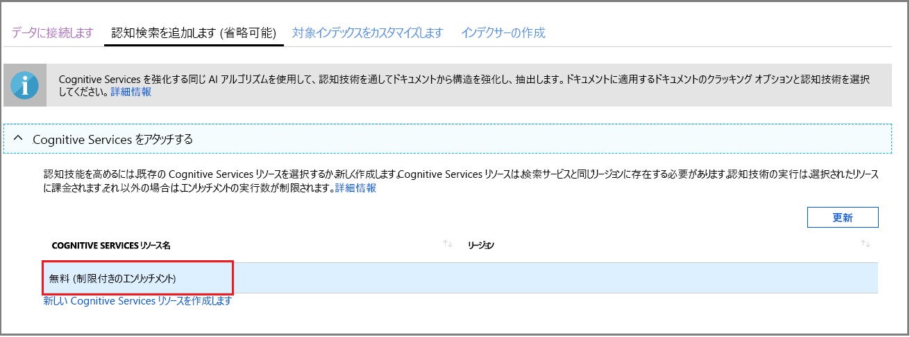
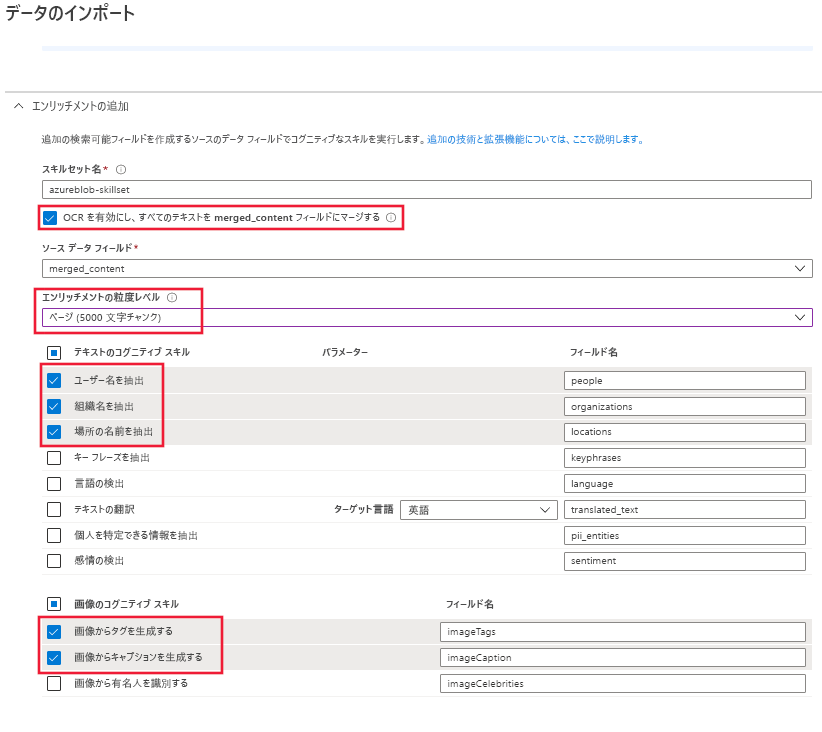
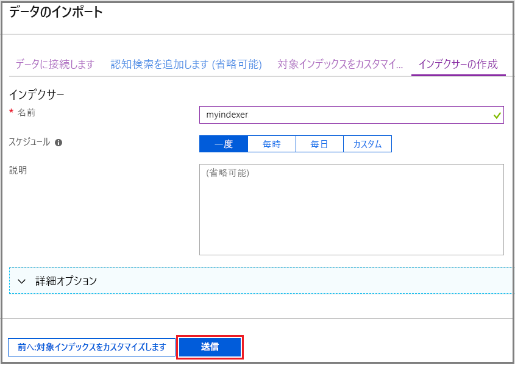
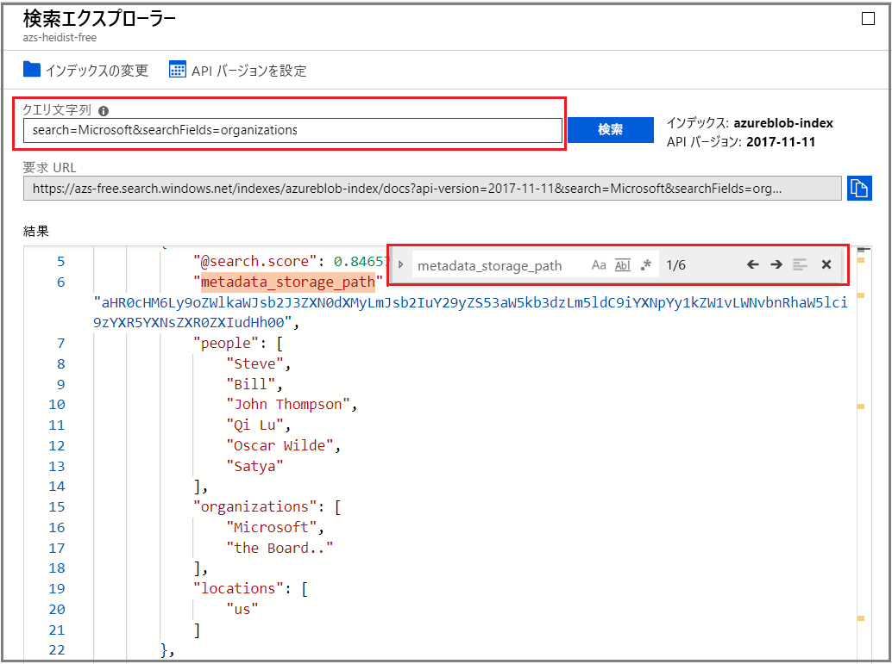

# クイック スタート:Azure Search 内でコグニティブ スキルを使用して AI インデックス作成パイプラインを作成する

Azure Search は [Cognitive Services](https://azure.microsoft.com/services/cognitive-services/) と統合され、コンテンツの抽出、自然言語処理 (NLP)、および画像処理のスキルを Azure Search インデックス作成パイプラインに追加して、検索できないコンテンツや非構造化コンテンツを検索可能にします。 

[OCR](cognitive-search-skill-ocr.md)、[言語検出](cognitive-search-skill-language-detection.md)、[エンティティ認識](cognitive-search-skill-entity-recognition.md)など、多くの Cognitive Services リソースをインデックス作成プロセスにアタッチすることができます。 Cognitive Services の AI アルゴリズムは、ソース データ内のパターン、機能、特性の検索に使用され、Azure Search に基づくフルテキスト検索ソリューション内で使用できる構造とテキスト コンテンツを返します。

このクイック スタートでは、1 行のコードを記述する前に、[Azure portal](https://portal.azure.com) 上で最初のエンリッチメント パイプラインを作成します。

> [!div class="checklist"]
> * Azure Blob Storage のサンプル データから始める
> * [**データのインポート**](search-import-data-portal.md) ウィザードをコグニティブのインデックス作成とエンリッチメント用に構成する 
> * ウィザードを実行する (エンティティ スキルで人、場所、および組織を検出する)
> * [**検索エクスプローラー**](search-explorer.md)を使って、エンリッチされたデータのクエリを実行する

このクイック スタートは無料のサービスで実行されますが、無料のトランザクションの数は 1 日あたり 20 のドキュメントまでに制限されます。 このクイックスタートを 1 日に複数回実行する場合は、より小さなファイル セットを使用して、より多くの実行が制限内に収まるようにします。

> [!NOTE]
> 処理の頻度を増やしたり、ドキュメントを追加したり、AI アルゴリズムを追加したりすることによってスコープを拡大する場合は、[請求対象の Cognitive Services リソースをアタッチする](cognitive-search-attach-cognitive-services.md)必要があります。 Cognitive Services の API を呼び出すとき、および Azure Search のドキュメントクラッキング段階の一部として画像抽出するときに、料金が発生します。 ドキュメントからのテキストの抽出には、料金はかかりません。
>
> 組み込みスキルの実行は、既存の [Cognitive Services の従量課金制の価格](https://azure.microsoft.com/pricing/details/cognitive-services/)で課金されます。 画像抽出の価格は、[Azure Search の価格のページ](https://go.microsoft.com/fwlink/?linkid=2042400)で説明されています。

Azure サブスクリプションをお持ちでない場合は、開始する前に [無料アカウント](https://azure.microsoft.com/free/?WT.mc_id=A261C142F) を作成してください。

## 前提条件

[Azure Search サービスを作成](search-create-service-portal.md)するか、現在のサブスクリプションから[既存のサービスを見つけます](https://ms.portal.azure.com/#blade/HubsExtension/BrowseResourceBlade/resourceType/Microsoft.Search%2FsearchServices)。 このクイック スタート用には、無料のサービスを使用できます。

[Cognitive Services](https://azure.microsoft.com/services/cognitive-services/) では、AI が提供されます。 このクイック スタートには、パイプラインを指定するときにこれらのリソースをインラインで追加するための手順が含まれています。 アカウントを事前に設定する必要はありません。

インデックス作成パイプラインへの入力を提供するために、Azure サービスが必要です。 AI インデックス作成でサポートされていない Azure Table Storage を除き、[Azure Search インデクサー](search-indexer-overview.md)でサポートされている任意のデータ ソースを使用できます。 このクイック スタートでは、ソース データ ファイルのコンテナーとして、[Azure BLOB ストレージ](https://azure.microsoft.com/services/storage/blobs/)を使用します。 

### Azure BLOB サービスを設定し、サンプル データを読み込む

1. さまざまなタイプの小さいファイル セットで構成されている[サンプル データをダウンロード](https://1drv.ms/f/s!As7Oy81M_gVPa-LCb5lC_3hbS-4)します。 

1. [Azure Blob Storage にサインアップ](https://docs.microsoft.com/azure/storage/common/storage-quickstart-create-account?tabs=azure-portal)してストレージ アカウントを作成します。BLOB サービス ページを開き、コンテナーを作成します。  ストレージ アカウントは、Azure Search と同じリージョンに作成します。

1. 作成したコンテナーで、 **[アップロード]** をクリックし、前の手順でダウンロードしたサンプル ファイルをアップロードします。

   

## エンリッチメント パイプラインを作成する

Azure Search サービスのダッシュボード ページに戻り、コマンド バーの **[データのインポート]** をクリックして、4 つの手順でコグニティブ エンリッチメントを設定します。

  ![[データのインポート] コマンド](media/cognitive-search-quickstart-blob/import-data-cmd2.png)

### 手順 1:データ ソースを作成する

**[データへの接続]** で、 **[Azure Blob Storage]** を選択し、作成したアカウントとコンテナーを選択します。 データ ソースの名前を指定し、残りの部分には既定値を使用します。 

  

次のページに進みます。

  

### 手順 2:コグニティブ スキルを追加する

次に、エンリッチメント ステップをインデックス作成パイプラインに追加します。 Cognitive Services リソースがない場合、毎日 20 トランザクションが提供される無料版にサインアップできます。 サンプル データは 14 ファイルで構成されるので、このウィザードの実行後は 1 日分の割り当てのほとんどが使用されます。

1. **[Cognitive Services をアタッチする]** を展開して、Cognitive Services APIs のリソース割り当てのオプションを表示します。 このチュートリアルの目的には、 **[Free]** リソースを使用できます。

   

2. **[エンリッチメントの追加]** を展開し、自然言語処理を実行するスキルを選択します。 このクイックスタートでは、人、組織、および場所のエンティティの認識を選択します。

   

   ポータルでは、OCR 処理とテキスト分析用の組み込みスキルが提供されます。 Portal では、スキルセットは 1 つのソース フィールドで動作します。 それは小さいターゲットのように見えることもありますが、Azure BLOB の場合は `content` フィールドにほとんどの BLOB ドキュメント (たとえば、Word 文書または PowerPoint デッキ) が含まれています。 そのため、BLOB のすべてのコンテンツがここにあるため、このフィールドは理想的な入力です。

3. 次のページに進みます。

   

> [!NOTE]
> 自然言語処理スキルは、サンプルのデータ セット内のテキスト コンテンツで動作します。 OCR オプションは選択していないので、サンプルのデータ セット内にある JPEG および PNG ファイルはこのクイック スタートでは処理されません。 

### 手順 3:インデックスの構成

通常、ウィザードでは既定のインデックスを推測できます。 この手順では、生成されたインデックス スキーマを表示し、必要に応じて任意の設定を変更できます。 以下は、デモの BLOB データ セット用に作成された既定のインデックスです。

このクイックスタートでは、ウィザードによって妥当な既定値が適切に設定されます。 

+ 既定の名前は、データ ソースの種類に基づいて *azureblob-index* となります。 

+ 既定のフィールドは、元のソース データ フィールド (`content`) に加え、コグニティブ パイプラインによって作成された出力フィールド (`people`、`organizations`、`locations`) に基づきます。 既定のデータ型は、メタデータとデータのサンプリングから推定されます。

+ 既定のキーは *metadata_storage_path* です (このフィールドには、一意の値が含まれています)。

+ これらのフィールドの既定の属性は **Retrievable** と **Searchable** です。 **[検索可能]** は、フィールドが検索可能であることを示します。 **[取得可能]** は、結果で返すことができることを意味します。 これらのフィールドはスキルセットを介して作成されていることから、取得可能かつ検索可能にするのがユーザーの意図であると見なされます。

  

`content` フィールドの近くにある **[取得可能]** 属性の取り消し線と疑問符に注目してください。 テキスト量の多い BLOB ドキュメントでは、`content` フィールドにファイルの大部分が格納され、それは数千行にも及ぶ可能性があります。 ファイルの内容をクライアント コードに渡す必要がある場合は必ず、 **[取得可能]** をオンにしておいてください。 それ以外の場合、抽出された要素 (`people`、`organizations`、`locations`) さえあれば目的上問題がなければ、この `content` の属性はオフにすることを検討してください。

フィールドを **[取得可能]** としてマークしたからといって、このフィールドが検索結果に "*必ず*" 存在するという意味ではありません。 検索結果の構成は、対象となるフィールドを **$select** クエリ パラメーターを使用して指定することにより、厳密に制御することができます。 テキスト量の多いフィールド (`content` など) には、 **$select** パラメーターが役立ちます。アプリケーションのユーザーには扱いやすい検索結果を提供しつつ、クライアント コードからは必要なすべての情報にアクセスできる状態を **[取得可能]** 属性で確保できます。
  
次のページに進みます。

  

### 手順 4:インデクサーを構成する

インデクサーは、インデックス作成プロセスを開始する高度なリソースです。 これは、データ ソース名、ターゲット インデックス、および実行の頻度を指定します。 **データのインポート** ウィザードの最終的な結果は常に、繰り返し実行できるインデクサーです。

**[インデクサー]** ページで、既定の名前を受け入れ、 **[一度だけ実行する ]** スケジュール オプションを使用して即時にこれを実行できます。 

  

**[送信]** をクリックして、インデクサーを作成し、同時に実行します。

## インデックス作成の監視

エンリッチメント手順は、一般的なテキストベースのインデックス作成よりも完了までに時間がかかります。 進行状況を追跡できるように、ウィザードの [概要] ページにインデクサーの一覧が開きます。 自己ナビゲーションを行うには、[概要] ページに移動し、 **[インデクサー]** をクリックします。

JPG および PNG ファイルはイメージ ファイルであり、このパイプラインからは OCR スキルを省略したので、警告が発生します。 切り捨ての通知が表示されることもあります。 Free レベルの Azure Search では、抽出が 32,000 文字に制限されます。

  

インデックス作成とエンリッチメントには時間がかかることがあるため、初期の探索には小さいデータ セットが推奨されます。 

## Search エクスプローラーでクエリを実行する

インデックスを作成した後は、クエリを送信して、インデックスからドキュメントを返すことができます。 Portal で、**Search エクスプローラー**を使用してクエリを実行し、結果を表示します。 

1. Search サービスのダッシュボード ページで、コマンド バーの **[Search エクスプローラー]** をクリックします。

1. 一番上にある **[インデックスの変更]** を選択して、作成したインデックスを選択します。

1. インデックスのクエリを実行する検索文字列 (`search=Microsoft&searchFields=organizations` など) を入力します。

結果は JSON で返されます。これは、Azure BLOB から送信された大きいドキュメントでは特に、詳細で読み取りにくい場合があります。 簡単に結果に目を通すことができない場合は、CTRL + F キーを使用してドキュメント内で検索します。 このクエリでは、特定の用語を JSON 内で検索できます。 

CTRL + F キーでは、特定の結果セット内のドキュメントの数を確認することもできます。 Azure BLOB の場合は、各値がドキュメントごとに一意であるため、Portal でキーとして "metadata_storage_path" が選択されます。 ドキュメントの数を取得するには、CTRL + F キーを使用して "metadata_storage_path" を検索します。 

  

## 重要なポイント

これで、最初のコグニティブ エンリッチされたインデックス作成の演習が完了しました。 このクイックスタートの目的は、重要な概念について紹介し、ウィザードについて説明して、独自のデータを使用したコグニティブ検索ソリューションのプロトタイプを短時間で作成できるようにすることでした。

習得していただきたい主な概念には、Azure データ ソースの依存関係が含まれます。 コグニティブ検索エンリッチメントは、インデクサーにバインドされ、インデクサーに Azure とソースに固有です。 このクイックスタートでは Azure Blob Storage を使用していますが、他の Azure データ ソースも使用可能です。 詳細については、「[Azure Search のインデクサー](search-indexer-overview.md)」をご覧ください。

もう 1 つの重要な概念は、スキルが入力フィールドで動作することです。 Portal では、すべてのスキル用に 1 つのソース フィールドを選択する必要があります。 コードでは、入力は、その他のフィールドであることも、アップストリーム スキルの出力であることもあります。

 スキルへの入力は、インデックス内の出力フィールドにマップされます。 内部的には、Portal が[注釈](cognitive-search-concept-annotations-syntax.md)を設定し、[スキルセット](cognitive-search-defining-skillset.md)を定義して、操作と一般的なフローの順序を確立します。 これらの手順は Portal には表示されませんが、コードの記述を開始するときは、これらの概念が重要になります。

最後に、結果はインデックスのクエリを実行することで表示されることを学習しました。 最終的に、Azure Search が提供するものは、[単純](https://docs.microsoft.com/rest/api/searchservice/simple-query-syntax-in-azure-search)または[完全に拡張されたクエリ構文](https://docs.microsoft.com/rest/api/searchservice/lucene-query-syntax-in-azure-search)のいずれかを使用してクエリを実行できる、検索可能なインデックスです。 エンリッチされたフィールドを含むインデックスは、他のフィールドと同様です。 標準または[カスタム アナライザー](search-analyzers.md)、[スコアリング プロファイル](https://docs.microsoft.com/rest/api/searchservice/add-scoring-profiles-to-a-search-index)、[シノニム](search-synonyms.md)、[ファセット フィルター](search-filters-facets.md)、地理空間検索、またはその他の Azure Search 機能を組み込みたい場合は、確実に実行できます。

## クリーンアップ

独自のサブスクリプションを使用している場合は、プロジェクトの最後に、作成したリソースがまだ必要かどうかを確認してください。 リソースを実行したままにすると、お金がかかる場合があります。 リソースは個別に削除することも、リソース グループを削除してリソースのセット全体を削除することもできます。

ポータルの左側のナビゲーション ウィンドウにある **[すべてのリソース]** または **[リソース グループ]** リンクを使って、リソースを検索および管理できます。

無料サービスを使っている場合は、3 つのインデックス、インデクサー、およびデータソースに制限されることに注意してください。 ポータルで個別の項目を削除して、制限を超えないようにすることができます。 

## 次の手順

Cognitive Services リソースをプロビジョニングした方法に応じて、スキルとソース データ フィールドを使ってウィザードを再実行して、インデックス作成とエンリッチメントを試してみることができます。 この手順を繰り返すには、インデックスとインデクサーを削除してから、選択項目の新しい組み合わせでインデクサーを再作成します。

+ **[概要]**  >  **[インデックス]** で、作成したインデックスを選択し、 **[削除]** をクリックします。

+ **[概要]** で、 **[インデクサー]** タイルをダブルクリックします。 作成したインデクサーを見つけて、削除します。

または、サンプル データと作成したサービスを再利用し、次のチュートリアルで、同じタスクをプログラムで実行する方法について学習します。 

> [!div class="nextstepaction"]
> [チュートリアル:コグニティブ検索 REST API について学習する](cognitive-search-tutorial-blob.md)
