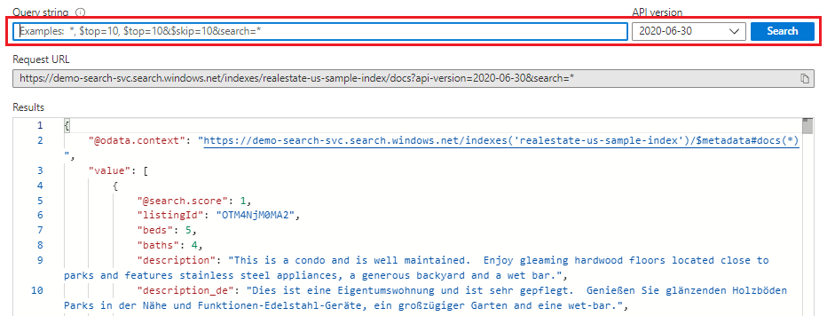
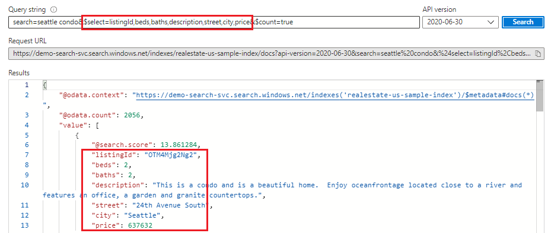
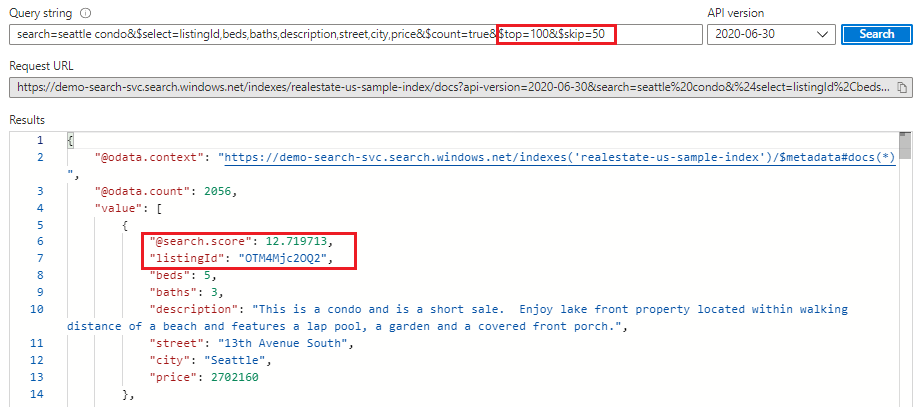

# <a name="search-explorer-for-querying-data-in-azure-search"></a>Azure Search でデータを問い合わせるための Search エクスプローラー 

この記事では、Azure Portal で **Search エクスプローラー**を使用して、既存の Azure Search インデックスのクエリを実行する方法について説明します。 Search エクスプローラーを使用すると、サービス内の既存のインデックスに対して単純または完全な Lucene クエリ文字列を送信できます。 

   ![ポータルの [Search エクスプローラー] コマンド](./media/search-explorer/search-explorer-cmd2.png "ポータルの [Search エクスプローラー] コマンド")


作業を開始する際にガイドが必要な場合は、「[Search エクスプローラーの起動方法](#start-search-explorer)」を参照してください。

## <a name="basic-search-strings"></a>基本的な検索文字列

以下の例では、組み込みの不動産サンプル インデックスを前提としています。 このインデックスの作成については、「[クイック スタート: Azure portal でのインポート、インデックス付け、クエリに関するクイック スタート](search-get-started-portal.md)を参照してください。

### <a name="example-1---empty-search"></a>例 1 - 空の検索

まずは内容を見るために、語句を指定せずに **[検索]** をクリックして空の検索を実行します。 空の検索は最初のクエリとして役に立ちます。ドキュメント全体が返されるので、ドキュメントの構成を確認できるからです。 空の検索では検索順位がなく、ドキュメントが任意の順序で返されます (すべてのドキュメントで `"@search.score": 1`)。 既定では、50 個のドキュメントが検索要求で返されます。

空の検索に相当する構文は `*` または `search=*` です。

   ```Input
   search=*
   ```

   **結果**
   
   

### <a name="example-2---free-text-search"></a>例 2 - フリー テキスト検索

自由形式のクエリは、演算子の有無に関係なく、カスタム アプリから Azure Search に送信されるユーザー定義のクエリをシミュレートするのに便利です。 クエリ語句または式を指定すると検索順位が機能することに注目してください。 次にフリー テキスト検索の例を示します。

   ```Input
   Seattle apartment "Lake Washington" miele OR thermador appliance
   ```

   **結果**

   CTRL + F キーを使用して、関心のある特定の語句を結果内で検索できます。

   

### <a name="example-3---count-of-matching-documents"></a>例 3 - 一致するドキュメントのカウント 

**$count** を追加して、インデックスで見つかった一致の数を取得します。 空の検索では、カウントはインデックス内のドキュメントの合計数です。 修飾された検索では、これはクエリ入力と一致するドキュメントの数です。

   ```Input1
   $count=true
   ```
   **結果**

   

### <a name="example-4---restrict-fields-in-search-results"></a>例 4 - 検索結果のフィールドを制限する

**Search エクスプローラー**で出力を読みやすくするために、**$select** を追加して、明示的に指定されたフィールドに結果を制限します。 検索文字列と **$count=true** を維持するには、引数の前に **&** を付けます。 

   ```Input
   search=seattle condo&$select=listingId,beds,baths,description,street,city,price&$count=true
   ```

   **結果**

   

### <a name="example-5---return-next-batch-of-results"></a>例 5 - 結果の次のバッチを返す

Azure Search は、検索順位に基づいて上位 50 の一致を返します。 一致するドキュメントの次のセットを取得するには、「**$top=100,&$skip=50**」を追加して、結果セットを 100 個のドキュメントに増やし (既定値は 50、最大は 1,000)、最初の 50 個のドキュメントをスキップします。 順位付けされた結果を取得するには、クエリ語句や式など、検索条件を指定する必要があることを思い出してください。 取得する検索結果が低位になるほど検索スコアが減少することに注目してください。

   ```Input
   search=seattle condo&$select=listingId,beds,baths,description,street,city,price&$count=true&$top=100,&$skip=50
   ```

   **結果**

   

## <a name="filter-expressions-greater-than-less-than-equal-to"></a>フィルター式 (より大きい、より小さい、等しい)

フリー テキスト検索ではなく正確な条件を指定したい場合は **$filter** パラメーターを使用します。 この例では、`search=seattle condo&$filter=beds gt 3&$count=true` を使用して 3 より大きいベッドルームを検索します。

   

## <a name="order-by-expressions"></a>orderby 式

**$orderby** を追加して、検索スコアに加えて別のフィールドを基準に結果を並べ替えます。 これをテストするために使用できる式の例は、`search=seattle condo&$select=listingId,beds,price&$filter=beds gt 3&$count=true&$orderby=price asc` です。

   

**$filter** 式と **$orderby** 式はどちらも OData 構文です。 詳細については、[フィルターの OData 構文](https://docs.microsoft.com/rest/api/searchservice/odata-expression-syntax-for-azure-search)に関するページを参照してください。

<a name="start-search-explorer"></a>

## <a name="how-to-start-search-explorer"></a>Search エクスプローラーの起動方法

1. [Azure portal](https://portal.azure.com) でダッシュボードから検索サービス ページを開くか、サービスの一覧で[ご自分のサービスを見つけ](https://ms.portal.azure.com/#blade/HubsExtension/BrowseResourceBlade/resourceType/Microsoft.Search%2FsearchServices)ます。

2. サービスの概要ページで、**[Search エクスプローラー]** をクリックします。

   ![ポータルの [Search エクスプローラー] コマンド](./media/search-explorer/search-explorer-cmd2.png "ポータルの [Search エクスプローラー] コマンド")

3. クエリを実行するインデックスを選択します。

   

4. 必要に応じて、API バージョンを設定します。 既定では現在一般提供されている API バージョンが選択されますが、使用したい構文がバージョン固有である場合はプレビューまたは以前の API を選択できます。

5. インデックスと API バージョンを選択したら、検索語句または完全修飾クエリ式を検索バーに入力し、**[検索]** をクリックして実行します。

   ![検索語句の入力と [検索] のクリック](./media/search-explorer/search-explorer-query-string-example.png "検索語句の入力と [検索] のクリック")

**Search エクスプローラー**での検索のヒント:

+ 結果は詳細な JSON ドキュメントとして返されます。そのため、ドキュメントの構成と内容を完全に確認できます。 例で示されているように、クエリ式を使用して、返されるフィールドを制限できます。

+ ドキュメントは、インデックスで**取得可能**としてマークされているすべてのフィールドで構成されます。 ポータルでインデックスの属性を確認するには、検索の概要ページの **[インデックス]** 一覧で *realestate-us-sample* をクリックします。

+ 商用 Web ブラウザーで入力することがあるような自由形式のクエリは、エンドユーザーのエクスペリエンスをテストするのに便利です。 たとえば、組み込みの不動産サンプル インデックスがあるとしたら、「Seattle apartments lake washington」と入力できます。そして、CTRL + F キーを使用して検索結果内で語句を見つけることができます。 

+ クエリ式とフィルター式は、Azure Search でサポートされている構文で明記される必要があります。 既定値は[単純な構文](https://docs.microsoft.com/rest/api/searchservice/simple-query-syntax-in-azure-search)です。しかし、必要に応じて[完全な Lucene](https://docs.microsoft.com/rest/api/searchservice/lucene-query-syntax-in-azure-search) を使用し、より強力なクエリを実行できます。 [フィルター式](https://docs.microsoft.com/rest/api/searchservice/odata-expression-syntax-for-azure-search)は OData 構文です。


## <a name="next-steps"></a>次の手順

クエリ構文のその他の情報や例については、次のリソースを参照してください。

 + [単純なクエリ構文](https://docs.microsoft.com/rest/api/searchservice/simple-query-syntax-in-azure-search) 
 + [Lucene クエリ構文](https://docs.microsoft.com/rest/api/searchservice/lucene-query-syntax-in-azure-search) 
 + [Lucene クエリ例](search-query-lucene-examples.md) 
 + [OData フィルター式の構文](https://docs.microsoft.com/rest/api/searchservice/odata-expression-syntax-for-azure-search) 