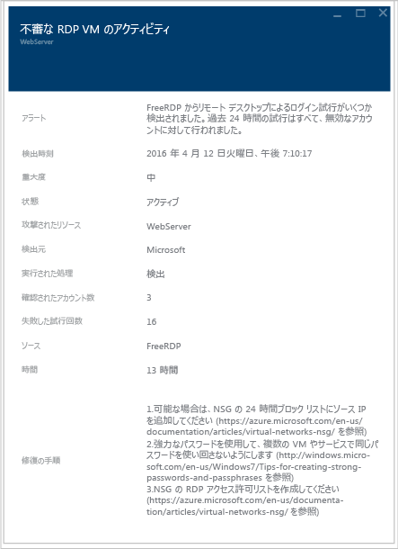

# Azure Security Center 計画および運用ガイド
このガイドは、所属組織が Azure Security Center の使用を計画している情報技術 (IT) プロフェッショナル、IT アーキテクト、情報セキュリティ アナリスト、クラウド管理者を対象としています。

## 計画ガイド
このガイドでは、組織のセキュリティ要件とクラウド管理モデルに応じて Security Center の利用を最適化できる、一連の手順とタスクについて説明します。 Security Center を最大限に活用するには、安全な開発と運用、監視、ガバナンス、インシデント対応のニーズを満たすために、組織内のさまざまな個人やチームがこのサービスをどのように使用するのかを把握することが重要です。 Security Center の使用を計画するうえで考慮が必要となる主な領域は次のとおりです。

* セキュリティ ロールとアクセス制御
* セキュリティ ポリシーと推奨事項
* データの収集と保存
* Azure 以外のリソースのオンボード
* 継続的なセキュリティの監視
* インシデント対応

次のセクションでは、これらの領域のそれぞれについて計画し、自社の要件に合わせて推奨事項を適用する方法について説明します。

> [!NOTE]
> 「 [Azure Security Center のよく寄せられる質問 (FAQ)](security-center-faq.md) 」に、設計と計画のフェーズにも役立つ一般的な質問の一覧が記載されています。
>

## セキュリティ ロールとアクセス制御
組織の規模と構造によっては、複数の個人やチームが Security Center を使用して、セキュリティ関連のさまざまなタスクを実行する場合があります。 次の図には、架空の人物のほか、それぞれの役割とセキュリティ責任が例として挙げられています。

Security Center を使用すると、上記のようなさまざまな責任を果たすことができます。 例:

**Jeff (ワークロード所有者)**

* クラウド ワークロードとその関連リソースを管理する
* 会社のセキュリティ ポリシーに従って保護を実装、管理する責任を負う

**Ellen (CISO/CIO)**

* 会社のセキュリティに関して全面的な責任を負う
* クラウド ワークロード全般について会社のセキュリティ体制を把握したいと考えている
* 主な攻撃とリスクを把握している必要がある

**David (IT セキュリティ担当者)**

* 適切な保護が実施されるように、会社のセキュリティ ポリシーを設定する
* ポリシーを使用してコンプライアンスを監視する
* リーダーまたは監査担当者向けのレポートを作成する

**Judy (セキュリティ運用担当者)**

* 24 時間 365 日監視を行い、セキュリティ アラートに対応する
* クラウド ワークロード所有者または IT セキュリティ アナリストに報告を行う

**Sam (セキュリティ アナリスト)**

* 攻撃を調査する
* クラウド ワークロード所有者と連携して修復を実施する

Security Center では[ロールベースのアクセス制御 (RBAC)](../role-based-access-control/role-assignments-portal.md) が使用されています。RBAC が提供する[組み込みのロール](../role-based-access-control/built-in-roles.md)は、Azure でユーザー、グループ、サービスに割り当てることができます。 ユーザーが Security Center を開くと、アクセス権のあるリソースに関する情報のみが表示されます。 これは、サブスクリプションまたはリソースが属するリソース グループについて、所有者、共同作業者、閲覧者のいずれかのロールがユーザーに割り当てられていることを意味します。 これらのロールに加え、Security Center には、次の 2 つの固有のロールがあります。

- **セキュリティ閲覧者**: このロールに属しているユーザーは、Security Center の構成 (推奨事項、アラート、ポリシー、正常性を含む) のみを閲覧できますが、変更を加えることはできません。
- **セキュリティ管理者**: セキュリティ閲覧者と同じですが、セキュリティ ポリシーの更新と、推奨事項とアラートの解除を実行することもできます。

上記で説明した Security Center のロールには、ストレージ、Web とモバイル、モノのインターネットなどの Azure の他のサービス領域へのアクセス権はありません。  

前の図で説明した人物の例では、次の RBAC が必要になります。

**Jeff (ワークロード所有者)**

* リソース グループの所有者/共同作成者

**David (IT セキュリティ担当者)**

* サブスクリプションの所有者/共同作成者またはセキュリティ管理者

**Judy (セキュリティ運用担当者)**

* サブスクリプションの閲覧者またはセキュリティ閲覧者 (アラートを表示する場合)
* サブスクリプションの所有者/共同作成者またはセキュリティ管理者 (アラートを解除する場合は必須)

**Sam (セキュリティ アナリスト)**

* サブスクリプションの閲覧者 (アラートを表示する場合)
* サブスクリプションの所有者/共同作成者 (アラートを解除する場合は必須)
* ワークスペースへのアクセスが必要な場合がある

上記に加えて、次の点を考慮する必要があります。

* セキュリティ ポリシーを編集できるのは、サブスクリプションの所有者/共同作成者とセキュリティ管理者のみです。
* セキュリティに関する推奨事項をリソースに適用できるのは、サブスクリプションとリソース グループの所有者と共同作成者のみです。

Security Center の RBAC を使用してアクセス制御を計画する際は、組織内のどのユーザーが Security Center を使用するのかを必ず把握してください。 また、実行されるタスクの種類を把握し、それに応じて RBAC を構成してください。

> [!NOTE]
> タスクを実行するために必要となる最小限の権限ロールをユーザーに割り当てることをお勧めします。 たとえば、リソースのセキュリティ状態に関する情報の表示のみが必要で、推奨事項の適用やポリシーの編集などの操作を行う必要がないユーザーには、閲覧者ロールを割り当てます。
>
>

## セキュリティ ポリシーと推奨事項
セキュリティ ポリシーは、ワークロードの必要な構成を定義し、会社や規制のセキュリティ要件に確実に準拠できるようにします。 Security Center では、Azure サブスクリプションのポリシーを定義できます。これらのポリシーは、ワークロードの種類やデータの機密性に合わせて調整できます。

Security Center のポリシーには、次のコンポーネントが含まれています。
- [データ収集](https://docs.microsoft.com/azure/security-center/security-center-enable-data-collection): エージェントのプロビジョニングとデータ収集の設定。
- [セキュリティ ポリシー](https://docs.microsoft.com/azure/security-center/security-center-policies): Security Center で監視および推奨されるコントロールを決定する [Azure Policy](../governance/policy/overview.md)。または、Azure Policy を使用して、新しい定義の作成、追加ポリシーの定義、管理グループ間でのポリシーの割り当てを行います。
- [電子メール通知](https://docs.microsoft.com/azure/security-center/security-center-provide-security-contact-details): セキュリティ連絡先と通知設定。
- [価格レベル](https://docs.microsoft.com/azure/security-center/security-center-pricing): Free または Standard の価格の選択。これにより、(サブスクリプション、リソース グループ、ワークスペースに指定できる) スコープ内のリソースに使用できる Security Center の機能が決まります。

> [!NOTE]
> セキュリティ コントラクトを指定すると、セキュリティ インシデントが発生した場合に Azure から組織内の適切な人物に連絡が届くようになります。 この推奨事項を有効にする方法の詳細については、「 [Azure Security Center でセキュリティ連絡先の詳細情報を指定する](https://docs.microsoft.com/azure/security-center/security-center-provide-security-contact-details) 」を参照してください。

### セキュリティ ポリシーの定義と推奨事項
Security Center では、Azure サブスクリプションごとに自動で既定のセキュリティ ポリシーが作成されます。 そのポリシーを Security Center で編集するか、Azure Policy を使って新しい定義を作成したり、追加のポリシーを定義したり、管理グループ (組織全体のこともあれば、その中の一部署などのこともあります) にポリシーを割り当てたりすることによって、複数のスコープにわたってポリシーに対するコンプライアンスを監視することができます。

セキュリティ ポリシーを構成する前に、 [セキュリティに関する推奨事項](https://docs.microsoft.com/azure/security-center/security-center-recommendations)をそれぞれ確認し、対象の各種サブスクリプションとリソース グループに対してこれらのポリシーが適切かどうかを判断します。 セキュリティに関する推奨事項に対処するためにどのような処置を実行する必要があるか、および組織のだれが新しい推奨事項を監視し、必要な手順に行うかを理解しておくことも重要です。

## データの収集と保存
Azure Security Center では、Microsoft Monitoring Agent を使用して、ご自分の仮想マシンからセキュリティ データを収集します。これは、Azure Monitor サービスで使用されるのと同じエージェントです。 このエージェントから[収集されたデータ](https://docs.microsoft.com/azure/security-center/security-center-enable-data-collection)は、Log Analytics ワークスペースに格納されます。

### エージェント

セキュリティ ポリシーで自動プロビジョニングを有効にすると、サポートされているすべての Azure VM と作成される新しい VM に Microsoft Monitoring Agent ([Windows](https://docs.microsoft.com/azure/log-analytics/log-analytics-windows-agents) または [Linux](https://docs.microsoft.com/azure/log-analytics/log-analytics-linux-agents) の場合) がインストールされます。 VM またはコンピューターに Microsoft Monitoring Agent が既にインストールされている場合、Azure Security Center は、現在インストールされているエージェントを活用します。 エージェントのプロセスは、他への影響が少なく設計されているため、VM のパフォーマンスに対する影響もごくわずかです。

Microsoft Monitoring Agent for Windows では、TCP ポート 443 を使用する必要があります。 詳細については、[トラブルシューティングに関する記事](security-center-troubleshooting-guide.md)を参照してください。

ある時点で、データ収集を無効にする必要が生じた場合は、セキュリティ ポリシーで無効にすることができます。 ただし、Microsoft Monitoring Agent は他の Azure 管理サービスや監視サービスで使用されている場合があるため、Security Center でデータ収集をオフにしても、このエージェントが自動的にアンインストールされることはありません。 必要な場合は、手動でエージェントをアンインストールできます。

> [!NOTE]
> サポート対象の VM の一覧については、「[Azure Security Center のよく寄せられる質問 (FAQ)](security-center-faq.md)」を参照してください。
>

### ワークスペース

ワークスペースとは、データのコンテナーとして機能する Azure リソースです。 組織のメンバーは、複数のワークスペースを使用して、IT インフラストラクチャの一部またはすべてから収集されるデータのさまざまなセットを管理する場合があります。

(Azure Security Center に代わって) Microsoft Monitoring Agent から収集されたデータは、VM の位置情報を考慮して、Azure サブスクリプションに関連付けられている既存の Log Analytics ワークスペースまたは新規のワークスペースのいずれかに格納されます。

Azure ポータルで、Log Analytics ワークスペースの一覧を参照して表示できます。一覧には、Azure Security Center によって作成されたワークスペースも含まれます。 新しいワークスペースに対して、関連するリソース グループが作成されます。 それらは、次の名前付け規則に従います。

* ワークスペース:*DefaultWorkspace-[subscription-ID]-[geo]*
* リソース グループ:*DefaultResourceGroup-[geo]*

Azure Security Center によって作成されたワークスペースでは、データは 30 日間保持されます。 既存のワークスペースでは、リテンション期間は、ワークスペースの価格レベルに基づきます。 必要に応じて、既存のワークスペースを使用することもできます。

> [!NOTE]
> このデータのプライバシーとセキュリティは強固に保護されています。 Microsoft ではコーディングからサービスの運用まで、厳密なコンプライアンスとセキュリティのガイドラインに準拠しています。 データの取い扱いとプライバシーに関する詳細については、「[Azure Security Center のデータ セキュリティ](security-center-data-security.md)」を参照してください。
>

## Azure 以外のリソースのオンボード

Security Center では、Azure 以外のコンピューターのセキュリティの状況を監視できますが、これらのリソースをオンボードしておく必要があります。 Azure 以外のリソースをオンボードする方法の詳細については、[セキュリティ強化のための Azure Security Center Standard へのオンボード](https://docs.microsoft.com/azure/security-center/security-center-onboarding#onboard-non-azure-computers)に関するページをご覧ください。

## 継続的なセキュリティの監視
Security Center の初期構成と推奨事項の適用を完了したら、次の手順は Security Center の運用プロセスの検討です。

Security Center の [概要] では、Azure リソースと接続済みの Azure 以外のリソースすべてのセキュリティが統合された 1 つのビューが表示されます。 以下の例は、対処すべき多くの問題を含む環境を示しています。

> [!NOTE]
> Security Center は、通常の運用上の手順には干渉しません。デプロイを受動的に監視し、有効にされたセキュリティ ポリシーに基づいて推奨事項を提供します。

現在の Azure 環境に対して Security Center を使用することを初めて選択する際は、すべての推奨事項を必ず確認してください。 **[推奨事項]** タイルで確認するか、リソース単位 (**コンピューティング**、**ネットワーク**、**ストレージとデータ**、**アプリケーション**) で確認できます。

すべての推奨事項に対処すると、 **[防止策]** セクションの対処済みのリソースがすべて緑色になります。 これで、今後は [リソースのセキュリティ正常性] タイルと [推奨事項] タイルの変化に基づいて対処するだけで済むようになるため、継続的な監視が容易になります。

**[検出]** セクションは事後対応型であり、現在対処中の問題、または過去に発生し、Security Center のコントロールやサード パーティ システムで検出された問題に関するアラートが表示されます。 [セキュリティ アラート] タイルには、各日に発行された脅威検出アラートの数を表す棒グラフと、各重要度カテゴリ (低、中、高) における分布図が表示されます。 セキュリティ アラートの詳細については、「 [Azure Security Center でのセキュリティの警告の管理と対応](security-center-managing-and-responding-alerts.md)」を参照してください。

毎日のセキュリティ操作の一環として、[脅威インテリジェンス](https://docs.microsoft.com/azure/security-center/security-center-threat-intel) オプションにアクセスすることを計画してください。 そこでは、特定のコンピューターがボットネットの一部であるかどうかを特定するなど、環境に対するセキュリティの脅威を特定することができます。

### 新しいリリースや変更されたリソースの監視
ほとんどの Azure 環境は動的で、新しいリソースが日常的に増減されたり、構成や変更が実施されたりします。Security Center を使用すると、これらの新しいリソースのセキュリティ状態を可視化できるようになります。

Azure 環境に新しいリソース (VM、SQL DB) を追加すると、Security Center によって自動的にこれらのリソースが検出され、セキュリティの監視が開始されます。 これには、PaaS の Web ロールと worker ロールも含まれます。 データ収集が [セキュリティ ポリシー](tutorial-security-policy.md)で有効になっている場合は、仮想マシンに対して追加の監視機能が自動的に有効になります。

1. 仮想マシンで、 **[防止]** セクションの **[コンピューティング]** をクリックします。 データの有効化に関する問題または関連する推奨事項があれば、 **[概要]** タブの **[監視の推奨事項]** セクションに表示されます。
2. **[推奨事項]** を表示し、新しいリソースに関してセキュリティ上のリスクが特定されているかどうか、あればどのようなリスクかを確認します。
3. 環境に新しい VM が追加されると、通常は、最初にオペレーティング システムのみがインストールされます。 リソースの所有者は、ある時点で、これらの VM で使用されるアプリをデプロイする必要が生じることがあります。  理想としては、このワークロードの最終的な目的を理解している必要があります。 たとえば、アプリケーション サーバーかもしれません。 新しいこのワークロードの目的に基づき、適切な**セキュリティ ポリシー**を有効にできます。これは、このワークフローの 3 番目の手順です。
4. Azure 環境に新しいリソースを追加すると、 **[セキュリティ アラート]** タイルに新しいアラートが表示される可能性があります。 このタイルに新しいアラートがあるかどうかを絶えず確認し、Security Center の推奨事項に従って対処してください。

既存のリソースの状態を定期的に監視し、セキュリティ リスクの原因となった構成の変更、推奨されたベースラインからのズレ、およびセキュリティ アラートを特定する必要もあります。 出発点となるのは、Security Center のダッシュボードです。 ここで、主に 3 つの領域を定期的に確認します。

1. **[防止]** セクション パネルでは、主要なリソースにすばやくアクセスできます。 コンピューティング、ネットワーク、ストレージとデータ、およびアプリケーションを監視するには、このオプションを使用します。
2. **[推奨事項]** パネルでは、Security Center の推奨事項を確認できます。 継続的な監視の実施中、推奨事項は毎日表示されるわけではありません。これは、Security Center の初回の設定時にすべての推奨事項に対処したためです。 この理由から、このセクションには毎日新しい情報が表示されるとは限らず、必要に応じてアクセスするだけで十分です。
3. **[検出]** セクションは、頻繁に変化するか、ほとんど変化しないかのどちらかになる可能性があります。 セキュリティ アラートを常に確認し、Security Center の推奨事項に従って対処してください。

### アクセスとアプリケーションのセキュリティ強化

セキュリティ操作の一環として、VM へのアクセスを制限する予防措置を採用したり、VM 上で実行されているアプリケーションを制御したりする必要もあります。 Azure VM への受信トラフィックをロックダウンすることで、攻撃にさらされることを減らすと同時に、必要に応じて簡単に VM に接続できるようになります。 VM へのアクセスのセキュリティを強化するには、[Just in Time VM](https://docs.microsoft.com/azure/security-center/security-center-just-in-time) アクセス機能を使用します。

[アダプティブ アプリケーション制御](https://docs.microsoft.com/azure/security-center/security-center-adaptive-application)を使用すると、Azure 内の VM 上でどのアプリケーションを実行できるかを制御するのに役立ちます。これには、さまざまな利点がありますが、たとえば、マルウェアに対する VM のセキュリティ強化に役立ちます。 Security Center は、機械学習によって VM で実行されているプロセスを分析し、この情報を利用することで、お客様がホワイトリスト登録に関する規則を適用するのを支援します。

## インシデント対応
脅威が発生すると、Security Center によって検出され、アラートが生成されます。 組織は新しいセキュリティ アラートの有無を監視し、必要に応じて、詳しい調査や攻撃の修復のための対策を講じる必要があります。 Security Center の検出機能に関する詳細については、「 [Azure Security Center の検出機能](security-center-detection-capabilities.md)」を参照してください。

この記事は実際のインシデント対応プランの作成支援を目的としていないため、インシデント対応の段階のベースとして、クラウド ライフサイクルにおける Microsoft Azure のセキュリティ レスポンスを使用します。 段階は次の図のとおりです。

> [!NOTE]
> 計画の作成については、米国国立標準技術研究所 (NIST) の『 [Computer Security Incident Handling Guide (コンピューター セキュリティ インシデント対応ガイド)](https://nvlpubs.nist.gov/nistpubs/SpecialPublications/NIST.SP.800-61r2.pdf) 』が参考資料としてご利用いただけます。
>

次の段階で、Security Center の警告を使用できます。

* **検出**: 1 つまたは複数のリソースで、疑わしいアクティビティを識別します。
* **評価**: 最初の評価を実行して、疑わしいアクティビティに関する詳細情報を入手します。
* **診断**: 修復手順を使用して技術的な処置を施し、問題に対処します。

各セキュリティ アラートで提供される情報は、攻撃の性質に関する理解を深め、緩和策を提案するために活用できます。 詳細情報へのリンクか Azure 内の他の情報源へのリンクがアラートに記載されている場合もあります。 提供される情報を使用して、さらに検索したり、緩和策を開始したりできます。ワークスペースに格納されているセキュリティ関連のデータを検索することもできます。

次の例は、疑わしい RDP アクティビティの発生を示しています。

このページには、攻撃が発生した時刻、ソース ホスト名、標的となった VM に関する詳細情報のほか、推奨される手順も表示されます。 状況によっては、攻撃元の情報が空白になっていることもあります。 このような動作の詳細については、「 [Missing Source Information in Azure Security Center Alerts (Azure Security Center アラートに表示されないソース情報)](https://blogs.msdn.microsoft.com/azuresecurity/2016/03/25/missing-source-information-in-azure-security-center-alerts/) 」を参照してください。

このページから[調査](https://docs.microsoft.com/azure/security-center/security-center-investigation)を開始すると、攻撃のタイムライン、攻撃がどのように行われたか、どのシステムが侵害された可能性があるか、どの資格情報が使用されたかについて理解を深めると共に、全体的な攻撃の連鎖をグラフィカルに示すこともできます。

侵害されたシステムを特定したら、以前に作成したセキュリティ [プレイブック](https://docs.microsoft.com/azure/security-center/security-center-playbooks)を実行できます。 セキュリティ プレイブックとは、選択したアラートから特定のプレイブックがトリガーされると Security Center から実行できるプロシージャの集合です。

ビデオ「[How to Leverage the Azure Security Center & Microsoft Operations Management Suite for an Incident Response (Azure Security Center と Microsoft Operations Management Suite をインシデント対応に活用する方法)](https://channel9.msdn.com/Blogs/Taste-of-Premier/ToP1703)」では、上記の各段階における Security Center の使用方法を理解するのに役立つデモを、いくつかご覧いただけます。

> [!NOTE]
> インシデント対応に役立つ Security Center 機能を使用する方法の詳細については、「 [Azure Security Center を活用したインシデント対応](security-center-incident-response.md) 」を参照してください。
>
>

## 次の手順
このドキュメントでは、Security Center の導入を計画する方法について説明しました。 セキュリティ センターの詳細については、次を参照してください。

* [Azure セキュリティ センターでのセキュリティの警告の管理と対応](security-center-managing-and-responding-alerts.md)
* [Azure Security Center でのセキュリティ ヘルスの監視](security-center-monitoring.md) 」 -- Azure リソースの正常性を監視する方法について説明しています。
* [Azure Security Center を使用したパートナー ソリューションの監視](security-center-partner-solutions.md) 」 -- パートナー ソリューションの正常性状態を監視する方法について説明しています。
* [Azure Security Center のよく寄せられる質問 (FAQ)](security-center-faq.md) 」 -- このサービスの使用に関してよく寄せられる質問が記載されています。
* [Azure セキュリティ ブログ](https://blogs.msdn.com/b/azuresecurity/) -- Azure のセキュリティとコンプライアンスについてのブログ記事を確認できます。
