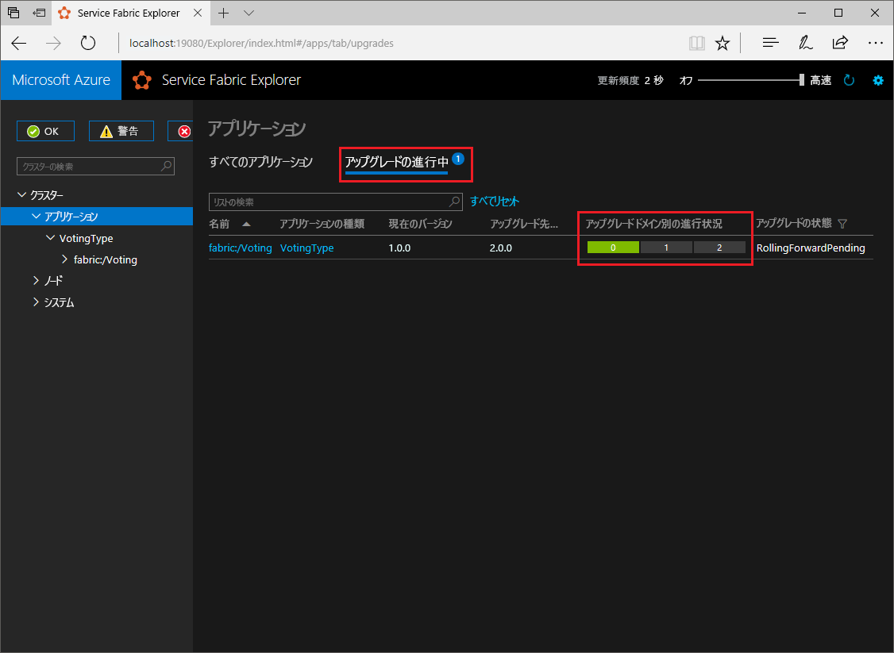

# <a name="quickstart-deploy-a-net-reliable-services-application-to-service-fabric"></a>クイック スタート: Service Fabric に .NET Reliable Services アプリケーションをデプロイする

Azure Service Fabric は、スケーラブルで信頼性に優れたマイクロサービスとコンテナーのデプロイと管理を行うための分散システム プラットフォームです。

このクイック スタートでは、初めての .NET アプリケーションを Service Fabric にデプロイする方法を紹介します。 最後まで読み進めていけば、ASP.NET Core Web フロントエンドからクラスター内のステートフルなバックエンド サービスに投票結果を保存するアプリケーションが完成します。


このアプリケーションを通じて次の方法を説明します。

* .NET と Service Fabric を使用してアプリケーションを作成する
* ASP.NET Core を Web フロントエンドとして使用する
* アプリケーション データをステートフル サービスに保存する
* アプリケーションをローカルでデバッグする
* 複数のノードにアプリケーションをスケールアウトする
* アプリケーションのローリング アップグレードを実行する

## <a name="prerequisites"></a>前提条件

このクイック スタートを完了するには、以下が必要です。

1. **Azure 開発** および **ASP.NET と Web 開発** ワークロードと共に [Visual Studio 2019 をインストール](https://www.visualstudio.com/)する
2. [Git をインストールする](https://git-scm.com/)
3. [Microsoft Azure Service Fabric SDK をインストールする](https://www.microsoft.com/web/handlers/webpi.ashx?command=getinstallerredirect&appid=MicrosoftAzure-ServiceFabric-CoreSDK)
4. 次のコマンドを実行して Visual Studio からローカル Service Fabric クラスターへのデプロイを有効にする

   ```powershell
   Set-ExecutionPolicy -ExecutionPolicy Unrestricted -Force -Scope CurrentUser
   ```
    
## <a name="build-a-cluster"></a>クラスターの構築

ランタイム、SDK、Visual Studio Tools、Docker をインストールし、Docker を実行したら、5 ノードのローカル開発クラスターを作成します。

> [!Note]
> クラスターを作成するときに Docker を実行させておく理由は、コンテナー機能を有効にしてクラスターを作成するためです。 Docker が実行されていない場合は、コンテナー機能を有効にするためにクラスターを再作成する必要があります。
> このクイック スタートでは必要ありませんが、クラスターを作成するときに Docker を実行しておくようにという指示が、ベストプラクティスに含まれています。
> Docker が実行中であるかどうかをテストするには、ターミナル ウィンドウを開いて `docker ps` を実行し、エラーが発生するかどうか確認します。 応答でエラーが表示されない場合は、Docker は実行中になっており、クラスターを構築する準備ができています。
>
> [コンテナー用の Windows 10 または Windows Server をセットアップする](/virtualization/windowscontainers/quick-start/set-up-environment?tabs=Windows-10-Client)

1. 管理者として、管理者特権で新しく PowerShell ウィンドウを開きます。
2. 次の PowerShell コマンドを実行して、開発クラスターを作成します。

   ```powershell
   . "C:\Program Files\Microsoft SDKs\Service Fabric\ClusterSetup\DevClusterSetup.ps1"
   ```
3. 次のコマンドを実行して、ローカル クラスター マネージャー ツールを起動します。

   ```powershell
   . "C:\Program Files\Microsoft SDKs\Service Fabric\Tools\ServiceFabricLocalClusterManager\ServiceFabricLocalClusterManager.exe"
   ```

>[!NOTE]
> このクイックスタートのサンプル アプリケーションは、Windows 7 では使用できない機能を使用します。
>

## <a name="download-the-sample"></a>サンプルのダウンロード

コマンド ウィンドウで、次のコマンドを実行して、サンプル アプリのリポジトリをローカル コンピューターに複製します。

```git
git clone https://github.com/Azure-Samples/service-fabric-dotnet-quickstart
```

## <a name="run-the-application-locally"></a>ローカルでアプリケーションを実行する

スタート メニューで Visual Studio アイコンを右クリックし、**[管理者として実行]** を選択します。 サービスにデバッガーをアタッチするには、Visual Studio を管理者として実行する必要があります。

複製したリポジトリから Visual Studio ソリューション **Voting.sln** を開きます。

既定では、この投票アプリケーションは、ポート 8080 でリッスンします。  アプリケーションのポートは、*/VotingWeb/PackageRoot/ServiceManifest.xml* ファイルで設定されます。  アプリケーションのポートは、**Endpoint** 要素の **Port** 属性を更新することで変更できます。  アプリケーションをローカルでデプロイして実行するには、アプリケーションのポートをコンピューター上で開いて、使用できるようにする必要があります。  アプリケーションのポートを変更する場合は、この記事全体で "8080" をアプリケーションのポートの新しい値に置き換えてください。

アプリケーションをデプロイするには、**F5** キーを押します。

> [!NOTE]
> Visual Studio の出力ウィンドウでは、"アプリケーション URL が設定されていないか、HTTP/HTTPS URL ではないため、アプリケーションに対してブラウザーは開かれません" というメッセージが表示されます。  このメッセージはエラーを示していませんが、ブラウザーは自動的に起動しません。

デプロイが完了したらブラウザーを起動し、`http://localhost:8080` を開いて、アプリケーションの Web フロントエンドを表示します。


これで一連の投票の選択肢を追加して投票を開始できます。 アプリケーションが実行され、データはすべて Service Fabric クラスターに保存されます。別途データベースを用意する必要はありません。

## <a name="walk-through-the-voting-sample-application"></a>投票のサンプル アプリケーションの概要

この投票アプリケーションは次の 2 つのサービスから成ります。

* Web フロントエンド サービス (VotingWeb) - ASP.NET Core Web フロントエンド サービス。Web ページを表示すると共に、バックエンド サービスとやり取りするための Web API を公開します。
* バックエンド サービス (VotingData) - ASP.NET Core Web サービス。ディスク上に永続化された信頼性の高いディクショナリに投票結果を保存する API を公開します。


アプリケーションで票を投じると、次のイベントが発生します。

1. JavaScript が Web フロントエンド サービスの Web API に HTTP PUT 要求として投票要求を送信します。

2. Web フロントエンド サービスがプロキシを使用して HTTP PUT 要求を検出し、バックエンド サービスに転送します。

3. バックエンド サービスが受信要求を受け取り、更新された結果を信頼性の高いディクショナリに保存すると、それがクラスター内の複数のノードにレプリケートされてディスク上に永続化されます。 アプリケーションのデータはすべてクラスターに保存されるため、データベースは必要ありません。

## <a name="debug-in-visual-studio"></a>Visual Studio でのデバッグ

アプリケーションは正常に実行されているはずですが、デバッガーを使用して、アプリケーションの主要部分がどのように動作しているかを確認することができます。 Visual Studio でアプリケーションをデバッグするときは、ローカルの Service Fabric 開発クラスターを使用します。 デバッグのエクスペリエンスは実際のシナリオに合わせて調整できます。 このアプリケーションでは、データは信頼性の高いディクショナリを使ってバックエンド サービスに保存されます。 既定では、デバッガーを停止すると、Visual Studio によってアプリケーションが削除されます。 アプリケーションが削除されると、バックエンド サービス内のデータも削除されます。 デバッグ セッションの終了後もデータを維持するには、Visual Studio の **Voting** プロジェクトのプロパティで、 **[アプリケーション デバッグ モード]** を変更してください。

コードでどのような処理が実行されているのかを確認するには、次の手順に従います。

1. **/VotingWeb/Controllers/VotesController.cs** ファイルを開き、Web API の **Put** メソッド (69 行目) にブレークポイントを設定します。このファイルは、Visual Studio のソリューション エクスプローラーで検索できます。

2. **/VotingData/Controllers/VoteDataController.cs** ファイルを開き、この Web API の **Put** メソッド (54 行目) にブレークポイントを設定します。

3. ブラウザーに戻り、投票の選択肢をクリックするか、新しい選択肢を追加します。 Web フロントエンドの API コントローラーで 1 つ目のブレークポイントに到達します。
   * このステップは、ブラウザーの JavaScript がフロントエンド サービスの Web API コントローラーに要求を送信する部分です。

     

   * 最初にバックエンド サービスの ReverseProxy の URL を構築します **(1)**。
   * 次に HTTP PUT 要求を ReverseProxy に送信します **(2)** 。
   * 最後にバックエンド サービスからの応答をクライアントに返します **(3)**。

4. **F5** キーを押して続行します。
   - ブラウザーのプロンプトが表示された場合は、デバッグ モードに使用する読み取りと実行のアクセス許可を ServiceFabricAllowedUsers グループに与えます。
   - 今度は、バックエンド サービスのブレークポイントに到達します。

     

   - メソッド **(1)** の先頭行では、`StateManager` によって信頼性の高いディクショナリ (`counts`) が取得または追加されます。
   - 信頼性の高いディクショナリ内の値とのすべてのやり取りにはトランザクションが必要です。この using ステートメント **(2)** によってトランザクションが作成されます。
   - その後、トランザクションで、投票の選択肢に関連したキーの値を更新し、操作をコミットします **(3)**。 コミット メソッドから制御が戻ると、ディクショナリ内のデータが更新され、クラスター内の他のノードにレプリケートされます。 これでデータが安全にクラスターに保存され、バックエンド サービスは、データの可用性を維持したまま他のノードにフェールオーバーすることができます。
5. **F5** キーを押して続行します。

デバッグ セッションを停止するには、**Shift + F5** キーを押します。

## <a name="perform-a-rolling-application-upgrade"></a>アプリケーションのローリング アップグレードを実行する

アプリケーションに対して新しい更新プログラムをデプロイすると、その更新プログラムが Service Fabric によって安全にロールアウトされます。 ローリング アップグレードは、アップグレード中のダウンタイムが発生せず、また万一エラーが発生しても自動的にロールバックされます。

アプリケーションをアップグレードするには、次の手順に従います。

1. Visual Studio で **/VotingWeb/Views/Home/Index.cshtml** ファイルを開きます。
2. テキストを追加または更新して、ページの見出しを変更します。 たとえば、見出しを "Service Fabric Voting Sample v2" に変更します。
3. ファイルを保存します。
4. ソリューション エクスプローラーで **[Voting]** を右クリックして、**[発行]** を選択します。 [発行] ダイアログが表示されます。
5. **[マニフェストのバージョン]** ボタンをクリックしてサービスとアプリケーションのバージョンを変更します。
6. たとえば **VotingWebPkg** の **Code** 要素のバージョンを "2.0.0" に変更し、**[保存]** をクリックします。

    
7. **[Service Fabric アプリケーションの発行]** ダイアログで、**[アプリケーションをアップグレードする] チェック ボックス** をオンにします。
8.  **[ターゲット プロファイル]** を **[PublishProfiles\Local.5Node.xml]** に変更し、**[接続のエンドポイント]** を **[ローカル クラスター]** に設定します。 
9. **[アプリケーションをアップグレードする]** を選択します。

    ![[発行] ダイアログのアップグレード設定](./media/service-fabric-quickstart-dotnet/upgrade-app.png)

10. **[発行]** をクリックします。

    アップグレード中もアプリケーションを使い続けることができます。 クラスターで実行されているサービスのインスタンスは 2 つあるため、アップグレード後のアプリケーションによって処理される要求と、アップグレード前のアプリケーションによって処理される要求が混在する可能性があります。

11. ブラウザーを開いて、クラスターのアドレスにポート 19080 でアクセスします。 たとえば、「 `http://localhost:19080/` 」のように入力します。
12. ツリー ビューの **[Applications]\(アプリケーション\)** ノードをクリックし、右側のペインの **[Upgrades in Progress]\(進行中のアップグレード\)** をクリックします。 アップグレードが、クラスター内のアップグレード ドメインに展開されていくようすが表示されます。個々のドメインが正常であることを確認してから、次の手順に進んでください。 ドメインの正常性が確認されると、進行状況バーのアップグレード ドメインが緑で表示されます。
    

    Service Fabric はアップグレードを安全に行うために、クラスター内の各ノードについて、サービスのアップグレード後、2 分間待ちます。 更新がすべて完了するまでに約 8 分かかります。

## <a name="next-steps"></a>次のステップ

このクイック スタートでは、次の方法について説明しました。

* .NET と Service Fabric を使用してアプリケーションを作成する
* ASP.NET Core を Web フロントエンドとして使用する
* アプリケーション データをステートフル サービスに保存する
* アプリケーションをローカルでデバッグする
* 複数のノードにアプリケーションをスケールアウトする
* アプリケーションのローリング アップグレードを実行する

Service Fabric と .NET の詳細については、次のチュートリアルを参照してください。
> [!div class="nextstepaction"]
> [Service Fabric における .NET アプリケーション](service-fabric-tutorial-create-dotnet-app.md)
