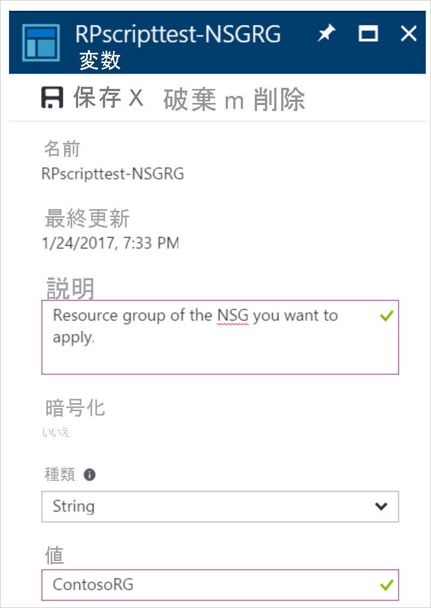

# <a name="add-azure-automation-runbooks-to-recovery-plans"></a>復旧計画に Azure Automation Runbook を追加する

この記事では、[Azure Site Recovery](site-recovery-overview.md) 復旧計画を拡張するために Azure Automation Runbook を統合する方法について説明します。 手動での介入を必要とした基本的なタスクを自動化する方法、および複数の手順の復旧を 1 回のクリックのアクションに変換する方法を示します。

## <a name="recovery-plans"></a>復旧計画 

復旧計画は、オンプレミスのマシンまたは Azure VM をフェールオーバーするときに使用できます。 復旧計画は、マシンのフェールオーバー方法と、フェールオーバー後の起動と復旧の方法を定義する体系的な復旧プロセスを定義するのに役立ちます。 

大規模なアプリの復旧は複雑になる可能性があります。 復旧計画は、復旧を常に正確で、繰り返し可能、さらに自動化されるような順序にするのに役立ちます。 スクリプトと Azure Automation Runbook を使用して、復旧計画内のタスクを自動化できます。 一般的な例としては、フェールオーバー後の Azure VM の設定の構成や、VM 上で実行されているアプリの再構成が挙げられます。

- [こちら](recovery-plan-overview.md) をご覧ください。
- Azure Automation Runbook の詳細については、[こちら](../automation/automation-runbook-types.md)をご覧ください。


## <a name="runbooks-in-recovery-plans"></a>復旧計画内の Runbook

Azure Automation アカウントと Runbook を復旧計画に追加します。 Runbook は、復旧計画の実行時に呼び出されます。

- Automation アカウントは、Azure のいずれのリージョンのものでもかまいません。Site Recovery コンテナーと同じサブスクリプションのものである必要があります。 
- Runbook は、プライマリの場所からセカンダリへのフェールオーバー中、またはセカンダリの場所からプライマリへのフェールバック中に、復旧計画で実行できます。
- 復旧計画の Runbook は、設定された順序で順番に実行されます。
- 復旧計画の Runbook により VM が異なるグループで開始するように構成される場合、すべての VM が実行中であると Azure から報告された場合のみ、復旧計画が続行されます。
- スクリプトが失敗した場合でも、復旧計画は引き続き実行されます。

### <a name="recovery-plan-context"></a>復旧計画のコンテキスト

スクリプトの実行時に、復旧計画のコンテキストが Runbook に挿入されます。 コンテキストには、この表にまとめられた変数が含まれています。

| **[変数名]** | **説明** |
| --- | --- |
| RecoveryPlanName |復旧計画の名前。 名前に基づくアクションで使用されます。 |
| FailoverType |テストまたは運用環境のどちらのフェールオーバーであるかを指定します。 
| FailoverDirection | プライマリまたはセカンダリの場所のどちらへの復旧かを指定します。 |
| GroupID |復旧計画が実行されている場合、その計画内のグループ番号を識別します。 |
| VmMap |グループ内のすべての VM の配列。 |
| VMMap キー |VM ごとの一意キー (GUID)。 |
| SubscriptionId |VM が作成されたときの Azure サブスクリプション ID。 |
| ResourceGroupName | VM が存在するリソース グループの名前。
| CloudServiceName |VM が作成されたときの Azure クラウド サービス名。 |
| RoleName |Azure VM の名前。 |
| RecoveryPointId|VM 復旧のタイムスタンプ。 |

>[!Note]
>変数 "FailoverDirection" の値は、フェールオーバーの場合は "PrimaryToSecondary" に、フェールバックの場合は "SecondaryToPrimary" になります。

次の例は、コンテキスト変数を示しています。

```
{"RecoveryPlanName":"hrweb-recovery",
"FailoverType":"Test",
"FailoverDirection":"PrimaryToSecondary",
"GroupId":"1",
"VmMap":{"7a1069c6-c1d6-49c5-8c5d-33bfce8dd183":
    { "SubscriptionId":"7a1111111-c1d6-49c5-8c5d-111ce8dd183",
    "ResourceGroupName":"ContosoRG",
    "CloudServiceName":"pod02hrweb-Chicago-test",
    "RoleName":"Fabrikam-Hrweb-frontend-test",
    "RecoveryPointId":"TimeStamp"}
    }
}
```

VMMap 内のすべての VM にループでアクセスする場合は、次のコードを使用できます。

```
$VMinfo = $RecoveryPlanContext.VmMap | Get-Member | Where-Object MemberType -EQ NoteProperty | select -ExpandProperty Name
$vmMap = $RecoveryPlanContext.VmMap
    foreach($VMID in $VMinfo)
    {
        $VM = $vmMap.$VMID                
            if( !(($VM -eq $Null) -Or ($VM.ResourceGroupName -eq $Null) -Or ($VM.RoleName -eq $Null))) {
            #this check is to ensure that we skip when some data is not available else it will fail
    Write-output "Resource group name ", $VM.ResourceGroupName
    Write-output "Rolename " = $VM.RoleName
            }
        }
```


[Harvesting Clouds](http://harvestingclouds.com) にある Aman Sharma のブログには、[復旧プラン コンテキスト スクリプト](http://harvestingclouds.com/post/script-sample-azure-automation-runbook-for-asr-recovery-plan/)の便利な例が含まれています。


## <a name="before-you-start"></a>開始する前に

- Azure Automation が初めての場合は、[サインアップ](https://azure.microsoft.com/services/automation/)し、[サンプル スクリプトをダウンロード](https://azure.microsoft.com/documentation/scripts/)できます。
- Automation アカウントに次のモジュールが含まれていることを確認してください。
    - AzureRM.profile
    - AzureRM.Resources
    - AzureRM.Automation
    - AzureRM.Network
    - AzureRM.Compute

    モジュールはすべて、互換性のあるバージョンである必要があります。 最も簡単な方法は、すべてのモジュールの最新バージョンを常に使用することです。


## <a name="customize-the-recovery-plan"></a>復旧計画のカスタマイズ

1. コンテナーで、 **[復旧計画 (Site Recovery)]** を選択します。
2. 復旧計画を作成するには、 **[+Recovery Plan]\(+復旧計画\)** をクリックします。 [詳細については、こちらを参照してください](site-recovery-create-recovery-plans.md)。 復旧計画が既にある場合は、それを選択して開きます。
3. 復旧計画のページで、 **[カスタマイズ]** をクリックします。

    ![[カスタマイズ] ボタンをクリックします。](media/site-recovery-runbook-automation-new/custom-rp.png)

2. **[グループ 1:開始]**  >  **[事後アクションの追加]** の横にある省略記号 (...) をクリックします。
3. **[アクションの挿入]** で、 **[スクリプト]** が選択されていることを確認し、スクリプトの名前 (**Hello World**) を指定します。
4. Automation アカウントを指定し、Runbook を選択します。 スクリプトを保存するには、 **[OK]** をクリックします。 このスクリプトは **[グループ 1: 後の手順]** に追加されます。


## <a name="reuse-a-runbook-script"></a>Runbook スクリプトの再利用

外部変数を使用することによって、複数の復旧計画で 1 つの Runbook スクリプトを使用できます。 

- [Azure Automation 変数 ](../automation/shared-resources/variables.md) を使用して、復旧計画の実行用のパラメーターを格納します。
- この変数へのプレフィックスとして復旧計画名を追加することにより、復旧計画ごとの個別の変数を作成できます。 次に、これらの変数をパラメーターとして使用します。
- スクリプトを変更しなくてもパラメーターを変更できますが、それによってスクリプトの動作が変更されます。

### <a name="use-a-simple-string-variable-in-a-runbook-script"></a>Runbook スクリプトで単純な文字列変数を使用する

この例では、ネットワーク セキュリティ グループ (NSG) の入力がスクリプトで受け取られ、復旧計画の VM に適用されます。 

1. どの復旧計画が実行されているかをスクリプトで検出できるようにするには、次の復旧計画のコンテキストを使用します。

    ```
    workflow AddPublicIPAndNSG {
        param (
              [parameter(Mandatory=$false)]
              [Object]$RecoveryPlanContext
        )

        $RPName = $RecoveryPlanContext.RecoveryPlanName
    ```

2. NSG の名前とリソース グループを書き留めます。 これらの変数は復旧計画スクリプトへの入力として使用します。 
1. Automation アカウント アセット内で、 NSG 名を格納する変数を作成します。 復旧計画の名前を使用して、この変数名にプレフィックスを追加します。

    

2. NSG リソースのリソース グループ名を格納するための変数を作成します。 復旧計画の名前を使用して、この変数名にプレフィックスを追加します。

    


3.  このスクリプトでは、次の参照コードを使用して変数の値を取得します。

    ```
    $NSGValue = $RecoveryPlanContext.RecoveryPlanName + "-NSG"
    $NSGRGValue = $RecoveryPlanContext.RecoveryPlanName + "-NSGRG"

    $NSGnameVar = Get-AutomationVariable -Name $NSGValue
    $RGnameVar = Get-AutomationVariable -Name $NSGRGValue
    ```

4.  この NSG をフェールオーバーされた VM のネットワーク インターフェイスに適用するには、これらの変数を Runbook で使用します。

    ```
    InlineScript {
    if (($Using:NSGname -ne $Null) -And ($Using:NSGRGname -ne $Null)) {
            $NSG = Get-AzureRmNetworkSecurityGroup -Name $Using:NSGname -ResourceGroupName $Using:NSGRGname
            Write-output $NSG.Id
            #Apply the NSG to a network interface
            #$vnet = Get-AzureRmVirtualNetwork -ResourceGroupName TestRG -Name TestVNet
            #Set-AzureRmVirtualNetworkSubnetConfig -VirtualNetwork $vnet -Name FrontEnd `
            #  -AddressPrefix 192.168.1.0/24 -NetworkSecurityGroup $NSG
        }
    }
    ```


このスクリプトを再利用できるように、復旧計画ごとに独立した変数を作成します。 復旧計画名を使用してプレフィックスを追加します。 

このシナリオ用のエンド ツー エンドのスクリプトについては、[こちらのスクリプト](https://gallery.technet.microsoft.com/Add-Public-IP-and-NSG-to-a6bb8fee)を確認してください。


### <a name="use-a-complex-variable-to-store-more-information"></a>複合変数を使用してより多くの情報を格納する

場合によっては、復旧計画ごとに個別の変数を作成できないことがあります。 特定の VM 上でパブリック IP アドレスを割り当てるための 1 つのスクリプトが必要なシナリオを考えてみます。 別のシナリオでは、(すべての VM 上ではなく) さまざまな VM 上で異なる NSG を適用することもできます。 以下の点に注意してください。

- どの復旧計画にも再利用可能なスクリプトを作成できます。
- 各復旧計画には、可変数の VM が存在できます。
- たとえば、SharePoint の復旧には 2 つのフロントエンドがあります。 基本的な基幹業務 (LOB) アプリケーションには 1 つのフロントエンドしかありません。
- このシナリオでは、復旧計画ごとに個別の変数を作成することはできません。

次の例では、Azure Automation アカウント内に[複合変数](/powershell/module/servicemanagement/azure.service/set-azureautomationvariable)を作成します。

これは、Azure PowerShell を使用して複数の値を指定することによって行います。

1. PowerShell で、Azure サブスクリプションにサインインします。

    ```
    Connect-AzureRmAccount
    $sub = Get-AzureRmSubscription -Name <SubscriptionName>
    $sub | Select-AzureRmSubscription
    ```

2. パラメーターを格納するには、復旧計画の名前を使用して複合変数を作成します。

    ```
    $VMDetails = @{"VMGUID"=@{"ResourceGroupName"="RGNameOfNSG";"NSGName"="NameOfNSG"};"VMGUID2"=@{"ResourceGroupName"="RGNameOfNSG";"NSGName"="NameOfNSG"}}
        New-AzureRmAutomationVariable -ResourceGroupName <RG of Automation Account> -AutomationAccountName <AA Name> -Name <RecoveryPlanName> -Value $VMDetails -Encrypted $false
    ```

3. この複合変数では、**VMDetails** は保護された VM の VM ID です。 VM ID を取得するには、Azure Portal でその VM のプロパティを表示します。 次のスクリーンショットは、2 つの VM の詳細を格納する変数を示しています。

    

4. この変数は Runbook で使用します。 示されている VM GUID が復旧計画のコンテキスト内に見つかった場合は、その VM 上で NSG を適用します。

    ```
    $VMDetailsObj = (Get-AutomationVariable -Name $RecoveryPlanContext.RecoveryPlanName).ToObject([hashtable])
    ```

4. Runbook で、復旧計画のコンテキストの各 VM をループ処理します。 この VM が **$VMDetailsObj** 内に存在するかどうかを確認します。 存在する場合は、その変数のプロパティにアクセスして NSG を適用します。

    ```
        $VMinfo = $RecoveryPlanContext.VmMap | Get-Member | Where-Object MemberType -EQ NoteProperty | select -ExpandProperty Name
        $vmMap = $RecoveryPlanContext.VmMap

        foreach($VMID in $VMinfo) {
            $VMDetails = $VMDetailsObj[$VMID].ToObject([hashtable]);
            Write-output $VMDetails
            if ($VMDetails -ne $Null) { #If the VM exists in the context, this will not be Null
                $VM = $vmMap.$VMID
                # Access the properties of the variable
                $NSGname = $VMDetails.NSGName
                $NSGRGname = $VMDetails.NSGResourceGroupName

                # Add code to apply the NSG properties to the VM
            }
        }
    ```

異なる復旧計画に対して同じスクリプトを使用できます。 復旧計画に対応する値を別の変数に格納することによって、異なるパラメーターを入力します。

## <a name="sample-scripts"></a>サンプルのスクリプト

サンプル スクリプトを Automation アカウントにデプロイするには、 **[Azure へのデプロイ]** ボタンをクリックします。

[](https://aka.ms/asr-automationrunbooks-deploy)

このビデオでは、別の例を紹介します。 これは、2 層 WordPress アプリケーションを Azure に復旧する方法を示しています。


> [!VIDEO https://channel9.msdn.com/Series/Azure-Site-Recovery/One-click-failover-of-a-2-tier-WordPress-application-using-Azure-Site-Recovery/player]


## <a name="next-steps"></a>次のステップ

- [Azure Automation の実行アカウント](../automation/manage-runas-account.md)について学習します。
- [Azure Automation サンプル スクリプト](https://gallery.technet.microsoft.com/scriptcenter/site/search?f%5B0%5D.Type=User&f%5B0%5D.Value=SC%20Automation%20Product%20Team&f%5B0%5D.Text=SC%20Automation%20Product%20Team)を確認します。
- フェールオーバーの実行については、[こちら](site-recovery-failover.md)を参照してください。
