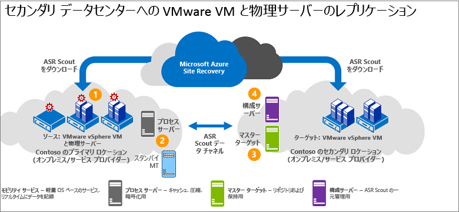

# セカンダリ オンプレミス サイトへの VMware または物理サーバーのレプリケーションのためのアーキテクチャ

この記事では、[Azure Site Recovery](site-recovery-overview.md) を使用して、オンプレミスの VMware 仮想マシン (VM) または Windows/Linux 物理サーバーのセカンダリ VMware サイトに対する、ディザスター リカバリー レプリケーション、フェールオーバーおよび復旧を設定するときに使われるアーキテクチャとプロセスについて説明します。

## アーキテクチャ コンポーネント

**領域** | **コンポーネント** | **詳細**
--- | --- | ---
**Azure** | InMage Scout を使用してこのシナリオをデプロイします。 | InMage Scout を入手するには、Azure サブスクリプションが必要です。   Recovery Services コンテナーを作成した後、InMage Scout をダウンロードし、最新の更新プログラムをインストールして、デプロイを設定します。
**プロセス サーバー** | プライマリ サイトにあります。 | キャッシュ、圧縮、データ最適化を処理するプロセス サーバーをデプロイします。   プロセス サーバーでは、保護するマシンへの統合エージェントのプッシュ インストールも処理します。
**構成サーバー** | セカンダリ サイトにあります。 | 構成サーバーは、管理 Web サイトまたは vContinuum コンソールを使用して、デプロイを管理、構成、監視します。
**vContinuum サーバー** | 省略可能。 構成サーバーと同じ場所にインストールされます。 | 保護対象の環境を管理および監視するためのコンソールを提供します。
**マスター ターゲット サーバー** | セカンダリ サイトにあります。 | マスター ターゲット サーバーは、レプリケートされたデータを保持します。 プロセス サーバーからデータを受信して、セカンダリ サイトにレプリカ マシンを作成し、データのリテンション期間ポイントを保持します。   必要のあるマスター ターゲット サーバーの数は、保護するマシンの数によって異なります。   プライマリ サイトにフェールバックする場合は、そこにもマスター ターゲット サーバーが必要です。 統合エージェントはこのサーバーにインストールされます。
**VMware ESX/ESXi と vCenter サーバー** |  VM は、ESX/ESXi ホストでホストされます。 ホストは vCenter サーバーで管理されます。 | VMware VM をレプリケートするには、VMware インフラストラクチャが必要です。
**VM/物理サーバー** |  VMware VM にインストールされた統合エージェントと、レプリケートする物理サーバー。 | エージェントはすべてのコンポーネント間の通信プロバイダーとして機能します。

## 発信ネットワーク接続を設定する

Site Recovery を期待どおりに動作させるためには、環境でレプリケートが可能になるように、発信ネットワーク接続を変更する必要があります。

> [!NOTE]
> Site Recovery では、ネットワーク接続を制御するための認証プロキシの使用をサポートしていません。

### URL に対する送信接続

アウトバウンド接続を制御するために URL ベースのファイアウォール プロキシを使用している場合、以下の URL へのアクセスを許可してください。

| **名前**                  | **商用**                               | **政府**                                 | **説明** |
| ------------------------- | -------------------------------------------- | ---------------------------------------------- | ----------- |
| ストレージ                   | `*.blob.core.windows.net`                  | `*.blob.core.usgovcloudapi.net`              | ソース リージョンのキャッシュ ストレージ アカウントに、VM からデータが書き込まれるよう許可します。 |
| Azure Active Directory    | `login.microsoftonline.com`                | `login.microsoftonline.us`                   | Site Recovery サービス URL に対する承認と認証を提供します。 |
| レプリケーション               | `*.hypervrecoverymanager.windowsazure.com` | `*.hypervrecoverymanager.windowsazure.com`   | VM と Site Recovery サービスの通信を許可します。 |
| Service Bus               | `*.servicebus.windows.net`                 | `*.servicebus.usgovcloudapi.net`             | VM による Site Recovery の監視および診断データの書き込みを許可します。 |

## レプリケーション プロセス

1. 各サイトでコンポーネント サーバー (構成、プロセス、マスター ターゲット) をセットアップし、レプリケートするマシンに統合エージェントをインストールします。
2. 初期レプリケーションの後、各マシン上のエージェントによって、差分レプリケーションの変更がプロセス サーバーに送信されます。
3. プロセス サーバーは、このデータを最適化して、セカンダリ サイト上のマスター ターゲット サーバーに転送します。 構成サーバーでは、レプリケーション プロセスを管理します。

## 次のステップ

セカンダリ サイトへの VMware VM と物理サーバーのディザスター リカバリーを[設定](vmware-physical-secondary-disaster-recovery.md)する。
