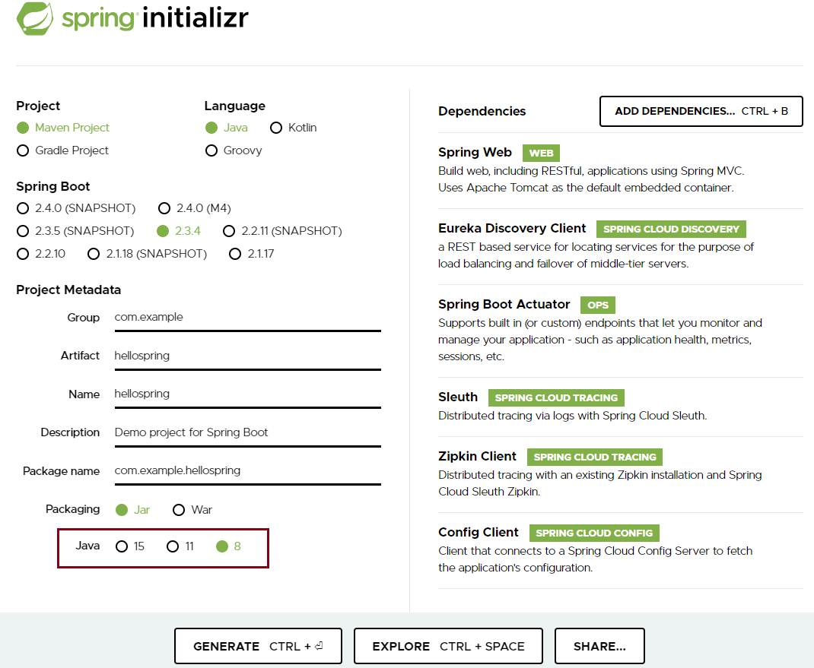

# <a name="quickstart-deploy-your-first-azure-spring-cloud-application"></a>クイック スタート:初めての Azure Spring Cloud アプリケーションをデプロイする

このクイックスタートでは、Azure で実行する単純な Azure Spring Cloud マイクロサービス アプリケーションをデプロイする方法について説明します。 

このチュートリアルで使用されるアプリケーション コードは、Spring Initializr を使用してビルドされる単純なアプリです。 この例を完了すると、アプリケーションにオンラインでアクセスし、Azure portal で管理できるようになります。

このクイックスタートでは、以下の方法について説明します。

> [!div class="checklist"]
> * 基本的な Spring Cloud プロジェクトを生成する
> * サービス インスタンスをプロビジョニングする
> * パブリック エンドポイントがあるアプリをビルドしてデプロイする
> * リアルタイムでログをストリームする

## <a name="prerequisites"></a>前提条件

このクイック スタートを完了するには、以下が必要です。

* [JDK 8 をインストールする](https://docs.microsoft.com/java/azure/jdk/?view=azure-java-stable)
* [Azure サブスクリプションにサインアップする](https://azure.microsoft.com/free/)
* (オプション) [Azure CLI バージョン 2.0.67 以降をインストール](https://docs.microsoft.com/cli/azure/install-azure-cli?view=azure-cli-latest)し、`az extension add --name spring-cloud` コマンドを使用して Azure Spring Cloud 拡張機能をインストールする
* (オプション) [Azure Toolkit for IntelliJ をインストール](https://plugins.jetbrains.com/plugin/8053-azure-toolkit-for-intellij/)し、[サインイン](https://docs.microsoft.com/azure/developer/java/toolkit-for-intellij/create-hello-world-web-app#installation-and-sign-in)する

## <a name="generate-a-spring-cloud-project"></a>Spring Cloud プロジェクトを生成する

[Spring Initializr](https://start.spring.io/#!type=maven-project&language=java&platformVersion=2.3.3.RELEASE&packaging=jar&jvmVersion=1.8&groupId=com.example&artifactId=hellospring&name=hellospring&description=Demo%20project%20for%20Spring%20Boot&packageName=com.example.hellospring&dependencies=web,cloud-eureka,actuator,cloud-starter-sleuth,cloud-starter-zipkin) を開始して、Azure Spring Cloud に対して推奨される依存関係があるサンプル プロジェクトを生成します。 次の図は、このサンプル プロジェクトに対して設定された Initializr を示しています。
```url
https://start.spring.io/#!type=maven-project&language=java&platformVersion=2.3.3.RELEASE&packaging=jar&jvmVersion=1.8&groupId=com.example&artifactId=hellospring&name=hellospring&description=Demo%20project%20for%20Spring%20Boot&packageName=com.example.hellospring&dependencies=web,cloud-eureka,actuator,cloud-starter-sleuth,cloud-starter-zipkin
```

  

1. すべての依存関係が設定されたら、 **[生成]** をクリックします。 パッケージをダウンロードしてアンパックし、次のように `src/main/java/com/example/hellospring/HelloController.java` を追加して、単純な Web アプリケーション用の Web コントローラーを作成します。

    ```java
    package com.example.hellospring;
    
    import org.springframework.web.bind.annotation.RestController;
    import org.springframework.web.bind.annotation.RequestMapping;
    
    @RestController
    public class HelloController {
    
        @RequestMapping("/")
        public String index() {
            return "Greetings from Azure Spring Cloud!";
        }
    
    }
    ```
## <a name="provision-an-instance-of-azure-spring-cloud"></a>Azure Spring Cloud のインスタンスをプロビジョニングする

次の手順では、Azure portal を使用して、Azure Spring Cloud のインスタンスを作成します。

1. 新しいタブで、[Azure portal](https://ms.portal.azure.com/) を開きます。 

2. 上部の検索ボックスから *Azure Spring Cloud* を探します。

3. その結果から *[Azure Spring Cloud]* を選択します。

    

4. Azure Spring Cloud ページで **[+ 追加]** をクリックします。

    

5. Azure Spring Cloud の **[作成]** ページで、フォームに入力します。  次のガイドラインを考慮してください。
    - **サブスクリプション**:このリソースに対する課金用のサブスクリプションを選択します。
    - **[リソース グループ]** :新しいリソース用に新しいリソース グループを作成することをお勧めします。 これが、後の手順で **\<resource group name\>** として使用されます。
    - **[サービスの詳細/名前]** : **\<service instance name\>** を指定します。  名前の長さは 4 文字から 32 文字で、小文字、数字、およびハイフンのみを使用できます。  サービス名の最初の文字は英字でなければならず、最後の文字は英字または数字でなければなりません。
    - **[場所]** :自分のサービス インスタンスのリージョンを選択します。

    

6. **[確認と作成]** をクリックします。

## <a name="build-and-deploy-the-app"></a>アプリを構築してデプロイする
    
#### <a name="cli"></a>[CLI](#tab/Azure-CLI)
以下の手順では、Azure CLI を使用してアプリケーションをビルドし、デプロイします。 プロジェクトのルートで、次のコマンドを実行します。

1. Maven を使用してプロジェクトをビルドします。

    ```console
    mvn clean package -DskipTests
    ```

1. Azure CLI 用の Azure Spring Cloud 拡張機能をまだインストールしていない場合は、インストールします。

    ```azurecli
    az extension add --name spring-cloud
    ```
    
1. パブリック エンドポイントが割り当てられるアプリを作成します。

    ```azurecli
    az spring-cloud app create -n hellospring -s <service instance name> -g <resource group name> --is-public
    ```

1. アプリの Jar ファイルをデプロイします。

    ```azurecli
    az spring-cloud app deploy -n hellospring -s <service instance name> -g <resource group name> --jar-path target\hellospring-0.0.1-SNAPSHOT.jar
    ```
    
1. アプリケーションのデプロイが完了するまでに数分かかります。 デプロイが完了したことを確認するには、Azure portal で **[アプリ]** ブレードに移動します。 アプリケーションの状態が表示されるはずです。

#### <a name="intellij"></a>[IntelliJ](#tab/IntelliJ)

次の手順では、Azure Spring Cloud 用の IntelliJ プラグインを使用して、IntelliJ IDEA でサンプル アプリをデプロイします。  

### <a name="import-project"></a>プロジェクトのインポート

1. IntelliJ の **[Welcome]\(ようこそ\)** ダイアログを開き、 **[Import Project]\(プロジェクトのインポート\)** を選択してインポート ウィザードを開きます。
1. `hellospring` フォルダーを選択します。

    

### <a name="deploy-the-app"></a>アプリケーションのデプロイ
Azure にデプロイするには、Azure アカウントでサインインし、ご自分のサブスクリプションを選択する必要があります。  サインインの詳細については、「[インストールとサインイン](https://docs.microsoft.com/azure/developer/java/toolkit-for-intellij/create-hello-world-web-app#installation-and-sign-in)」を参照してください。

1. IntelliJ のプロジェクト エクスプローラーでプロジェクトを右クリックし、 **[Azure]**  ->  **[Deploy to Azure Spring Cloud]\(Azure Spring Cloud にデプロイ\)** を選択します。

    [  ](media/spring-cloud-quickstart-java/intellij-deploy-azure-1.png#lightbox)

1. **[Name]\(名前\)** フィールドのアプリの名前はそのまま使用します。 **[Name]\(名前\)** は、アプリ名ではなく構成を参照します。 通常、ユーザーはこれを変更する必要はありません。
1. **[Artifact]\(成果物\)** ボックスで、 *[hellospring-0.0.1-SNAPSHOT.jar]* を選択します。
1. **[Subscription]\(サブスクリプション\)** ボックスで、自分のサブスクリプションを確認します。
1. **[Spring Cloud]** ボックスで、「[Azure Spring Cloud インスタンスをプロビジョニングする](https://docs.microsoft.com/azure/spring-cloud/spring-cloud-quickstart-provision-service-instance)」で作成した Azure Spring Cloud のインスタンスを選択します。
1. **[Public Endpoint]\(パブリック エンドポイント\)** を *[Enable]\(有効化\)* に設定します。
1. **[App:]\(アプリ:\)** ボックスで、 **[Create app]\(アプリの作成\)** を選択します。
1. 「*hellospring*」と入力し、 **[OK]** をクリックします。

    [ ![Azure へのデプロイ [OK]](media/spring-cloud-quickstart-java/intellij-deploy-to-azure.png) ](media/spring-cloud-quickstart-java/intellij-deploy-to-azure.png#lightbox)

1. **[Deploy Azure Spring Cloud app]\(Azure Spring Cloud アプリのデプロイ\)** ダイアログの下部にある **[Run]\(実行\)** ボタンをクリックして、デプロイを開始します。 このプラグインは、`hellospring` アプリに対して `mvn package` コマンドを実行し、`package` コマンドによって生成された jar をデプロイします。
---

デプロイが完了したら、`https://<service instance name>-hellospring.azuremicroservices.io/` でアプリにアクセスできるようになります。

  [  ](media/spring-cloud-quickstart-java/access-app-browser.png#lightbox)

## <a name="streaming-logs-in-real-time"></a>リアルタイムでログをストリーミングする

#### <a name="cli"></a>[CLI](#tab/Azure-CLI)

次のコマンドを使用して、アプリからリアルタイム ログを取得します。

```azurecli
az spring-cloud app logs -n hellospring -s <service instance name> -g <resource group name> --lines 100 -f

```
結果のログが表示されます。

[  ](media/spring-cloud-quickstart-java/streaming-logs.png#lightbox)

>[!TIP]
> さらに多くのパラメーターとログ ストリーム機能を調べるには、`az spring-cloud app logs -h` を使用します。

#### <a name="intellij"></a>[IntelliJ](#tab/IntelliJ)

1. **Azure Explorer** を選択し、 **[Spring Cloud]** を選択します。
1. 実行中のアプリを右クリックします。
1. ドロップダウン リストから **[Streaming Logs]\(ストリーミング ログ\)** を選択します。
1. インスタンスを選択します。

    [  ](media/spring-cloud-quickstart-java/intellij-get-streaming-logs.png)

1. ストリーミング ログが出力ウィンドウに表示されます。

    [  ](media/spring-cloud-quickstart-java/intellij-streaming-logs-output.png)
---

高度なログ分析機能については、[Azure portal](https://portal.azure.com/) のメニューで **[ログ]** タブにアクセスしてください。 ここで、ログの待ち時間は数分です。

[  ](media/spring-cloud-quickstart-java/logs-analytics.png#lightbox)

## <a name="clean-up-resources"></a>リソースをクリーンアップする
前の手順では、リソース グループ内に Azure リソースを作成しました。 今後これらのリソースが必要になることが予想されない場合は、ポータルからリソース グループを削除するか、Cloud Shell で次のコマンドを実行します。
```azurecli
az group delete --name <your resource group name; for example: hellospring-1558400876966-rg> --yes
```

このクイックスタートでは、次の方法について学習しました。

> [!div class="checklist"]
> * 基本的な Azure Spring Cloud プロジェクトを生成する
> * サービス インスタンスをプロビジョニングする
> * パブリック エンドポイントがあるアプリをビルドしてデプロイする
> * リアルタイムでログをストリーミングする
## <a name="next-steps"></a>次のステップ
> [!div class="nextstepaction"]
> [マイクロサービスをビルドして実行する](spring-cloud-quickstart-sample-app-introduction.md)

その他のサンプルを GitHub で入手できます ([Azure Spring Cloud のサンプル](https://github.com/Azure-Samples/Azure-Spring-Cloud-Samples/tree/master/service-binding-cosmosdb-sql))。
