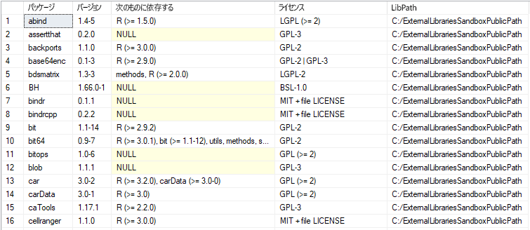

# <a name="create-and-run-simple-r-scripts-in-azure-sql-database-machine-learning-services-preview"></a>Azure SQL Database Machine Learning Services (プレビュー) で簡単な R スクリプトを作成して実行する

このクイック スタートでは、[Azure SQL Database の Machine Learning Services (と R)](sql-database-machine-learning-services-overview.md) のパブリック プレビューを使用して、一連の簡単な R スクリプトを作成して実行します。 適切な形式の R スクリプトをストアド プロシージャ [sp_execute_external_script](https://docs.microsoft.com/sql/relational-databases/system-stored-procedures/sp-execute-external-script-transact-sql) にラップし、SQL データベースでそのスクリプトを実行する方法について説明します。

[!INCLUDE[ml-preview-note](../../includes/sql-database-ml-preview-note.md)]

## <a name="prerequisites"></a>前提条件

- Azure サブスクリプションをお持ちでない場合は、始める前に[アカウントを作成](https://azure.microsoft.com/free/)してください。

- 以降の演習のサンプル コードを実行するには、あらかじめ、Machine Learning Services (R を使用) が有効になった Azure SQL データベースを用意しておく必要があります。 パブリック プレビュー期間中は、Microsoft がお客様のオンボードを行い、既存のデータベースまたは新しいデータベースに対して機械学習を有効にします。 「[Sign up for the preview (プレビューにサインアップする)](sql-database-machine-learning-services-overview.md#signup)」の手順に従ってください。

- 最新の [SQL Server Management Studio](https://docs.microsoft.com/sql/ssms/sql-server-management-studio-ssms) (SSMS) をインストールしていることを確認してください。 他のデータベース管理またはクエリ ツールを使用して R スクリプトを実行することはできますが、このクイック スタートでは SSMS を使用します。

- このクイック スタートでは、サーバーレベルのファイアウォール規則を構成する必要があります。 これを行う方法については、[サーバーレベルのファイアウォール規則の作成](sql-database-server-level-firewall-rule.md)に関するページを参照してください。

## <a name="run-a-simple-script"></a>サンプル スクリプトを実行する

R スクリプトを実行するには、それをシステム ストアド プロシージャ [sp_execute_external_script](https://docs.microsoft.com/sql/relational-databases/system-stored-procedures/sp-execute-external-script-transact-sql) に引数として渡します。

以降の手順では、次のサンプル R スクリプトを SQL データベースで実行します。

```r
a <- 1
b <- 2
c <- a/b
d <- a*b
print(c(c, d))
```

1. **SQL Server Management Studio** を開き、SQL データベースに接続します。

   接続についてご不明な点がある場合は、「[クイック スタート: SQL Server Management Studio を使用して Azure SQL データベースに接続しクエリを実行する](sql-database-connect-query-ssms.md)」をご覧ください。

1. R スクリプト全体を [sp_execute_external_script](https://docs.microsoft.com/sql/relational-databases/system-stored-procedures/sp-execute-external-script-transact-sql) ストアド プロシージャに渡します。

   スクリプトは `@script` 引数で渡します。 `@script` 引数の内容は有効な R コードである必要があります。

    ```sql
    EXECUTE sp_execute_external_script @language = N'R'
        , @script = N'
    a <- 1
    b <- 2
    c <- a/b
    d <- a*b
    print(c(c, d))
    '
    ```

   なんらかのエラーが発生した場合は、お使いの SQL データベースで Machine Learning Services のパブリック プレビューと R が有効になっていない可能性があります。 前述の「[前提条件](#prerequisites)」を参照してください。

   > [!NOTE]
   > 管理者の場合は、外部コードを自動的に実行できます。 次のコマンドを使用して他のユーザーにアクセス許可を付与することができます。
   <br>**GRANT EXECUTE ANY EXTERNAL SCRIPT TO** *\<ユーザー名\>*

2. 適切な結果が計算され、R の `print` 関数から **[メッセージ]** ウィンドウに結果が返されます。

   これは次のようになります。

    **結果**

    ```text
    STDOUT message(s) from external script:
    0.5 2
    ```

## <a name="run-a-hello-world-script"></a>Hello World スクリプトを実行する

典型的なサンプル スクリプトとして、"Hello World" という文字列を出力するだけのものがあります。 次のコマンドを実行します。

```sql
EXECUTE sp_execute_external_script @language = N'R'
    , @script = N'OutputDataSet<-InputDataSet'
    , @input_data_1 = N'SELECT 1 AS hello'
WITH RESULT SETS(([Hello World] INT));
GO
```

このストアド プロシージャへの入力は次のとおりです。

| | |
|-|-|
| @language | 呼び出す言語拡張機能 (この場合は R) を定義します |
| @script | R ランタイムに渡されるコマンドを定義します。 この引数には R スクリプト全体を Unicode テキストとして含める必要があります。 また、そのテキストを **nvarchar** 型の変数に追加したうえで、その変数を呼び出すこともできます |
| @input_data_1 | クエリから返されて R ランタイムに渡されるデータです。R ランタイムはそのデータをデータ フレームとして SQL Server に返します |
|WITH RESULT SETS | SQL Server に対して返されるデータ テーブルのスキーマを定義する句です。"Hello World" を列名として追加し、データ型には **int** が指定されています |

このコマンドは、次のテキストを出力します。

| Hello World |
|-------------|
| 1 |

## <a name="use-inputs-and-outputs"></a>入力と出力を使用する

[sp_execute_external_script](https://docs.microsoft.com/sql/relational-databases/system-stored-procedures/sp-execute-external-script-transact-sql) が入力として既定で受け取るのは、単一のデータセットです。これは通常、有効な SQL クエリの形式で指定します。 その後、その出力として、単一の R データ フレームが返されます。

ここでは、[sp_execute_external_script](https://docs.microsoft.com/sql/relational-databases/system-stored-procedures/sp-execute-external-script-transact-sql) の既定の入力変数と出力変数を使用しましょう: **InputDataset** と **OutputDataset**。

1. テスト データの小さなテーブルを作成します。

    ```sql
    CREATE TABLE RTestData (col1 INT NOT NULL)
    
    INSERT INTO RTestData
    VALUES (1);
    
    INSERT INTO RTestData
    VALUES (10);
    
    INSERT INTO RTestData
    VALUES (100);
    GO
    ```

1. `SELECT` ステートメントを使用してテーブルに対してクエリを実行します。
  
    ```sql
    SELECT *
    FROM RTestData
    ```

    **結果**

    

1. 次の R スクリプトを実行します。 `SELECT` ステートメントを使用してテーブルからデータを取得し、R ランタイムを介して渡した後、データ フレームとしてそのデータを返します。 `WITH RESULT SETS` 句は、列名として *NewColName* を追加して、SQL Database に対して返されるデータ テーブルのスキーマを定義します。

    ```sql
    EXECUTE sp_execute_external_script @language = N'R'
        , @script = N'OutputDataSet <- InputDataSet;'
        , @input_data_1 = N'SELECT * FROM RTestData;'
    WITH RESULT SETS(([NewColName] INT NOT NULL));
    ```

    **結果**

    

1. 今度は、入力変数と出力変数の名前を変更してみましょう。 入力変数と出力変数の既定の名前は **InputDataSet** と **OutputDataSet** です。次のスクリプトで、これらの名前を **SQL_in** と **SQL_out** に変更します。

    ```sql
    EXECUTE sp_execute_external_script @language = N'R'
        , @script = N' SQL_out <- SQL_in;'
        , @input_data_1 = N' SELECT 12 as Col;'
        , @input_data_1_name = N'SQL_in'
        , @output_data_1_name = N'SQL_out'
    WITH RESULT SETS(([NewColName] INT NOT NULL));
    ```

    R では大文字と小文字が区別されることに注意してください。 この R スクリプトで使用されている入力変数と出力変数 (**SQL_out**、**SQL_in**) は、大文字と小文字の区別も含め、`@input_data_1_name` と `@output_data_1_name` で定義された値と一致している必要があります。

   > [!TIP]
   > パラメーターとして渡すことができる入力データセットは 1 つだけです。また、返すことのできるデータセットも 1 つだけです。 ただし、R コード内から他のデータセットを呼び出し、そのデータセットに加えて、他の種類の出力を返すことができます。 任意のパラメーターに OUTPUT キーワードを追加することもでき、その場合は、パラメーターに結果が返されます。

1. R スクリプトのみを使用して、入力データなしで (`@input_data_1` を空白に設定して) 値を生成することもできます。

   次のスクリプトは、"hello" と "world" というテキストを出力します。

    ```sql
    EXECUTE sp_execute_external_script @language = N'R'
        , @script = N'
    mytextvariable <- c("hello", " ", "world");
    OutputDataSet <- as.data.frame(mytextvariable);
    '
        , @input_data_1 = N''
    WITH RESULT SETS(([Col1] CHAR(20) NOT NULL));
    ```

    **結果**

    

## <a name="check-r-version"></a>R のバージョンを確認する

お使いの SQL データベースにインストールされている R のバージョンを確認する場合は、次のスクリプトを実行します。

```sql
EXECUTE sp_execute_external_script @language = N'R'
    , @script = N'print(version)';
GO
```

R の `print` 関数から **[メッセージ]** ウィンドウにバージョンが返されます。 下の出力例では、この SQL Database には R バージョン 3.4.4 がインストールされていることがわかります。

**結果**

```text
STDOUT message(s) from external script:
                   _
platform       x86_64-w64-mingw32
arch           x86_64
os             mingw32
system         x86_64, mingw32
status
major          3
minor          4.4
year           2018
month          03
day            15
svn rev        74408
language       R
version.string R version 3.4.4 (2018-03-15)
nickname       Someone to Lean On
```

## <a name="list-r-packages"></a>R パッケージを一覧表示する

Microsoft では、SQL データベースに Machine Learning Services と共にプレインストールされる R パッケージを多数提供しています。

バージョン、依存関係、ライセンス、ライブラリのパス情報を含め、インストールされている R パッケージのリストを表示するには、次のスクリプトを実行します。

```SQL
EXEC sp_execute_external_script @language = N'R'
    , @script = N'
OutputDataSet <- data.frame(installed.packages()[,c("Package", "Version", "Depends", "License", "LibPath")]);'
WITH result sets((
            Package NVARCHAR(255)
            , Version NVARCHAR(100)
            , Depends NVARCHAR(4000)
            , License NVARCHAR(1000)
            , LibPath NVARCHAR(2000)
            ));
```

この出力は、R の `installed.packages()` によるもので、結果セットとして返されます。

**結果**



## <a name="next-steps"></a>次の手順

R を使用して SQL Database に機械学習モデルを作成するには、次のクイック スタートに従ってください。

> [!div class="nextstepaction"]
> [R で Azure SQL Database Machine Learning Services (プレビュー) を使用して予測モデルを作成およびトレーニングする](sql-database-quickstart-r-train-score-model.md)

Azure SQL Database Machine Learning Services と R (プレビュー) の詳細については、次の記事を参照してください。

- [Azure SQL Database Machine Learning Services と R (プレビュー)](sql-database-machine-learning-services-overview.md)
- [Machine Learning Services (プレビュー) を使用して Azure SQL Database に高度な R 関数を記述する](sql-database-machine-learning-services-functions.md)
- [Azure SQL Database Machine Learning Services (プレビュー) での R および SQL データの処理](sql-database-machine-learning-services-data-issues.md)
