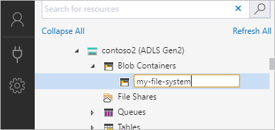

# Azure Storage Explorer を使用して Azure Data Lake Storage Gen2 のディレクトリとファイルを管理する

この記事では、[Azure Storage Explorer](https://azure.microsoft.com/features/storage-explorer/) を使用して、階層型名前空間 (HNS) が有効なストレージ アカウントでディレクトリとファイルを作成および管理する方法について説明します。

## 前提条件

- Azure サブスクリプション。 [Azure 無料試用版の取得](https://azure.microsoft.com/pricing/free-trial/)に関するページを参照してください。

- 階層型名前空間 (HNS) が有効になっているストレージ アカウント。 作成するには、[こちら](../common/storage-account-create.md)の手順に従います。

- ローカル コンピューターにインストールされた Azure Storage Explorer。 Windows、Macintosh、または Linux 用の Azure Storage Explorer をインストールする方法については、「[Azure Storage Explorer](https://azure.microsoft.com/features/storage-explorer/)」をご覧ください。

> [!NOTE]
> Storage Explorer では、Azure Data Lake Storage Gen2 を操作するときに BLOB (blob) と Data Lake Storage Gen2 (dfs) の[エンドポイント](../common/storage-private-endpoints.md#private-endpoints-for-azure-storage)が使用されます。 Azure Data Lake Storage Gen2 へのアクセスがプライベート エンドポイントを使用して構成されている場合は、ストレージ アカウント用に 2 つのプライベート エンドポイント (1 つはターゲット サブリソース `blob` 用で、もう 1 つはターゲット サブリソース `dfs` 用) が作成されていることを確認します。

## Storage Explorer にサインインする

Storage Explorer を初めて起動すると、 **[Microsoft Azure Storage Explorer - 接続]** ウィンドウが表示されます。 Storage Explorer にはストレージ アカウントに接続する方法がいくつか用意されていますが、現在のところ、ACL の管理にサポートされている方法は 1 つのみです。

|タスク|目的|
|---|---|
|Azure アカウントを追加する | Azure に対する認証を行うための組織のサインイン ページにリダイレクトします。 現在のところ、これが ACL を管理および設定する場合にサポートされている唯一の認証方法です。|
|接続文字列または Shared Access Signature URI を使用する | SAS トークンまたは共有の接続文字列でコンテナーまたはストレージ アカウントに直接アクセスするために使用できます。 |
|ストレージ アカウントの名前とキーを使用する| ストレージ アカウントの名前とキーを使用して、Azure Storage に接続します。|

**[Add an Azure Account\(Azure アカウントの追加\)]** を選択し、 **[サインイン]** をクリックします。画面上のプロンプトに従って Azure アカウントにサインインします。

![Microsoft Azure Storage Explorer を示すスクリーンショット。[Azure アカウントの追加] オプションと [サインイン] ボタンが強調表示されています。](media/storage-quickstart-blobs-storage-explorer/connect.png)

接続が完了すると、Azure Storage Explorer が読み込まれて **[Explorer]** タブが表示されます。 このビューには、すべての Azure ストレージ アカウント、[Azure Storage Emulator](../common/storage-use-azurite.md?toc=%2fazure%2fstorage%2fblobs%2ftoc.json)、[Cosmos DB](../../cosmos-db/storage-explorer.md?toc=%2fazure%2fstorage%2fblobs%2ftoc.json) アカウント、または [Azure Stack](/azure-stack/user/azure-stack-storage-connect-se?toc=%2fazure%2fstorage%2fblobs%2ftoc.json) 環境を使用して構成されたおよびローカル ストレージの分析情報が表示されます。

![[Microsoft Azure Storage Explorer - 接続] ウィンドウ](media/storage-quickstart-blobs-storage-explorer/mainpage.png)

## コンテナーを作成する

コンテナーには、ディレクトリとファイルが保持されます。 作成するには、前の手順で作成したストレージ アカウントを展開します。 **[BLOB コンテナー]** を選択し、右クリックして **[BLOB コンテナーの作成]** を選択します。 コンテナーの名前を入力します。 コンテナーの名前付けに関する規則と制限の一覧については、「[コンテナーを作成する](storage-quickstart-blobs-dotnet.md#create-a-container)」セクションを参照してください。 完了したら、**Enter** キーを押してコンテナーを作成します。 コンテナーは、正常に作成されると、選択されたストレージ アカウントの **[BLOB コンテナー]** フォルダーの下に表示されます。

## ディレクトリを作成する

ディレクトリを作成するには、前の手順で作成したコンテナーを選択します。 コンテナーのリボンで、 **[新しいフォルダー]** ボタンを選択します。 ディレクトリの名前を入力します。 完了したら、**Enter** キーを押してディレクトリを作成します。 ディレクトリが正常に作成されると、エディター ウィンドウに表示されます。

## BLOB をディレクトリにアップロードする

ディレクトリのリボンで、 **[アップロード]** ボタンを選択します。 この操作によって、フォルダーまたはファイルをアップロードするためのオプションが表示されます。

アップロードするファイルまたはフォルダーを選択します。

**[OK]** を選択すると、選択したファイルがキューに登録され、各ファイルがアップロードされます。 アップロードが完了すると、 **[アクティビティ]** ウィンドウに結果が表示されます。

## ディレクトリ内の BLOB を表示する

**Azure Storage Explorer** アプリケーションで、ストレージ アカウント以下のディレクトリを選択します。 選択したディレクトリ内の BLOB の一覧がメイン ウィンドウに表示されます。

## BLOB をダウンロードする

**Azure Storage Explorer** を使用してファイルをダウンロードするには、ファイルを選択した状態で、リボンの **[ダウンロード]** を選択します。 ファイル ダイアログが開き、ファイル名を入力するオプションが表示されます。 **[保存]** を選択して、ローカルの場所へのファイルのダウンロードを開始します。

## 次のステップ

アクセス制御リスト (ACL) を設定して、ファイルとディレクトリのアクセス許可を管理する方法について説明します

> [!div class="nextstepaction"]
> [Azure Storage Explorer を使用して Azure Data Lake Storage Gen2 での ACL を管理する](./data-lake-storage-explorer-acl.md)
