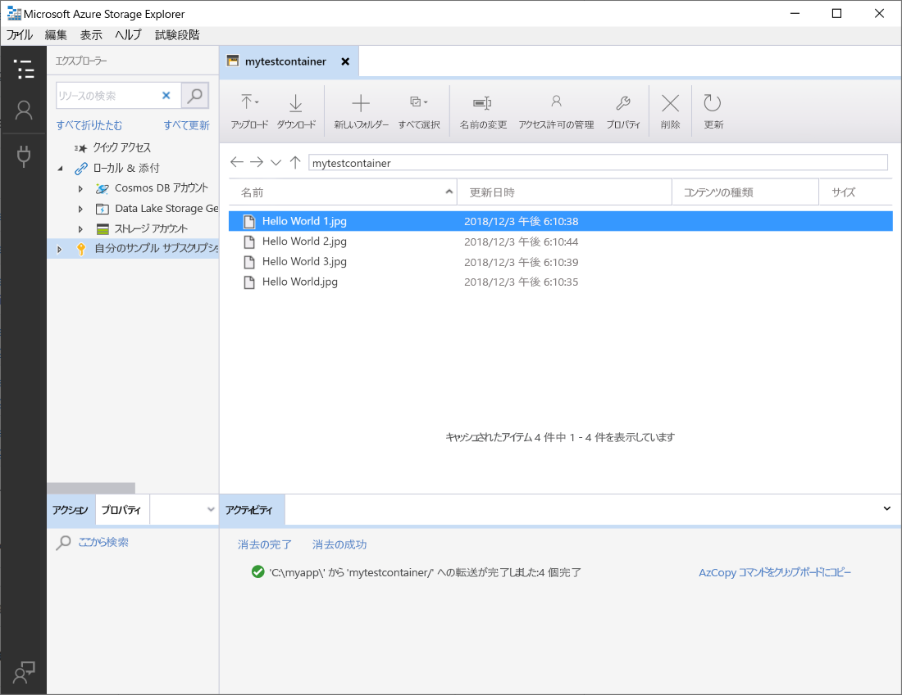

# クイック スタート:Azure Storage Explorer を使用して Azure Data Lake Storage Gen2 アカウントのデータを管理する

このクイック スタートでは、[Azure Storage Explorer](https://azure.microsoft.com/features/storage-explorer/) を使用して、ディレクトリと BLOB を作成する方法について説明します。 次に、ローカル コンピューターに BLOB をダウンロードする方法と、ディレクトリ内のすべての BLOB を表示する方法について説明します。 また、BLOB のスナップショットを作成する方法、ディレクトリのアクセス ポリシーを管理する方法、共有アクセス署名を作成する方法についても学習します。

## 前提条件

[!INCLUDE [storage-quickstart-prereq-include](../../../includes/storage-quickstart-prereq-include.md)]

このクイックスタートでは、Azure Storage Explorer をインストールする必要があります。 Windows、Macintosh、または Linux 用の Azure Storage Explorer をインストールする方法については、「[Azure Storage Explorer](https://azure.microsoft.com/features/storage-explorer/)」をご覧ください。

## Storage Explorer にログインする

初回の起動時には、**[Microsoft Azure Storage Explorer - 接続]** ウィンドウが表示されます。 Storage Explorer にはストレージ アカウントに接続する方法がいくつか用意されていますが、現在のところ、ACL の管理にサポートされている方法は 1 つのみです。

|タスク|目的|
|---|---|
|Azure アカウントを追加する | Azure に対する認証を行うための組織のログイン ページにリダイレクトします。 現在のところ、これが ACL を管理および設定する場合にサポートされている唯一の認証方法です。 |

**[Add an Azure Account\(Azure アカウントの追加\)]** を選択し、**[サインイン]** をクリックします。画面上のプロンプトに従って Azure アカウントにサインインします。

![[Microsoft Azure Storage Explorer - 接続] ウィンドウ](media/storage-quickstart-blobs-storage-explorer/connect.png)

接続が完了すると、Azure Storage Explorer が読み込まれて **[Explorer]** タブが表示されます。 このビューには、すべての Azure ストレージ アカウント、[Azure ストレージ エミュレーター](../common/storage-use-emulator.md?toc=%2fazure%2fstorage%2fblobs%2ftoc.json)、[Cosmos DB](../../cosmos-db/storage-explorer.md?toc=%2fazure%2fstorage%2fblobs%2ftoc.json) アカウント、または [Azure Stack](../../azure-stack/user/azure-stack-storage-connect-se.md?toc=%2fazure%2fstorage%2fblobs%2ftoc.json) 環境を使用して構成されたおよびローカル ストレージの情報が表示されます。

![[Microsoft Azure Storage Explorer - 接続] ウィンドウ](media/storage-quickstart-blobs-storage-explorer/mainpage.png)

## ファイルシステムを作成する

BLOB は常にディレクトリにアップロードされます。 これにより、フォルダー内でコンピューター上のファイルを整理するように、BLOB のグループを整理できます。

ディレクトリを作成するには、前の手順で作成したストレージ アカウントを展開します。 **[BLOB コンテナー]** を選択し、**[BLOB コンテナーの作成]** を右クリックして選択します。 ファイルシステムの名前を入力します。 完了したら、**Enter** キーを押してファイルシステムを作成します。 BLOB ディレクトリは、正常に作成されると、選択されたストレージ アカウントの **[BLOB コンテナー]** フォルダーの下に表示されます。

## BLOB をディレクトリにアップロードする

Blob Storage は、ブロック BLOB、追加 BLOB、およびページ BLOB をサポートします。 IaaS VM をバックアップするために使用される VHD ファイルはページ BLOB です。 追加 BLOB は、ファイルに書き込んでから詳細情報を追加し続ける場合などの、ログ記録に使用されます。 BLOB ストレージに格納されているほとんどのファイルはブロック BLOB です。

ディレクトリのリボンで **[アップロード]** を選択します。 この操作によって、フォルダーまたはファイルをアップロードするためのオプションが表示されます。

アップロードするファイルまたはフォルダーを選択します。 **BLOB の種類**を選択します。 **追加**、**ページ**、または**ブロック**の各 BLOB を選択できます。

.vhd または .vhdx ファイルをアップロードする場合は、**[.vhd/.vhdx ファイルをページ BLOB としてアップロードする (推奨)]** を選択します。

**[アップロード先のフォルダー (オプション)]** フィールドで、ファイルを格納するフォルダーの名前またはディレクトリの下にあるフォルダー内のフォルダーを選択します。 フォルダーが選択されていない場合は、ファイルがディレクトリの下に直接アップロードされます。

**[OK]** を選択すると、選択したファイルがキューに登録され、各ファイルがアップロードされます。 アップロードが完了すると、**[アクティビティ]** ウィンドウに結果が表示されます。

## ディレクトリ内の BLOB を表示する

**Azure Storage Explorer** アプリケーションで、ストレージ アカウント以下のディレクトリを選択します。 選択したディレクトリ内の BLOB の一覧がメイン ウィンドウに表示されます。

## BLOB をダウンロードする

**Azure Storage Explorer** を使用して BLOB をダウンロードするには、BLOB を選択した状態で、リボンの **[ダウンロード]** を選択します。 ファイル ダイアログが開き、ファイル名を入力するオプションが表示されます。 **[保存]** を選択して、ローカルの場所への BLOB のダウンロードを開始します。

## 次の手順

このクイックスタートでは、**Azure Storage Explorer** を使用してローカル ディスクと Azure Blob Storage との間でファイルを転送する方法について学習しました。 ファイルやディレクトリに ACL を設定する方法については、その主題に関するハウツーの記事を参照してください。

> [!div class="nextstepaction"]
> [ファイルとディレクトリに対して ACL を設定する方法](data-lake-storage-how-to-set-permissions-storage-explorer.md)
