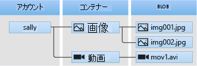

# <a name="quickstart-azure-blob-storage-client-library-v12-for-c"></a>クイックスタート: C++ 用 Azure Blob Storage クライアント ライブラリ v12

C++ 用 Azure Blob Storage クライアント ライブラリ v12 を使用してみましょう。 Azure Blob Storage は、Microsoft のクラウド用オブジェクト ストレージ ソリューションです。 手順に従ってパッケージをインストールし、基本タスクのコード例を試してみましょう。 Blob Storage は、テキスト データやバイナリ データなどの大量の非構造化データを格納するために最適化されています。

C++ 用 Azure Blob Storage クライアント ライブラリ v12 を使用すると、以下のことができます。

- コンテナーを作成する
- Azure Storage へ BLOB をアップロードする
- コンテナー内のすべての BLOB を一覧表示する
- ローカル コンピューターに BLOB をダウンロードする
- コンテナーを削除する

リソース:

- [API リファレンス ドキュメント](https://azure.github.io/azure-sdk-for-cpp/storage.html)
- [ライブラリ ソース コード](https://github.com/Azure/azure-sdk-for-cpp/tree/master/sdk/storage)
- [サンプル](../common/storage-samples-c-plus-plus.md?toc=%2fazure%2fstorage%2fblobs%2ftoc.json)

[!INCLUDE [storage-multi-protocol-access-preview](../../../includes/storage-multi-protocol-access-preview.md)]

## <a name="prerequisites"></a>前提条件

- [Azure サブスクリプション](https://azure.microsoft.com/free/)
- [Azure Storage アカウント](../common/storage-account-create.md)
- [C++ コンパイラ](https://azure.github.io/azure-sdk/cpp_implementation.html#supported-platforms)
- [CMake](https://cmake.org/)
- [Vcpkg - C および C++ パッケージ マネージャー](https://github.com/microsoft/vcpkg/blob/master/docs/index.md)
- [LibCurl](https://curl.haxx.se/libcurl/)
- [LibXML2](http://www.xmlsoft.org/)

## <a name="setting-up"></a>設定

このセクションでは、C++ 用 Azure Blob Storage クライアント ライブラリ v12 を操作するためのプロジェクトの準備について説明します。

### <a name="install-the-packages"></a>パッケージのインストール

LibCurl パッケージと LibXML2 パッケージをまだインストールしていない場合は、`vcpkg install` コマンドを使用してインストールしてください。

```console
vcpkg.exe install libxml2:x64-windows curl:x64-windows
```

GitHub の手順に従って、[C++ 用 Azure SDK](https://github.com/Azure/azure-sdk-for-cpp/) を入手し、ビルドします。

### <a name="create-the-project"></a>プロジェクトを作成する

Visual Studio で、*BlobQuickstartV12* という、Windows 向けの新しい C++ コンソール アプリケーションを作成します。

:::image type="content" source="./media/quickstart-blobs-c-plus-plus/vs-create-project.jpg" alt-text="新しい C++ Windows コンソール アプリを構成するための Visual Studio ダイアログ":::

次のライブラリをプロジェクトに追加します。

- libcurl.lib
- libxml2.lib
- bcrypt.lib
- Crypt32.Lib
- WS2_32.Lib
- azure-core.lib
- azure-storage-common.lib
- azure-storage-blobs.lib

[!INCLUDE [storage-quickstart-credentials-include](../../../includes/storage-quickstart-credentials-include.md)]

## <a name="object-model"></a>オブジェクト モデル

Azure Blob Storage は、大量の非構造化データを格納するために最適化されています。 非構造化データとは、特定のデータ モデルや定義に従っていないデータであり、テキスト データやバイナリ データなどがあります。 Blob Storage には、3 種類のリソースがあります。

- ストレージ アカウント
- ストレージ アカウント内のコンテナー
- コンテナー内の BLOB

次の図に、これらのリソースの関係を示します。



これらのリソースとやり取りするには、以下の C++ クラスを使用します。

- [BlobServiceClient](https://azuresdkdocs.blob.core.windows.net/$web/cpp/azure-storage-blobs/1.0.0-beta.2/class_azure_1_1_storage_1_1_blobs_1_1_blob_service_client.html):`BlobServiceClient` クラスを使用して、Azure Storage リソースと BLOB コンテナーを操作できます。
- [BlobContainerClient](https://azuresdkdocs.blob.core.windows.net/$web/cpp/azure-storage-blobs/1.0.0-beta.2/class_azure_1_1_storage_1_1_blobs_1_1_blob_container_client.html):`BlobContainerClient` クラスを使用して、Azure Storage コンテナーとその BLOB を操作できます。
- [BlobClient](https://azuresdkdocs.blob.core.windows.net/$web/cpp/azure-storage-blobs/1.0.0-beta.2/class_azure_1_1_storage_1_1_blobs_1_1_blob_client.html):`BlobClient` クラスを使用して、Azure Storage BLOB を操作できます。 これは、特殊化されたすべての BLOB クラスの基底クラスです。
- [BlockBlobClient](https://azuresdkdocs.blob.core.windows.net/$web/cpp/azure-storage-blobs/1.0.0-beta.2/class_azure_1_1_storage_1_1_blobs_1_1_block_blob_client.html): `BlockBlobClient` クラスを使用して、Azure Storage のブロック BLOB を操作できます。

## <a name="code-examples"></a>コード例

以下のサンプル コード スニペットは、C++ 用 Azure Blob Storage クライアント ライブラリを使用して以下のタスクを実行する方法を示します。

- [インクルード ファイルを追加する](#add-include-files)
- [接続文字列を取得する](#get-the-connection-string)
- [コンテナーの作成](#create-a-container)
- [コンテナーに BLOB をアップロードする](#upload-blobs-to-a-container)
- [コンテナー内の BLOB を一覧表示する](#list-the-blobs-in-a-container)
- [BLOB をダウンロードする](#download-blobs)
- [コンテナーの削除](#delete-a-container)

### <a name="add-include-files"></a>インクルード ファイルを追加する

プロジェクト ディレクトリで次の操作を行います。

1. Visual Studio で *BlobQuickstartV12.sln* ソリューション ファイルを開きます。
1. Visual Studio 内で、*BlobQuickstartV12.cpp* ソース ファイルを開きます。
1. `main` 内の自動生成されたコードをすべて削除します。
1. `#include` ステートメントを追加します

:::code language="cpp" source="~/azure-storage-snippets/blobs/quickstarts/C++/V12/BlobQuickstartV12/BlobQuickstartV12/BlobQuickstartV12.cpp" id="Snippet_Includes":::

### <a name="get-the-connection-string"></a>接続文字列を取得する

以下のコードでは、「[ストレージ接続文字列の構成](#configure-your-storage-connection-string)」で作成した環境変数から、ストレージ アカウントに対する接続文字列を取得します。

このコードを `main()` 内に追加します。

:::code language="cpp" source="~/azure-storage-snippets/blobs/quickstarts/C++/V12/BlobQuickstartV12/BlobQuickstartV12/BlobQuickstartV12.cpp" id="Snippet_ConnectionString":::

### <a name="create-a-container"></a>コンテナーを作成する

[CreateFromConnectionString](https://azuresdkdocs.blob.core.windows.net/$web/cpp/azure-storage-blobs/1.0.0-beta.2/class_azure_1_1_storage_1_1_blobs_1_1_blob_container_client.html#ad103d1e3a7ce7c53a82da887d12ce6fe) 関数を呼び出して、[BlobContainerClient](https://azuresdkdocs.blob.core.windows.net/$web/cpp/azure-storage-blobs/1.0.0-beta.2/class_azure_1_1_storage_1_1_blobs_1_1_blob_container_client.html) クラスのインスタンスを作成します。 次に、[Create](https://azuresdkdocs.blob.core.windows.net/$web/cpp/azure-storage-blobs/1.0.0-beta.2/class_azure_1_1_storage_1_1_blobs_1_1_blob_container_client.html#a22a1e001068a4ec52bb1b6bd8b52c047) を呼び出して、ストレージ アカウントに実際のコンテナーを作成します。

> [!IMPORTANT]
> コンテナーの名前は小文字にする必要があります。 コンテナーと BLOB の名前付けの詳細については、「[Naming and Referencing Containers, Blobs, and Metadata (コンテナー、BLOB、メタデータの名前付けと参照)](/rest/api/storageservices/naming-and-referencing-containers--blobs--and-metadata)」を参照してください。

`main()` の末尾に次のコードを追加します。

:::code language="cpp" source="~/azure-storage-snippets/blobs/quickstarts/C++/V12/BlobQuickstartV12/BlobQuickstartV12/BlobQuickstartV12.cpp" id="Snippet_CreateContainer":::

### <a name="upload-blobs-to-a-container"></a>コンテナーに BLOB をアップロードする

次のコード スニペット:

1. "Hello Azure!" を含む文字列を宣言します。
1. 「[コンテナーを作成する](#create-a-container)」セクションでのコンテナー上で [GetBlockBlobClient](https://azuresdkdocs.blob.core.windows.net/$web/cpp/azure-storage-blobs/1.0.0-beta.2/class_azure_1_1_storage_1_1_blobs_1_1_blob_container_client.html#acd8c68e3f37268fde0010dd478ff048f) を呼び出すことで、[BlockBlobClient](https://azuresdkdocs.blob.core.windows.net/$web/cpp/azure-storage-blobs/1.0.0-beta.2/class_azure_1_1_storage_1_1_blobs_1_1_block_blob_client.html) オブジェクトへの参照を取得します。
1. [UploadFrom](https://azuresdkdocs.blob.core.windows.net/$web/cpp/azure-storage-blobs/1.0.0-beta.2/class_azure_1_1_storage_1_1_blobs_1_1_block_blob_client.html#af93af7e37f8806e39481596ef253f93d) 関数を呼び出して、文字列を BLOB にアップロードします。 この関数では、BLOB がまだ存在しない場合は作成し、既に存在する場合は更新します。

`main()` の末尾に次のコードを追加します。

:::code language="cpp" source="~/azure-storage-snippets/blobs/quickstarts/C++/V12/BlobQuickstartV12/BlobQuickstartV12/BlobQuickstartV12.cpp" id="Snippet_UploadBlob":::

### <a name="list-the-blobs-in-a-container"></a>コンテナー内の BLOB を一覧表示する

[ListBlobsFlatSegment](https://azuresdkdocs.blob.core.windows.net/$web/cpp/azure-storage-blobs/1.0.0-beta.2/class_azure_1_1_storage_1_1_blobs_1_1_blob_container_client.html#ac7712bc46909dc061d6bf554b496550c) 関数を呼び出して、コンテナー内の BLOB を一覧表示します。 コンテナーに追加されている BLOB は 1 つだけなので、この操作から返されるのは、その BLOB だけです。

`main()` の末尾に次のコードを追加します。

:::code language="cpp" source="~/azure-storage-snippets/blobs/quickstarts/C++/V12/BlobQuickstartV12/BlobQuickstartV12/BlobQuickstartV12.cpp" id="Snippet_ListBlobs":::

### <a name="download-blobs"></a>BLOB をダウンロードする

アップロードされた BLOB のプロパティを取得します。 次に、新しい `std::string` オブジェクトを宣言し、アップロードした BLOB のプロパティを使用してサイズを変更します。 [BlobClient](https://azuresdkdocs.blob.core.windows.net/$web/cpp/azure-storage-blobs/1.0.0-beta.2/class_azure_1_1_storage_1_1_blobs_1_1_blob_client.html) 基底クラスの [DownloadTo](https://azuresdkdocs.blob.core.windows.net/$web/cpp/azure-storage-blobs/1.0.0-beta.2/class_azure_1_1_storage_1_1_blobs_1_1_blob_client.html#aa844f37a8c216f3cb0f27912b114c4d2) 関数を呼び出して、先ほど作成した BLOB を新しい `std::string` オブジェクトにダウンロードします。 最後に、ダウンロードされた BLOB データを表示します。

`main()` の末尾に次のコードを追加します。

:::code language="cpp" source="~/azure-storage-snippets/blobs/quickstarts/C++/V12/BlobQuickstartV12/BlobQuickstartV12/BlobQuickstartV12.cpp" id="Snippet_DownloadBlob":::

### <a name="delete-a-blob"></a>BLOB を削除する

次のコードは、[BlobClient.Delete](https://azuresdkdocs.blob.core.windows.net/$web/cpp/azure-storage-blobs/1.0.0-beta.2/class_azure_1_1_storage_1_1_blobs_1_1_blob_client.html#a621eabcc8d23893ca1eb106494198615) 関数を呼び出して、Azure Blob Storage コンテナーから BLOB を削除します。

:::code language="cpp" source="~/azure-storage-snippets/blobs/quickstarts/C++/V12/BlobQuickstartV12/BlobQuickstartV12/BlobQuickstartV12.cpp" id="Snippet_DeleteBlob":::

### <a name="delete-a-container"></a>コンテナーを削除する

次のコードでは、[BlobContainerClient.Delete](https://azuresdkdocs.blob.core.windows.net/$web/cpp/azure-storage-blobs/1.0.0-beta.2/class_azure_1_1_storage_1_1_blobs_1_1_blob_container_client.html#aa6b1db52697ae92e9a1227e2e02a5178) を使用してコンテナー全体を削除することで、アプリによって作成されたリソースをクリーンアップします。

`main()` の末尾に次のコードを追加します。

:::code language="cpp" source="~/azure-storage-snippets/blobs/quickstarts/C++/V12/BlobQuickstartV12/BlobQuickstartV12/BlobQuickstartV12.cpp" id="Snippet_DeleteContainer":::

## <a name="run-the-code"></a>コードの実行

このアプリは、コンテナーを作成し、テキスト ファイルを Azure Blob Storage にアップロードします。 さらに、この例では、コンテナー内の BLOB を一覧表示し、ファイルをダウンロードして、ファイルの内容を表示します。 最後に、BLOB とコンテナーを削除します。

アプリの出力は、次の例のようになります。

```output
Azure Blob Storage v12 - C++ quickstart sample
Creating container: myblobcontainer
Uploading blob: blob.txt
Listing blobs...
Blob name: blob.txt
Downloaded blob contents: Hello Azure!
Deleting blob: blob.txt
Deleting container: myblobcontainer
```

## <a name="next-steps"></a>次のステップ

このクイックスタートでは、C++ を使用して BLOB をアップロード、ダウンロード、および一覧表示する方法について説明しました。 また、Azure Blob Storage コンテナーの作成方法と削除方法についても説明しました。

C++ Blob Storage サンプルを確認するには、次の記事に進んでください。

> [!div class="nextstepaction"]
> [C++ 用 Azure Blob Storage SDK v12 サンプル](https://github.com/Azure/azure-sdk-for-cpp/tree/master/sdk/storage/azure-storage-blobs/sample)