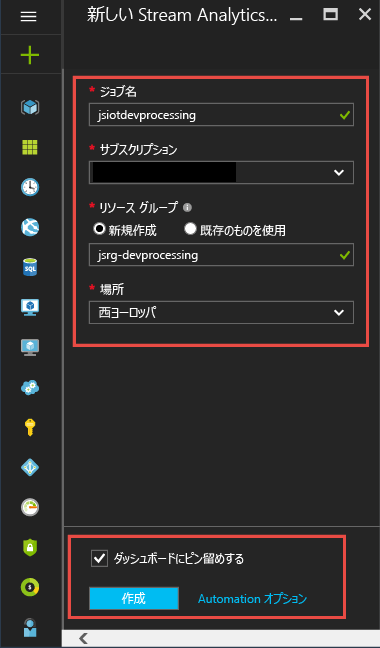
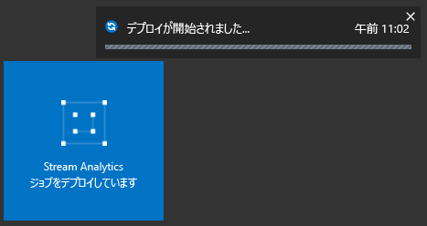
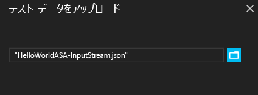
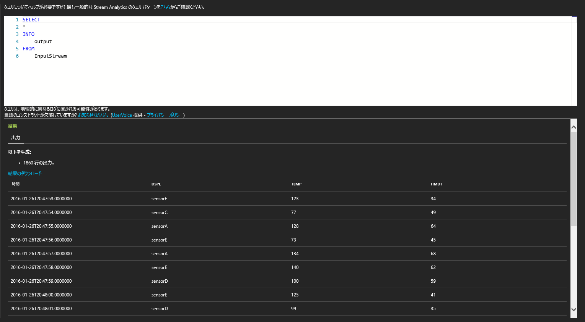
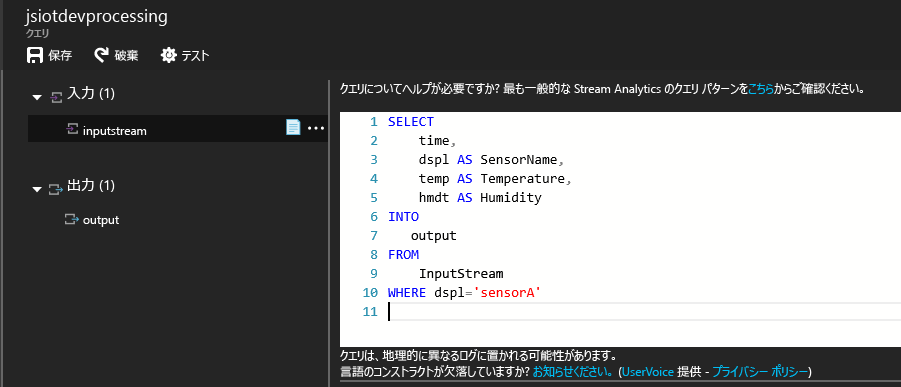
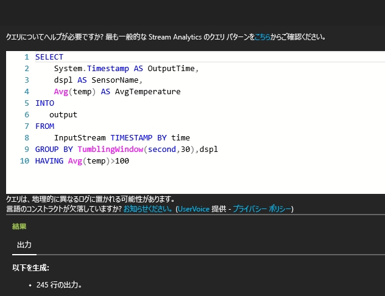

# <a name="get-started-with-azure-stream-analytics-to-process-data-from-iot-devices"></a>Azure Stream Analytics の使用を開始して IoT デバイスからのデータを処理する

このチュートリアルでは、モノのインターネット (IoT) デバイスからデータを収集するストリーム処理ロジックの作成方法について学習します。 実際のモノのインターネット (IoT) ユース ケースを使用して、迅速で経済的なソリューションを構築する方法を紹介します。

## <a name="prerequisites"></a>前提条件

* [Azure サブスクリプション](https://azure.microsoft.com/pricing/free-trial/)
* [GitHub](https://aka.ms/azure-stream-analytics-get-started-iot)

## <a name="scenario"></a>シナリオ

Contoso は工業オートメーションの領域で活動する会社で、自社の製造工程を完全に自動化しています。 この工場の機械には、リアルタイムでデータのストリームを生成することのできるセンサーがあります。 このシナリオにおいて、生産現場マネージャーは、センサー データからリアルタイムの詳細情報を取得し、パターンを見つけて、それらに対処したいと考えています。 センサー データに対して Stream Analytics クエリ言語 (SAQL) を使用し、データの受信ストリームから興味深いパターンを検出します。

ここに示すデータは、Texas Instruments 社のセンサー タグ デバイスから生成されています。 データのペイロードは JSON 形式で、次のようになります。

```json
{
    "time": "2016-01-26T20:47:53.0000000",  
    "dspl": "sensorE",  
    "temp": 123,  
    "hmdt": 34  
}  
```

実際のシナリオでは、何百ものこのようなセンサーがストリームとしてイベントを生成することになります。 ゲートウェイ デバイスがコードを実行し、これらのイベントを [Azure Event Hubs](https://azure.microsoft.com/services/event-hubs/) または [Azure IoT Hub](https://azure.microsoft.com/services/iot-hub/) にプッシュできれば理想的です。 Stream Analytics ジョブでそれらのイベントを Event Hubs から取り込み、そのストリームに対してリアルタイム分析クエリを実行することになると思われます。 結果はその後、いずれかの[サポートされている出力](stream-analytics-define-outputs.md)に送信することになります。

このガイドでは使いやすさを考えて、現実のセンサー タグ デバイスからキャプチャしたサンプル データ ファイルを用意しています。 このサンプル データに対してクエリを実行し、結果を確認できます。 以降のチュートリアルでは、各自のジョブを入力と出力に関連付け、それらを Azure サービスにデプロイする方法を学習します。

## <a name="create-a-stream-analytics-job"></a>Stream Analytics のジョブの作成
1. [Azure Portal](https://portal.azure.com) で、プラス記号をクリックし、右側のテキスト ウィンドウに「**STREAM ANALYTICS**」と入力します。 結果の一覧で **[Stream Analytics ジョブ]** を選択します。
   
    
2. 一意のジョブ名を入力し、サブスクリプションがジョブに適したものであることを確認します。 次に、新しいリソース グループを作成するか、サブスクリプションで既存のリソース グループを選択します。
3. ジョブの場所を選択します。 データ転送時のコストの削減と処理の高速化のために、リソース グループおよび目的のストレージ アカウントと同じ場所を選択することをお勧めします。
   
    
   
   > [!NOTE]
   > このストレージ アカウントは、1 リージョンあたり 1 回のみ作成します。 このストレージは、そのリージョン内に作成されるすべての Stream Analytics ジョブで共有されます。
   > 
   > 
4. ボックスをオンにしてジョブをダッシュボードに配置し、 **[作成]** をクリックします。
   
    
5. ブラウザー ウィンドウの右上に "デプロイを開始しました..." と表示されます。 それがすぐに、以下に示すような完了ウィンドウに変化します。
   
    

## <a name="create-an-azure-stream-analytics-query"></a>Azure Stream Analytics クエリの作成
ジョブが作成されたら、それを開いてクエリを作成します。 ジョブには、そのタイルをクリックして簡単にアクセスできます。


**[ジョブ トポロジ]** ペインで **[クエリ]** ボックスをクリックしてクエリ エディターに移動します。 **[クエリ]** エディターでは、入力イベント データに対して変換を実行する T-SQL クエリを入力できます。


### <a name="query-archive-your-raw-data"></a>クエリ:生データのアーカイブ
クエリの最も単純な形式は、すべての入力データを指定された出力にアーカイブするパススルー クエリです。 サンプル データ ファイルを [GitHub](https://aka.ms/azure-stream-analytics-get-started-iot) からコンピューター上の場所にダウンロードします。 

1. PassThrough.txt ファイルからクエリを貼り付けます。 
   
    
2. 入力の隣にある 3 つの点をクリックし、 **[ファイルからサンプル データをアップロードする]** ボックスを選択します。
   
    
3. その結果、右側にウィンドウが開きます。そのウィンドウで、ダウンロードした場所から HelloWorldASA-InputStream.json データ ファイルを選択し、ウィンドウ下部の **[OK]** をクリックします。
   
    
4. 次に、ウィンドウの左上の領域で **[テスト]** の歯車をクリックし、サンプル データセットに対するテスト クエリを処理します。 処理が完了すると、クエリの下に結果ウィンドウが開きます。
   
    

### <a name="query-filter-the-data-based-on-a-condition"></a>クエリ:条件に基づいたデータのフィルター処理
条件に基づいて結果をフィルター処理しましょう。 "sensorA" から取得したイベントの結果のみを表示したいとします。 クエリは Filtering.txt ファイルにあります。



このクエリは文字列値を比較するものであるため、大文字小文字が区別されることに注意してください。 **[テスト]** の歯車をもう一度クリックしてクエリを実行します。 1,860 のイベントのうち、389 行だけが返されるはずです。


### <a name="query-alert-to-trigger-a-business-workflow"></a>クエリ:ビジネス ワークフローをトリガーするアラート
クエリについて、もう少し詳しく説明します。 あらゆる種類のセンサーを対象に、30 秒間隔で平均温度を監視し、平均温度が 100 度を超える場合にのみ結果を表示するのであれば、 次のクエリを記述し、 **[テスト]** をクリックして結果を確認します。 このクエリは ThresholdAlerting.txt ファイルにあります。



ご覧のように、結果に含まれるのは 245 行のみで、平均温度が 100 度を超えるセンサーの名前が一覧表示されます。 このクエリでは、センサー名である **dspl** 別に、30 秒の**タンブリング ウィンドウ**でイベントのストリームをグループ化しています。 一時的なクエリでは、時間の進み方を指定する必要があります。 ここでは、一時的な計算すべてに時間を関連付けるため、**TIMESTAMP BY** 句を使用して **OUTPUTTIME** 列を指定しました。 詳細については、MSDN の[時間管理](https://docs.microsoft.com/stream-analytics-query/time-management-azure-stream-analytics)と[ウィンドウ関数](https://docs.microsoft.com/stream-analytics-query/windowing-azure-stream-analytics)に関する記事を参照してください。

### <a name="query-detect-absence-of-events"></a>クエリ:Detect absence of events
入力イベントがないことを検出するためのクエリは、どのように記述すればよいのでしょうか。 センサーが最後にデータを送信してから 5 秒間イベントを送信しなかったタイミングを見つけましょう。 このクエリは AbsenceOfEvent.txt ファイルにあります。


ここでは、同じデータ ストリームに対して **LEFT OUTER** JOIN を使用しています (自己結合)。 **INNER** JOIN では、一致が見つかった場合にのみ結果が返されます。  これに対して、**LEFT OUTER** JOIN では、結合の左側のイベントに一致するデータがない場合、その右側の列がすべて NULL となった行が返されます。 この手法は、イベントの欠落を見つけるためにきわめて便利です。 [JOIN](https://docs.microsoft.com/stream-analytics-query/join-azure-stream-analytics) の詳細については、MSDN ドキュメントを参照してください。

## <a name="conclusion"></a>まとめ
このチュートリアルの目的は、Stream Analytics クエリ言語を使ったさまざまなクエリを記述し、その結果をブラウザーで確認する方法を紹介することです。 ただし、これはほんの導入部に過ぎません。 Stream Analytics でできることは、まだまだたくさんあります。 Stream Analytics は多様な入出力に対応していることに加え、Azure Machine Learning の関数も利用できることから、データ ストリームを分析するうえで強力な手段となっています。 Stream Analytics についてもっと詳しく知りたい方は、まず [学習マップ](https://docs.microsoft.com/azure/stream-analytics/)を参照してください。 クエリの作成方法の詳細については、[一般的なクエリ パターン](stream-analytics-stream-analytics-query-patterns.md)に関する記事を参照してください。

