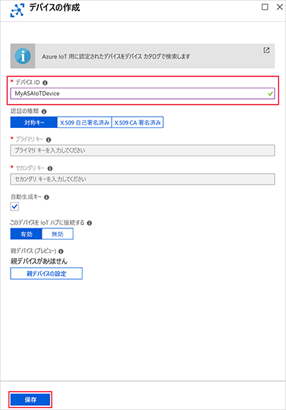
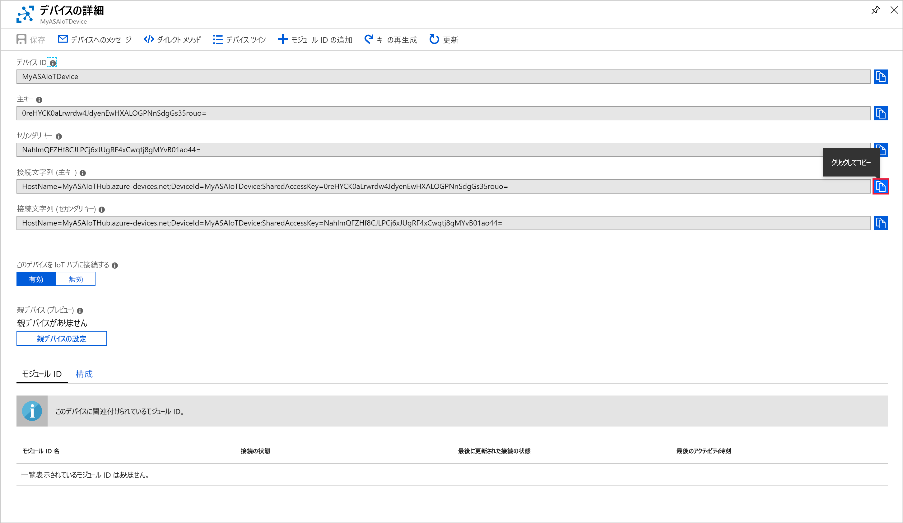
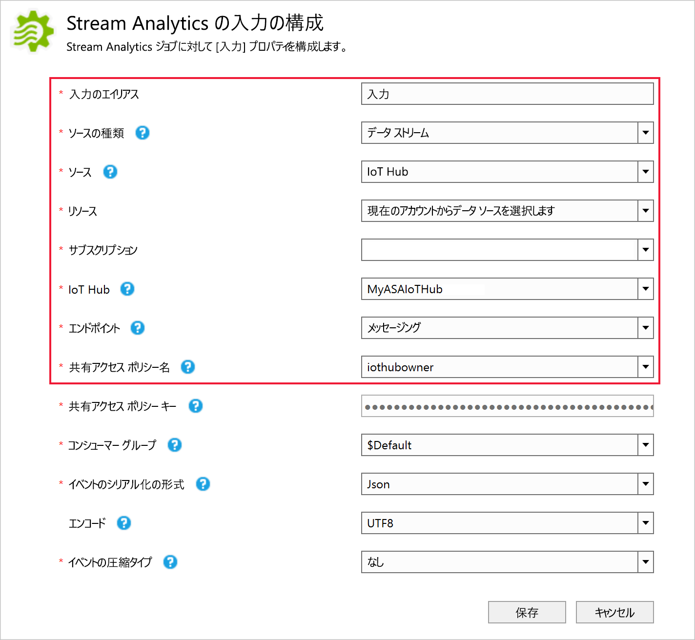
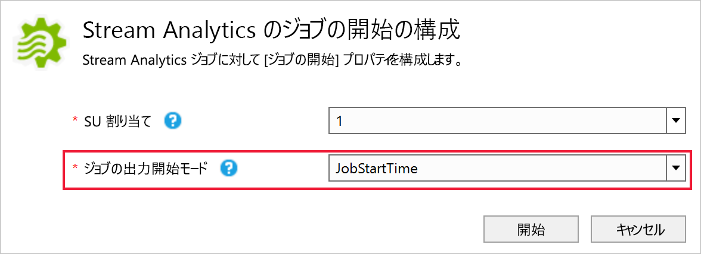

# <a name="quickstart-create-an-azure-stream-analytics-job-by-using-visual-studio"></a>クイック スタート:Visual Studio を使用して Azure Stream Analytics ジョブを作成する

このクイック スタートでは、Visual Studio の Azure Stream Analytics ツールを使用して Stream Analytics ジョブを作成および実行する方法を示します。 サンプル ジョブでは、IoT Hub デバイスからストリーミング データを読み取ります。 温度が 27 度を超えるときに平均温度を計算し、結果の出力イベントを BLOB ストレージ内の新しいファイルに書き込むジョブを定義します。

## <a name="before-you-begin"></a>開始する前に

* Azure サブスクリプションをお持ちでない場合は、[無料アカウント](https://azure.microsoft.com/free/)を作成してください。

* [Azure Portal](https://portal.azure.com/) にサインインします。

* Visual Studio 2019、Visual Studio 2015、または Visual Studio 2013 Update 4 をインストールします。 Enterprise (Ultimate/Premium)、Professional、Community の各エディションがサポートされています。 Express エディションはサポートされていません。

* [インストール手順](https://docs.microsoft.com/azure/stream-analytics/stream-analytics-tools-for-visual-studio-install)に従って、Visual Studio の Stream Analytics ツールをインストールします。

## <a name="prepare-the-input-data"></a>入力データを準備する

Stream Analytics ジョブを定義する前に、後でジョブの入力として構成されるデータを準備する必要があります。 ジョブで必要な入力データを準備するには、次の手順を完了します。

1. [Azure Portal](https://portal.azure.com/) にサインインします。

2. **[リソースの作成]**  >  **[モノのインターネット]**  >  **[IoT Hub]** を選択します。

3. **[IoT Hub]** ウィンドウで、以下の情報を入力します。
   
   |**設定**  |**推奨値**  |**説明**  |
   |---------|---------|---------|
   |Subscription  | \<該当するサブスクリプション\> |  使用する Azure サブスクリプションを選択します。 |
   |Resource group   |   asaquickstart-resourcegroup  |   **[新規作成]** を選択し、アカウントの新しいリソース グループ名を入力します。 |
   |Region  |  \<ユーザーに最も近いリージョンを選択\> | お客様の IoT ハブをホストできる地理的な場所を選択します。 お客様のユーザーに最も近い場所を使用します。 |
   |IoT Hub 名  | MyASAIoTHub  |   お客様の IoT ハブの名前を選択します。   |

   

4. **[次へ:Set size and scale]\(次へ: サイズとスケールの設定\)** を選択します。

5. **[価格とスケールティア]** を選択します。 このクイック スタートでは、 **[F1 - Free tier]\(F1 - Free レベル\)** を選択します (お客様のサブスクリプションでまだ使用可能な場合)。 Free レベルを使用できない場合は、使用可能な最も低いレベルを選択します。 詳細については、「[IoT Hub の価格](https://azure.microsoft.com/pricing/details/iot-hub/)」を参照してください。

   

6. **[Review + create]\(レビュー + 作成\)** を選択します。 お客様の IoT ハブの情報を確認して、 **[作成]** をクリックします。 お客様の IoT ハブの作成には数分かかることがあります。 **[通知]** ウィンドウで進行状況を監視できます。

7. お客様の IoT ハブ ナビゲーション メニューで、 **[IoT デバイス]** の **[追加]** をクリックします。 **デバイス ID** を追加して **[保存]** をクリックします。

   

8. デバイスが作成されたら、 **[IoT デバイス]** の一覧からデバイスを開きます。 後で使用するために **[接続文字列 (主キー)]** をコピーしてメモ帳に保存します。

   

## <a name="create-blob-storage"></a>BLOB ストレージを作成する

1. Azure Portal の左上隅で、 **[リソースの作成]**  >  **[ストレージ]**  >  **[ストレージ アカウント]** の順に選択します。

2. **[ストレージ アカウントの作成]** ウィンドウで、ストレージ アカウントの名前、場所、リソース グループを入力します。 お客様が作成した IoT ハブと同じ場所およびリソース グループを選択します。 **[確認および作成]** をクリックしてアカウントを作成します。

   

3. お客様のストレージ アカウントが作成されたら、 **[概要]** ウィンドウの **[BLOB]** タイルを選択します。

   

4. **[Blob service]** ページで、 **[コンテナー]** を選択し、お客様のコンテナーに名前を付けます (*container1* など)。 **[パブリック アクセス レベル]** を **[Private (no anonymous access)]\(プライベート (匿名アクセスなし)\)** のままにして、 **[OK]** を選択します。

   

## <a name="create-a-stream-analytics-project"></a>Stream Analytics プロジェクトを作成する

1. Visual Studio を起動します。

2. **[ファイル] > [新しいプロジェクト]** を選択します。  

3. 左側のテンプレートの一覧で **[Stream Analytics]** を選択し、 **[Azure Stream Analytics アプリケーション]** を選択します。  

4. プロジェクトの**名前**、**場所**、および**ソリューション名**を入力し、 **[OK]** を選択します。

   

Azure Stream Analytics プロジェクトに含まれる要素に注目してください。

   


## <a name="choose-the-required-subscription"></a>必要なサブスクリプションを選択する

1. Visual Studio の **[表示]** メニューで **[サーバー エクスプローラー]** を選択します。

2. **[Azure]** を右クリックし、 **[Connect to Microsoft Azure Subscription]\(Microsoft Azure サブスクリプションへの接続\)** を選択します。その後、Azure アカウントでサインインします。

## <a name="define-input"></a>入力を定義する

1. **ソリューション エクスプローラー**で **[入力]** ノードを展開し、 **[Input.json]** をダブルクリックします。

2. **[Stream Analytics Input Configuration]\(Stream Analytics 入力構成\)** で、次の値を入力します。

   |**設定**  |**推奨値**  |**説明**   |
   |---------|---------|---------|
   |入力のエイリアス  |  入力   |  ジョブの入力を識別する名前を入力します。   |
   |ソースの種類   |  データ ストリーム |  適切な入力ソース ([データ ストリーム] または [参照データ]) を選択します。   |
   |source  |  IoT Hub |  適切な入力ソースを選択します。   |
   |Resource  | 現在のアカウントからデータ ソースを選択します | 手動でデータを入力するか、既存のアカウントを選択するかを選択します。   |
   |Subscription  |  \<該当するサブスクリプション\>   | 作成した IoT ハブがある Azure サブスクリプションを選択します。   |
   |IoT Hub  |  MyASAIoTHub   |  対象の IoT ハブの名前を選択または入力します。 IoT ハブが同じサブスクリプション内に作成されている場合、IoT ハブ名は自動的に検出されます。   |
   
3. 他のオプションは既定値のままにして、 **[保存]** を選択し、設定を保存します。  

   

## <a name="define-output"></a>出力の定義

1. **ソリューション エクスプローラー**で **[出力]** ノードを展開し、 **[Output.json]** をダブルクリックします。

2. **[Stream Analytics Output Configuration]\(Stream Analytics 出力構成\)** で、次の値を入力します。

   |**設定**  |**推奨値**  |**説明**   |
   |---------|---------|---------|
   |出力のエイリアス  |  Output   |  ジョブの出力を識別する名前を入力します。   |
   |シンク   |  Blob Storage |  適切なシンクを選択します。    |
   |Resource  |  データ ソース設定を手動で提供します |  手動でデータを入力するか、既存のアカウントを選択するかを選択します。   |
   |Subscription  |  \<該当するサブスクリプション\>   | 作成したストレージ アカウントを持っている Azure サブスクリプションを選択します。 ストレージ アカウントは、同じサブスクリプションにある場合も、別のサブスクリプションにある場合もあります。 この例では、同じサブスクリプションにストレージ アカウントを作成したと想定しています。   |
   |ストレージ アカウント  |  asaquickstartstorage   |  ストレージ アカウントの名前を選択するか、入力します。 ストレージ アカウントが同じサブスクリプション内に作成されている場合、ストレージ アカウント名は自動的に検出されます。   |
   |コンテナー  |  container1   |  ストレージ アカウントで作成した既存のコンテナーを選択します。   |
   |パスのパターン  |  output   |  コンテナー内に作成するファイル パスの名前を入力します。   |
   
3. 他のオプションは既定値のままにして、 **[保存]** を選択し、設定を保存します。  

   

## <a name="define-the-transformation-query"></a>変換クエリを定義する

1. Visual Studio の**ソリューション エクスプローラー**から **Script.asaql** を開きます。

2. 次のクエリを追加します。

   ```sql
   SELECT *
   INTO BlobOutput
   FROM IoTHubInput
   HAVING Temperature > 27
   ```

## <a name="submit-a-stream-analytics-query-to-azure"></a>Stream Analytics クエリを Azure に送信する

1. **クエリ エディター**で、スクリプト エディターの **[Azure に送信]** を選択します。

2. **[新しい Azure Stream Analytics ジョブを作成する]** を選択し、**ジョブ名**を入力します。 クイック スタートの最初に使用した**サブスクリプション**、**リソース グループ**、および**場所**を選択します。

   

## <a name="run-the-iot-simulator"></a>IoT シミュレーターを実行する

1. 新しいブラウザー タブまたはウィンドウで [Raspberry Pi Azure IoT オンライン シミュレーター](https://azure-samples.github.io/raspberry-pi-web-simulator/)を開きます。

2. 前のセクションで保存した Azure IoT Hub デバイスの接続文字列を使用して、行 15 のプレースホルダーを置き換えます。

3. **[実行]** をクリックします。 お客様の IoT ハブに送信されているセンサー データとメッセージが出力に表示されます。

   

## <a name="start-the-stream-analytics-job-and-check-output"></a>Stream Analytics ジョブを開始して出力を確認する

1. ジョブが作成されると、ジョブ ビューが自動的に開きます。 緑色の矢印ボタンを選択して、ジョブを開始します。

   

2. **[ジョブ出力の開始モード]** を **[JobStartTime]** に変更し、 **[開始]** を選択します。

   

3. ジョブの状態が **[実行中]** に変わり、入力/出力イベントが表示されることに注目してください。 これには数分かかることがあります。

   

4. 結果を表示するには、 **[表示]** メニューで **[Cloud Explorer]** を選択し、リソース グループ内のストレージ アカウントに移動します。 **[BLOB コンテナー]** で、 **[container1]** をダブルクリックし、 **[出力]** ファイル パスをダブルクリックします。

   

## <a name="clean-up-resources"></a>リソースのクリーンアップ

リソース グループ、ストリーミング ジョブ、および関連するすべてのリソースは、不要になったら削除します。 ジョブを削除すると、ジョブによって消費されるストリーミング ユニットに対する課金を回避することができます。 ジョブを後で使用する計画がある場合は、ジョブを停止し、必要なときに再起動することができます。 このジョブの使用を続けない場合は、以下の手順に従って、このクイック スタートで作成したすべてのリソースを削除してください。

1. Azure Portal の左側のメニューで **[リソース グループ]** を選択し、作成したリソースの名前を選択します。  

2. リソース グループのページで **[削除]** を選択し、削除するリソースの名前をテキスト ボックスに入力してから **[削除]** を選択します。

## <a name="next-steps"></a>次の手順

このクイック スタートでは、Visual Studio を使用して、簡単な Stream Analytics ジョブをデプロイしました。 [Azure portal](stream-analytics-quick-create-portal.md) と [PowerShell](stream-analytics-quick-create-powershell.md) を使用して Stream Analytics ジョブをデプロイすることもできます。 

Visual Studio の Azure Stream Analytics ツールについて学習するには、次の記事に進んでください。

> [!div class="nextstepaction"]
> [Visual Studio を使用して Azure Stream Analytics ジョブを表示する](stream-analytics-vs-tools.md)
