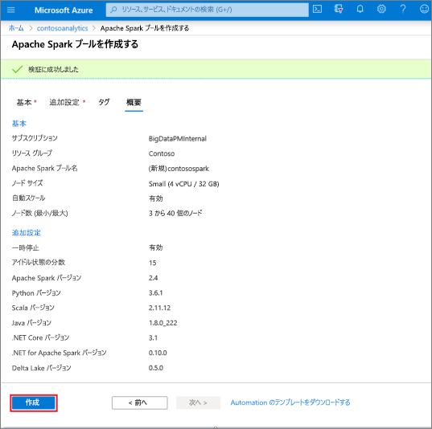
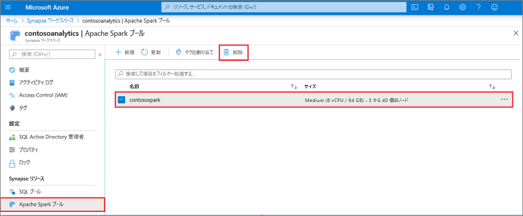
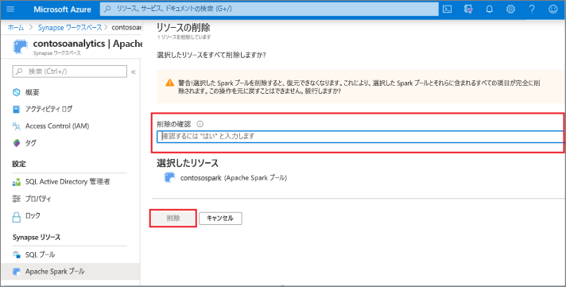

# クイックスタート: Azure portal を使用して新しいサーバーレス Apache Spark プールを作成する

Azure Synapse Analytics には、データの取り込み、変換、モデル化、分析、配布に役立つさまざまな分析エンジンが用意されています。 Apache Spark プールは、オープンソースのビッグ データ コンピューティング機能を提供します。 お使いの Synapse ワークスペースに Apache Spark プールを作成した後、データを読み込み、モデル化し、処理し、配布して、分析情報を迅速に得ることができます。

このクイックスタートでは、Azure portal を使用して Synapse ワークスペースに Apache Spark プールを作成する方法を学習します。

> [!IMPORTANT]
> Spark インスタンスの料金は、それを使用しているかどうかに関係なく、分単位で課金されます。 必ず、Spark インスタンスの使用を終了した後にシャットダウンするか、短いタイムアウトを設定してください。 詳しくは、この記事の「**リソースのクリーンアップ**」をご覧ください。

Azure サブスクリプションをお持ちでない場合は、[開始する前に無料アカウントを作成](https://azure.microsoft.com/free/)してください。

## 前提条件

- Azure サブスクリプション - [無料アカウントを作成する](https://azure.microsoft.com/free/)
- [Synapse Analytics ワークスペース](quickstart-create-workspace.md)

## Azure portal にサインインする

[Azure ポータル](https://portal.azure.com/)

## Synapse ワークスペースに移動する 
1. Synapse ワークスペースに移動します。ここでは、検索バーにサービス名 (またはリソース名を直接) 入力して、Apache Spark プールを作成します。

1. ワークスペースの一覧で、開くワークスペースの名前 (または名前の一部) を入力します。 この例では、**contosoanalytics** という名前のワークスペースを使用します。

## 新しい Apache Spark プールを作成する

1. Apache Spark プールを作成する Synapse ワークスペースで、 **[新しい Apache Spark プール]** を選択します。
    
2. **[基本]** タブで、以下の詳細を入力します。

    |設定 | 推奨値 | 説明 |
    | :------ | :-------------- | :---------- |
    | **[Apache Spark pool name]\(Apache Spark プール名\)** | 有効なプール名 | これは、Apache Spark プールの名前です。 |
    | **ノード サイズ** | Small (4 vCPU / 32 GB) (S (4 vCPU/32 GB)) | このクイックスタートのコストを削減するために、最小サイズに設定します |
    | **Autoscale** | 無効 | このクイックスタートでは、自動スケーリングは必要ありません |
    | **[Number of nodes]\(ノードの数\)** | 5 | このクイックスタートでは、コストを制限するために小さいサイズを使用します |

    ![Apache Spark プール作成のフロー - [基本] タブ。](media/quickstart-create-apache-spark-pool/create-spark-pool-portal-02.png)
    > [!IMPORTANT]
    > Apache Spark プールで使用できる名前には、特定の制限があることに注意してください。 名前は、文字または数字のみを含み、15 文字以下である必要があります。さらに、文字で始まり、予約語を含まず、ワークスペース内で一意である必要があります。

3. **[次へ: 追加設定]** をクリックして、既定の設定を確認します。 既定の設定は変更しないでください。
    ![[Additional settings]\(追加設定\) タブが選択されている [Create Apache Spark pool]\(Apache Spark プールの作成\) ページのスクリーンショット。](media/quickstart-create-apache-spark-pool/create-spark-pool-portal-03.png)

4. **[次へ: タグ]** を選択します。 タグは追加しないでください。
    ![Apache Spark プールの作成フロー - [additional settings]\(追加設定\) タブ。](media/quickstart-create-apache-spark-pool/create-spark-pool-03-tags.png)

5. **[Review + create]\(レビュー + 作成\)** を選択します。

6. 以前に入力した内容に基づいて詳細が正しいことを確認し、 **[作成]** を選択します。
    

7. この時点で、リソースのプロビジョニング フローが開始されます。完了すると、その旨が表示されます。
    !["Your deployment is complete (デプロイが完了しました)" というメッセージが表示された [概要] ページのスクリーンショット。](media/quickstart-create-apache-spark-pool/create-spark-pool-portal-06.png)

8. プロビジョニングが完了した後にワークスペースに戻ると、新しく作成された Apache Spark プールの新しいエントリが表示されます。
    

9. この時点で、実行されているリソースはなく、Spark の料金は発生していません。この時点で、作成する Spark インスタンスに関するメタデータが作成されています。

## リソースをクリーンアップする

次の手順に従って、ワークスペースから Apache Spark プールを削除します。
> [!WARNING]
> Apache Spark プールを削除すると、ワークスペースから分析エンジンが削除されます。 プールに接続することはできなくなります。また、この Apache Spark プールを使用するすべてのクエリ、パイプライン、ノートブックは動作しなくなります。

Apache Spark プールを削除する場合は、次の手順を実行します。

1. ワークスペースの [Apache Spark プール] ブレードに移動します。
2. 削除する Apache Spark プール (この場合は **contosospark**) を選択します。
3. **[削除]** を押します。
 
4. 削除を確認し、 **[削除]** を押します。
 
5. プロセスが正常に完了すると、Apache Spark プールはワークスペース リソースの一覧に表示されなくなります。

## 次のステップ

- 「[クイック スタート:Apache Spark ノートブックの作成](quickstart-apache-spark-notebook.md)に関するページを参照してください。
- 「[クイック スタート:Azure portal を使用して専用 SQL プールを作成する](quickstart-create-sql-pool-portal.md)」を参照してください。
