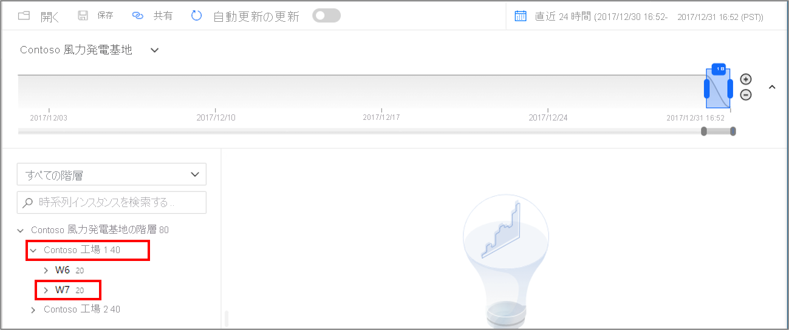
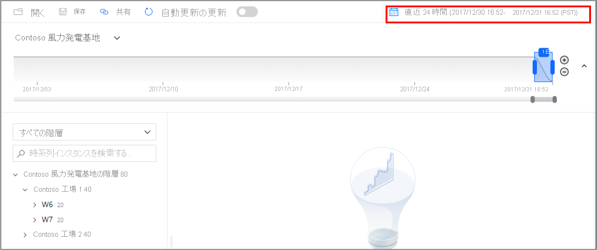
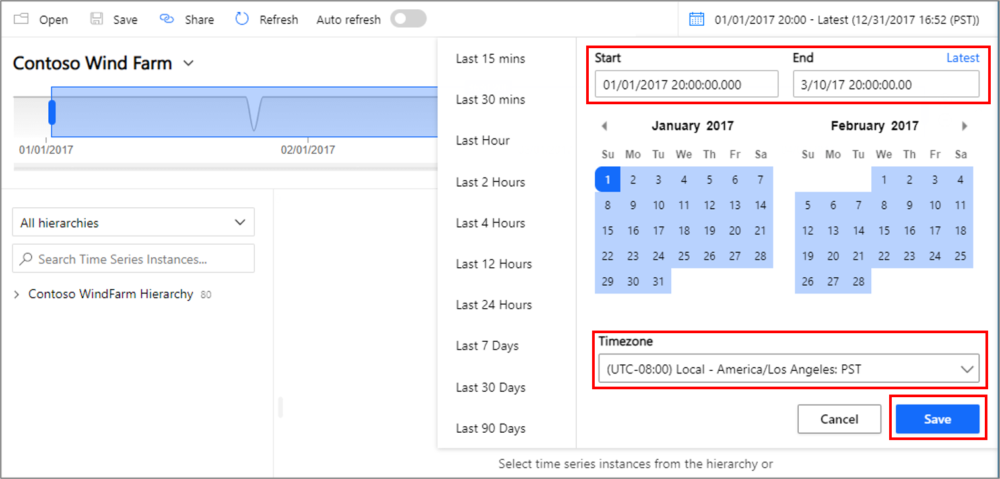
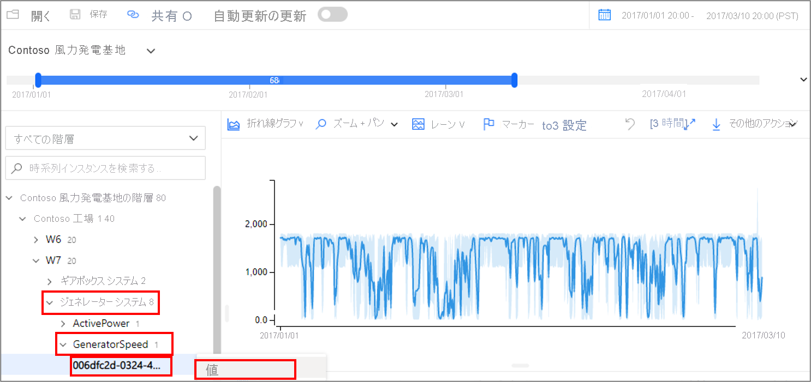

# クイック スタート:Azure Time Series Insights Gen2 デモ環境を探索する

このクイックスタートでは、Azure Time Series Insights Gen2 環境の概要について説明します。 無料のデモで、Azure Time Series Insights Gen2 に追加された主な機能を紹介します。

Azure Time Series Insights Gen2 デモ環境には、2 つの風力タービン発電所を運営するシナリオ会社 Contoso が含まれています。 各発電所には 10 個のタービンがあります。 各タービンには 20 個のセンサーが付いていて、1 分ごとに Azure IoT Hub にデータを報告します。 センサーにより、気象条件、ブレードの回転速度、ヨーの位置に関する情報が収集されます。 発電機のパフォーマンス、ギアボックスの動作、安全モニターに関する情報も記録されます。

このクイックスタートでは、Azure Time Series Insights Gen2 を使用して Contoso データから実用的な分析情報を見つける方法を説明します。 重大な障害をより的確に予測し、メンテナンスを実行するために、簡単な根本原因分析も実施します。

> [!IMPORTANT]
> まだ作成していない場合、 [無料の Azure アカウント](https://azure.microsoft.com/free/?ref=microsoft.com&utm_source=microsoft.com&utm_medium=docs&utm_campaign=visualstudio) を作成します。

## デモ環境で Azure Time Series Insights Gen2 エクスプローラーを探索する

Azure Time Series Insights Gen2 エクスプローラーでは、履歴データと根本原因分析が示されます。 作業を開始するには:

1.  [Contoso Wind Farm デモ](https://insights.timeseries.azure.com/preview/samples)環境に移動します。  

1. プロンプトが表示されたら、Azure アカウントの資格情報を使用して Azure Time Series Insights Gen2 エクスプローラーにサインインします。

## 履歴データを操作する

1. **[Contoso WindFarm Hierarchy]\(Contoso WindFarm の階層\)** を選択します。

   [![[Contoso WindFarm Hierarchy]\(Contoso WindFarm の階層\)](media/quickstart-explore/quick-start-contoso-1.png)](media/quickstart-explore/quick-start-contoso-1.png#lightbox)

1. **Contoso Plant 1** の風力タービン **W7** を確認します。

   

   1. 表示範囲を **1/1/17 20:00:00.00 から 3/10/17 20:00:00.00 (UTC)** に変更します。

      

      

   1. 拡大 **(+)** および縮小 **(-)** を使用し、スライド バーを動かして範囲ビューを調整します。

      

   1. センサーを選択するには、**Contoso Plant 1** > **W7** > **Generator System** > **GeneratorSpeed** の順に選択します。 次に、表示される値を確認します。

      

1. 最近、Contoso は風力タービン **W7** で火災を発見しました。 火災の原因についての見解はさまざまです。 Azure Time Series Insights Gen2 には、火災時に作動した火災アラート センサーが表示されています。

   1. 表示範囲を **3/9/17 20:00:00.00 から 3/10/17 20:00:00.00 (UTC)** に変更します。
   1. **Safety System** > **FireAlert** の順に選択します。

      

1. 火災発生前後の他のイベントを確認して、何が起こったかを理解します。 火災の直前に油圧とアクティブな警告が急上昇しました。

   1. **Pitch System** > **HydraulicOilPressure** の順に選択します。
   1. **Pitch System** > **ActiveWarning** の順に選択します。

      

1. 火災の直前に、油圧センサーとアクティブな警告センサーが急上昇しました。 表示されている時系列を展開して、出火の原因を明白に示したその他の兆候がないかを確認します。 両方のセンサーは、時間の経過と共に一貫して変動していました。 この変動は持続的で気がかりなパターンを示しています。

    * 表示範囲を **2/24/17 20:00:00.00 から 3/10/17 20:00:00.00 (UTC)** に変更します。

      

1. 2 年間の履歴データを調べると、別の火災でセンサーに同様の変動があったことが明らかになります。

    * 表示範囲を **1/1/16 から 12/31/17** (全データ) に変更します。

      

Azure Time Series Insights Gen2 とセンサー テレメトリを使用して、履歴データに隠れていた長期的な傾向が見つかりました。 これらの新しい分析情報を使用して、次のことができます。

* 実際に起こったことを明らかにする。
* その問題を修正する。
* より優れたアラート通知システムを導入する。

## 根本原因分析

1. シナリオによっては、データの手がかりを見つけるために高度な分析が必要となります。 **6/25** の日付の風力発電 **W6** を選択します。

    1. 表示範囲を **6/1/17 20:00:00.00 から 7/1/17 20:00:00.00 (UTC)** に変更します。
    1. **Contoso Plant 1** > **W6** > **Safety System** > **VoltageActuatorSwitchWarning** の順に選択します。

       

1. 警告は、発電機から出力されている電圧の問題を示しています。 発電機の全体的な出力電力は、現在の間隔では正常なパラメーター内にあります。 間隔を広げると、別のパターンが出現します。 下落がはっきりとわかります。

    1. **VoltageActuatorSwitchWarning** センサーを削除します。
    1. **Generator System** > **ActivePower** の順に選択します。
    1. 間隔を **3d** に変更します。

       

1. 時間範囲を広げることで、問題が停止したか、継続しているかを判断できます。

    * 期間を 60 日間に拡大します。

      

1. センサーの他のデータ ポイントを追加して、コンテキストを拡大できます。 表示するセンサーの数が多ければ多いほど、問題に対する理解は深まります。 実際の値を表示するマーカーを置いてみましょう。

    1. **Generator System** を選択してから 3 つのセンサーを選択します: **GridVoltagePhase1**、**GridVoltagePhase2**、**GridVoltagePhase3**。
    1. 表示領域の最後のデータ ポイントにマーカーを置きます。

       

    2 つの電圧センサーは、正常なパラメーター内で同等に動作しています。 **[GridVoltagePhase3]** センサーが原因であるようです。

1. 高度なコンテキスト データを追加すると、このフェーズ 3 の下落が問題として浮上してきます。 これで、警告の原因についての有力な手掛かりが手に入りました。 問題をメンテナンス チームに任せる準備ができました。  

    * 同じグラフ スケール上に **Generator System** のセンサーをすべてオーバーレイ表示するように変更します。

      

## 次のステップ

独自の Azure Time Series Insights Gen2 環境を作成する準備ができました。 開始するには:

> [!div class="nextstepaction"]
> [Azure Time Series Insights Gen2 環境の計画](./how-to-plan-your-environment.md)

デモとその機能の使用方法を説明します。

> [!div class="nextstepaction"]
> [Azure Time Series Insights Gen2 エクスプローラー](./concepts-ux-panels.md)
