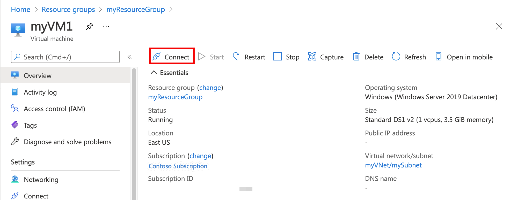

# <a name="quickstart-create-a-virtual-network-using-the-azure-portal"></a>クイック スタート:Azure Portal を使用した仮想ネットワークの作成

このクイックスタートでは、Azure Portal を使用した仮想ネットワークの作成方法について説明します。 2 つの仮想マシン (VM) をデプロイします。 次に、VM 間で安全な通信を行い、インターネットから VM に接続します。 仮想ネットワークは、Azure 内のプライベート ネットワークの基本的な構成要素です。 それにより、VM などの Azure リソースは、相互に、またはインターネットと、安全に通信することができます。

## <a name="prerequisites"></a>前提条件

* アクティブなサブスクリプションが含まれる Azure アカウント。 [無料で作成できます](https://azure.microsoft.com/free/?ref=microsoft.com&utm_source=microsoft.com&utm_medium=docs&utm_campaign=visualstudio)。

## <a name="sign-in-to-azure"></a>Azure へのサインイン

[Azure Portal](https://portal.azure.com) にサインインします。

## <a name="create-a-virtual-network"></a>仮想ネットワークの作成

1. Azure Portal メニューから **[リソースの作成]** を選択します。 Azure Marketplace で、 **[ネットワーク]**  >  **[仮想ネットワーク]** を選択します。

1. **[仮想ネットワークの作成]** に次の情報を入力または選択します。

    | 設定 | 値 |
    | ------- | ----- |
    | サブスクリプション | サブスクリプションを選択します。|
    | Resource group | **[新規作成]** を選択し、「*myResourceGroup*」と入力して、 **[OK]** を選択します。 |
    | 名前 | 「*myVirtualNetwork*」と入力します。 |
    | 場所 | **[米国東部]** を選択します。|

1. **次へ:[Next: IP Addresses]\(次へ: IP アドレス\)** を選択し、 **[IPv4 アドレス空間]** に「*10.1.0.0/16*」と入力します。

1. **[サブネットの追加]** を選択し、 **[サブネット名]** に「*myVirtualSubnet*」、 **[サブネットのアドレス範囲]** に「*10.1.0.0/24*」と入力します。

1. **[追加]** を選択し、 **[Review + create]\(確認と作成\)** を選択します。 残りは既定値のままにして、 **[作成]** を選択します。

1. **[仮想ネットワークの作成]** で、 **[作成]** を選択します。

## <a name="create-virtual-machines"></a>仮想マシンを作成する

仮想ネットワークに 2 つの VM を作成します。

### <a name="create-the-first-vm"></a>最初の VM を作成する

1. Azure Portal メニューから **[リソースの作成]** を選択します。

1. Azure Marketplace で、 **[コンピューティング]**  >  **[Windows Server 2019 Datacenter]** を選択します。 **［作成］** を選択します

1. **[仮想マシンの作成 - 基本]** に次の情報を入力または選択します。

    | 設定 | 値 |
    | ------- | ----- |
    | **プロジェクトの詳細** | |
    | サブスクリプション | サブスクリプションを選択します。 |
    | Resource group | **[myResourceGroup]** を選択します。 このリソース グループは、前のセクションで作成しました。 |
    | **インスタンスの詳細** |  |
    | 仮想マシン名 | 「*myVm1*」と入力します。 |
    | リージョン | **[米国東部]** を選択します。 |
    | 可用性のオプション | 既定値の **[インフラストラクチャ冗長は必要ありません]** になります。 |
    | Image | 既定値の **[Windows Server 2019 Datacenter]** になります。 |
    | サイズ | 既定値の **[Standard DS1 v2]** になります。 |
    | **管理者アカウント** |  |
    | ユーザー名 | 任意のユーザー名を入力します。 |
    | Password | 任意のパスワードを入力します。 パスワードは 12 文字以上で、[定義された複雑さの要件](../virtual-machines/windows/faq.md?toc=%2fazure%2fvirtual-network%2ftoc.json#what-are-the-password-requirements-when-creating-a-vm)を満たす必要があります。|
    | パスワードの確認 | パスワードを再入力します。 |
    | **受信ポートの規則** |  |
    | パブリック受信ポート | **[選択したポートを許可する]** を選択します。 |
    | 受信ポートの選択 | 「*HTTP (80)* 」と「*RDP (3389)* 」と入力します。 |
    | **コスト削減** |  |
    | Windows ライセンスを既にお持ちの場合 | 既定値の **[いいえ]** になります。 |

1. **次へ:ディスク** を選択します。

1. **[仮想マシンの作成 - Disk]** で、既定値のままにして、 **[Next:Networking]\(次へ : ネットワーク\)** を選択します。

1. **[仮想マシンの作成 - ネットワーク]** で次の情報を選択します。

    | 設定 | 値 |
    | ------- | ----- |
    | 仮想ネットワーク | 既定値の **[myVirtualNetwork]** になります。 |
    | Subnet | 既定値の **[myVirtualSubnet (10.1.0.0/24)]** になります。 |
    | パブリック IP | 既定値の **[(new) myVm-ip]** になります。 |
    | NIC ネットワーク セキュリティ グループ | 既定値の **[Basic]** になります。 |
    | パブリック受信ポート | 既定値の **[選択したポートを許可する]** になります。 |
    | 受信ポートの選択 | 既定値の **[HTTP]** と **[RDP]** になります。

1. **次へ:管理** を選択します。

1. **[仮想マシンの作成 - 管理]** の **[診断ストレージ アカウント]** で **[新規作成]** を選択します。

1. **[ストレージ アカウントの作成]** に次の情報を入力または選択します。

    | 設定 | 値 |
    | ------- | ----- |
    | 名前 | 「*myvmstorageaccount*」と入力します。 この名前を取得する場合は、一意の名前を作成します。|
    | アカウントの種類 | 既定値の **[Azure Storage General Purpose v1]** になります。 |
    | パフォーマンス | 既定値の **[Standard]** になります。 |
    | レプリケーション | 既定値の **[ローカル冗長ストレージ (LRS)]** になります。 |

1. **[OK]** を選択し、 **[Review + create]\(確認と作成\)** を選択します。 **[確認および作成]** ページが表示され、Azure によって構成が検証されます。

1. "**証に成功しました**" というメッセージが表示されたら、 **[作成]** を選択します。

### <a name="create-the-second-vm"></a>2 つ目の VM を作成する

前のセクションの手順を繰り返して、別の仮想マシンを作成します。

> [!IMPORTANT]
> **[仮想マシン名]** に「*myVm2*」と入力します。
>
> **[診断ストレージ アカウント]** には、 **[myvmstorageaccount]** を作成するのではなく、必ず選択してください。

## <a name="connect-to-a-vm-from-the-internet"></a>インターネットから VM に接続する

*myVm1* を作成した後、インターネットに接続します。

1. Azure Portal で、*myVm1* を検索して選択します。

1. **[接続]** 、 **[RDP]** の順に選択します。

    

    **[接続]** ページが開きます。

1. **[RDP ファイルのダウンロード]** を選択します。 リモート デスクトップ プロトコル ( *.rdp*) ファイルが作成され、お使いのコンピューターにダウンロードされます。

1. RDP ファイルを開きます。 メッセージが表示されたら、 **[Connect]** を選択します。

1. VM の作成時に指定したユーザー名とパスワードを入力します。

    > [!NOTE]
    > 場合によっては、 **[その他]**  >  **[別のアカウントを使用する]** を選択して、VM の作成時に入力した資格情報を指定する必要があります。

1. **[OK]** を選択します。

1. サインインすると、証明書の警告を受け取ることがあります。 証明書の警告を受信する場合は、 **[はい]** または **[続行]** を選択します。

1. VM デスクトップが表示されたら最小化してローカル デスクトップに戻ります。

## <a name="communicate-between-vms"></a>VM 間の通信

1. *myVm1* のリモート デスクトップで、PowerShell を開きます。

1. 「`ping myVm2`」と入力します。

    次の出力のようなメッセージが返されます。

    ```output
    Pinging myVm2.0v0zze1s0uiedpvtxz5z0r0cxg.bx.internal.clouda
    Request timed out.
    Request timed out.
    Request timed out.
    Request timed out.

    Ping statistics for 10.1.0.5:
    Packets: Sent = 4, Received = 0, Lost = 4 (100% loss),
    ```

    `ping`インターネット制御メッセージ プロトコル (ICMP) を使用しているため、`ping` は失敗します。 既定では、Windows ファイアウォールを介した ICMP は許可されていません。

1. 後の手順で *myVm2* に *myVm1* への ping を許可するには、次のコマンドを入力します。

    ```powershell
    New-NetFirewallRule –DisplayName "Allow ICMPv4-In" –Protocol ICMPv4
    ```

    このコマンドを実行すると、Windows ファイアウォールを介して ICMP を受信できます。

1. *myVm1* へのリモート デスクトップ接続を閉じます。

1. 「[インターネットから VM に接続する](#connect-to-a-vm-from-the-internet)」の手順をもう一度実行します。ただし、ここでは *myVm2* に接続します。

1. コマンド プロンプトに `ping myvm1` と入力します。

    次のようなメッセージが返されます。

    ```output
    Pinging myVm1.0v0zze1s0uiedpvtxz5z0r0cxg.bx.internal.cloudapp.net [10.1.0.4] with 32 bytes of data:
    Reply from 10.1.0.4: bytes=32 time=1ms TTL=128
    Reply from 10.1.0.4: bytes=32 time<1ms TTL=128
    Reply from 10.1.0.4: bytes=32 time<1ms TTL=128
    Reply from 10.1.0.4: bytes=32 time<1ms TTL=128

    Ping statistics for 10.1.0.4:
        Packets: Sent = 4, Received = 4, Lost = 0 (0% loss),
    Approximate round trip times in milli-seconds:
        Minimum = 0ms, Maximum = 1ms, Average = 0ms
    ```

    ステップ 3 で *myVm1* VM での Windows ファイアウォール経由の ICMP を許可したため、*myVm1* から応答を受信します。

1. *myVm2* へのリモート デスクトップ接続を閉じます。

## <a name="clean-up-resources"></a>リソースをクリーンアップする

このクイック スタートでは、既定の仮想ネットワークと 2 つの VM を作成しました。 インターネットから 1 つの VM に接続し、2 つの VM の間で安全に通信を行いました。

仮想ネットワークと VM を使い終えたら、リソース グループと含まれるすべてのリソースを削除します。

1. *myResourceGroup* を検索して選択します。

1. **[リソース グループの削除]** を選択します。

1. **[TYPE THE RESOURCE GROUP NAME]\(リソース グループ名を入力してください\)** に「*myResourceGroup*」と入力し、 **[削除]** を選択します。

## <a name="next-steps"></a>次のステップ

仮想ネットワーク設定の詳細については、「[仮想ネットワークの作成、変更、削除](manage-virtual-network.md)」をご覧ください。

Azure では、VM 間の安全な通信を既定で実行できます。 Azure では、インターネットから Windows VM への受信リモート デスクトップ接続のみが許可されています。 VM ネットワーク通信の種類の詳細については、[ネットワーク トラフィックのフィルター処理](tutorial-filter-network-traffic.md)に関する記事を参照してください。

> [!NOTE] 
> Azure サービスは有料です。 Azure Cost Management を使用すると、予算を設定して、支出を制御するためのアラートを構成できます。 Cost Management で Azure のコストを分析、管理、最適化しましょう。 詳細については、[コスト分析に関するクイック スタート](https://docs.microsoft.com/azure/cost-management-billing/costs/quick-acm-cost-analysis?WT.mc_id=costmanagementcontent_docsacmhorizontal_-inproduct-learn)に関するページを参照してください。
