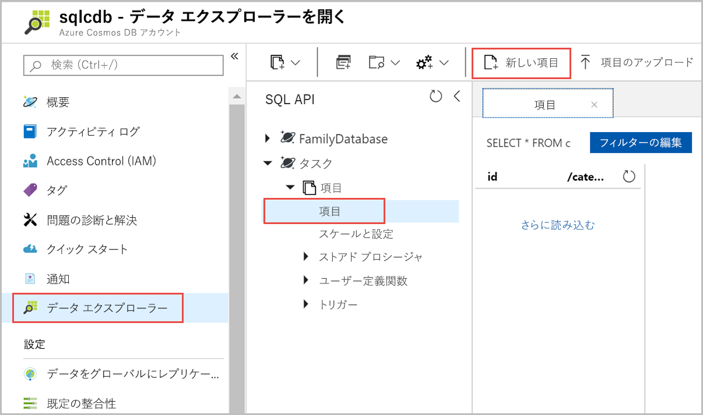

これで、データ エクスプローラーを使用して、新しいコンテナーにデータを追加できます。

1. **データ エクスプローラー**で、**Tasks** データベースを展開し、**Items** コンテナーを展開します。 **[項目]** を選択し、 **[新しい項目]** をクリックします。

   
  
2. ここで、次の構造のドキュメントをコンテナーに追加します。

     ```json
     {
         "id": "1",
         "category": "personal",
         "name": "groceries",
         "description": "Pick up apples and strawberries.",
         "isComplete": false
     }
     ```

3. json を **[ドキュメント]** タブに追加したら、 **[保存]** を選択します。

    ![json データをコピーし、Azure portal のデータ エクスプローラーで [保存] を選択する](./media/cosmos-db-create-sql-api-add-sample-data/azure-cosmosdb-data-explorer-save-document.png)

4.  もう 1 つドキュメントを作成して保存します。`id` プロパティには一意の値を挿入し、その他のプロパティについては適宜変更してください。 Azure Cosmos DB では、データにスキーマを課さないため、新しいドキュメントは必要な任意の構造にすることができます。