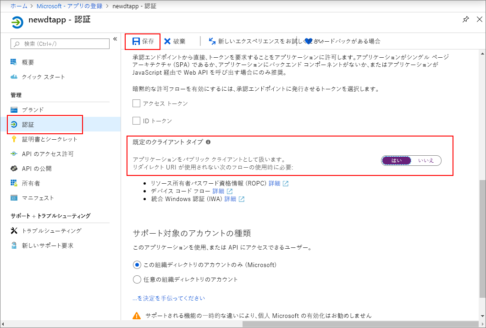
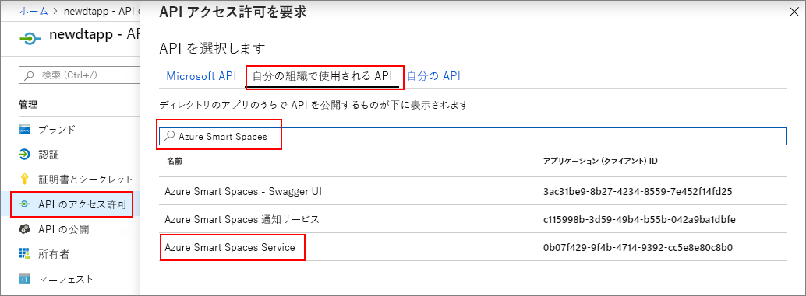

>[!NOTE]
>このセクションでは、[新しい Azure AD アプリの登録](https://docs.microsoft.com/azure/active-directory/develop/quickstart-register-app)手順について説明します。 まだ従来のネイティブ アプリの登録がある場合、サポートされている限りはそれを使用できます。 さらに、何らかの理由でアプリ登録の新しい方法が設定で機能しない場合は、従来のネイティブ AAD アプリを作成してみてください。 詳細な手順については、「[Register your Azure Digital Twins app with Azure Active Directory legacy (Azure Digital Twins アプリを Azure Active Directory レガシに登録する)](../articles/digital-twins/how-to-use-legacy-aad.md)」を参照してください。 

1. [Azure portal](https://portal.azure.com) で、左側のウィンドウの **[Azure Active Directory]** を開き、 **[アプリの登録]** ウィンドウを開きます。 **[新規登録]** ボタンを選択します。

    

1. **[名前]** ボックスに、このアプリ登録の表示名を入力します。 **[リダイレクト URI (省略可能)]** セクションで、左側のドロップダウン メニューから **[パブリック クライアント (モバイルとデスクトップ)]** を選択し、右側のテキストボックスに「`https://microsoft.com`」と入力します。 **[登録]** を選択します。

    

1. [アプリが "*ネイティブ アプリ*" として登録されている](https://docs.microsoft.com/azure/active-directory/develop/scenario-desktop-app-registration)ことを確認するには、アプリ登録の **[認証]** ウィンドウを開き、そのウィンドウを下にスクロールします。 **[既定のクライアントの種類]** セクションで、 **[アプリケーションは、パブリック クライアントとして扱います]** に **[はい]** を選択します。 

    

1.  登録済みアプリの **[概要]** ウィンドウを開き、次のエンティティの値を一時ファイルにコピーします。 これらの値は、以下のセクションでサンプル アプリケーションを構成する際に使用します。

    - **アプリケーション (クライアント) ID**
    - **ディレクトリ (テナント) ID**

    

1. アプリの登録の **[API アクセス許可]** ウィンドウを開きます。 **[アクセス許可の追加]** ボタンを選択します。 **[API アクセス許可の要求]** ウィンドウで、 **[所属する組織で使用している API]** タブを選択し、以下を探します:
    
    1. `Azure Digital Twins` **Azure Digital Twins** API を選択します。

        

    1. または、`Azure Smart Spaces Service` を検索します。 **Azure Smart Spaces Service** API を選択します。

        

    > [!IMPORTANT]
    > 表示される Azure AD API の名前と ID は、テナントによって異なります。
    > * テスト テナントと顧客アカウントでは、`Azure Digital Twins` を検索する必要があります。
    > * 他の Microsoft アカウントでは、`Azure Smart Spaces Service` を検索する必要があります。

1. 選択された API は、同じ **[API アクセス許可の要求]** ウィンドウに **Azure Digital Twins** と表示されます。 **[Read (1)]\(読み取り (1)\)** ドロップ ダウンを選択し、 **[Read.Write]** チェック ボックスをオンにします。 **[アクセス許可の追加]** ボタンを選択します

    

1. 組織の設定によっては、この API への管理者アクセスを許可するために追加の手順を実行する必要があります。 詳細については、管理者にお問い合わせください。 管理者アクセスが承認されると、 **[API アクセス許可]** ウィンドウの **[管理者の同意が必要]** 列に API の次のような内容が表示されます。

    

