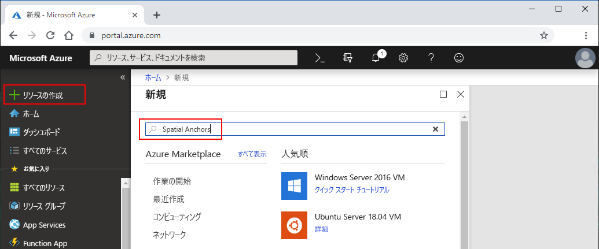
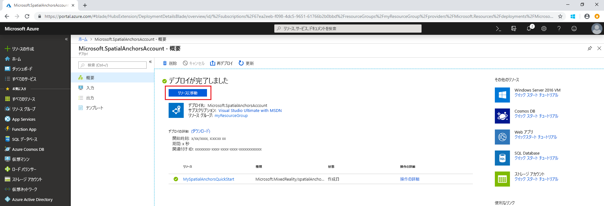
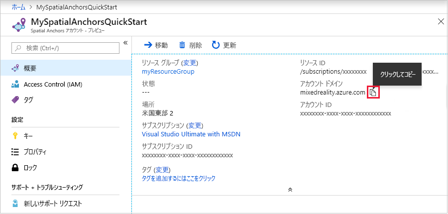

## <a name="create-a-spatial-anchors-resource"></a>Spatial Anchors リソースを作成する

### <a name="portal"></a>[ポータル](#tab/azure-portal)

<a href="https://portal.azure.com" target="_blank">Azure ポータル</a>にアクセスします。

左側のウィンドウで、 **[リソースの作成]** を選択します。

検索ボックスを使用して、「**Spatial Anchors**」を検索します。



**[Spatial Anchors]** を選択し、 **[作成]** を選択します。

**[Spatial Anchors アカウント]** ウィンドウで次を行います。

* 通常の英数字を使用して一意のリソース名を入力します。
* リソースをアタッチするサブスクリプションを選択します。
* **[新規作成]** を選択して、リソース グループを作成します。 「**myResourceGroup**」と名前を付け、 **[OK]** を選択します。

  [!INCLUDE [resource group intro text](resource-group.md)]

* リソースを配置する場所 (リージョン) を選択します。
* **[新規]** を選択して、リソースの作成を開始します。

![リソースを作成するための [Spatial Anchors] ウィンドウのスクリーンショット。](./media/spatial-anchors-get-started-create-resource/create-resource-form.png)

リソースが作成されると、Azure portal に、デプロイが完了したことが表示されます。



**[リソースに移動]** を選択します。 これでリソースのプロパティを表示できます。

リソースの **[アカウント ID]** 値は後で使用するためにテキスト エディターにコピーしておきます。

![[リソース プロパティ] ウィンドウのスクリーンショット。](./media/spatial-anchors-get-started-create-resource/view-resource-properties.png)

また、リソースの **[アカウント ドメイン]** 値を後で使用するためにテキスト エディターにコピーします。



**[設定]** で **[キー]** を選択します。 **[主キー]** 値の **[アカウント キー]** を後で使用するためにテキスト エディターにコピーします。

![アカウントの [キー] ウィンドウのスクリーンショット。](./media/spatial-anchors-get-started-create-resource/view-account-key.png)

### <a name="azure-cli"></a>[Azure CLI](#tab/azure-cli)

まず、Azure CLI の環境を準備します。

[!INCLUDE [azure-cli-prepare-your-environment-no-header.md](azure-cli-prepare-your-environment-no-header.md)]

1. サインインしたら、[az account set](/cli/azure/account#az_account_set) コマンドを使用して、Spatial Anchors アカウントを設定するサブスクリプションを選択します。

   ```azurecli
   az account set --subscription 00000000-0000-0000-0000-000000000000
   ```

1. [az group create](/cli/azure/group#az_group_create) コマンドを実行してリソース グループを作成するか、既存のリソース グループを使用します。

   ```azurecli
   az group create --name myResourceGroup --location eastus2
   ```

   [!INCLUDE [resource group intro text](resource-group.md)]

   リソース グループの現在の Spatial Anchors アカウントを表示するには、[az spatial-anchors-account list](/cli/azure/ext/mixed-reality/spatial-anchors-account#ext_mixed_reality_az_spatial_anchors_account_list) コマンドを使用します。

   ```azurecli
   az spatial-anchors-account list --resource-group myResourceGroup
   ```

   また、ご利用のサブスクリプションの Spatial Anchors アカウントを表示することもできます。

   ```azurecli
   az spatial-anchors-account list
   ```

1. Spatial Anchors アカウントを作成するには、[az spatial-anchors-account create](/cli/azure/ext/mixed-reality/spatial-anchors-account#ext_mixed_reality_az_spatial_anchors_account_create) コマンドを実行します。

   ```azurecli
   az spatial-anchors-account create --resource-group myResourceGroup --name MySpatialAnchorsQuickStart --location eastus2
   ```

1. [az spatial-anchors-account show](/cli/azure/ext/mixed-reality/spatial-anchors-account#ext_mixed_reality_az_spatial_anchors_account_show) コマンドを使用して、リソースのプロパティを表示します。

   ```azurecli
   az spatial-anchors-account show --resource-group myResourceGroup --name MySpatialAnchorsQuickStart
   ```

   リソースの **[アカウント ID]** 値とリソースの **[アカウント ドメイン]** 値を後で使用するためにテキスト エディターにコピーします。

1. [az spatial-anchors-account key show](/cli/azure/ext/mixed-reality/spatial-anchors-account/key#ext_mixed_reality_az_spatial_anchors_account_key_show) コマンドを実行して、主キーとセカンダリ キーを取得します。

   ```azurecli
   az spatial-anchors-account key show --resource-group myResourceGroup --name MySpatialAnchorsQuickStart
   ```

   後で使用するためにキー値をテキスト エディターにコピーします。

   キーを再生成する必要がある場合は、[az spatial-anchors-account key renew](/cli/azure/ext/mixed-reality/spatial-anchors-account/key#ext_mixed_reality_az_spatial_anchors_account_key_renew) コマンドを使用します。

   ```azurecli
   az spatial-anchors-account key renew --resource-group myResourceGroup --name example --key primary
   az spatial-anchors-account key renew --resource-group myResourceGroup --name example --key secondary
   ```

[az spatial-anchors-account delete](/cli/azure/ext/mixed-reality/spatial-anchors-account#ext_mixed_reality_az_spatial_anchors_account_delete) コマンドを使用すると、アカウントを削除できます。

```azurecli
az spatial-anchors-account delete --resource-group myResourceGroup --name MySpatialAnchorsQuickStart
```

### <a name="azure-powershell"></a>[Azure PowerShell](#tab/azure-powershell)

まず、Azure PowerShell の環境を準備します。

[!INCLUDE [azure-powershell-requirements-no-header.md](azure-powershell-requirements-no-header.md)]

> [!IMPORTANT]
> **Az.MixedReality** PowerShell モジュールがプレビュー段階にある間は、`Install-Module` コマンドレットを使用して、これを別途インストールする必要があります。 この PowerShell モジュールは、一般提供されると、将来の Az PowerShell モジュール リリースに含まれ、既定で Azure Cloud Shell 内から使用できるようになります。

```azurepowershell-interactive
Install-Module -Name Az.MixedReality
```

1. サインインしたら、[Set-AzContext](/powershell/module/az.accounts/set-azcontext) コマンドレットを使用して、Spatial Anchors アカウントを設定するサブスクリプションを選択します。

   ```azurepowershell-interactive
   Set-AzContext -SubscriptionId 00000000-0000-0000-0000-000000000000
   ```

1. [New-AzResourceGroup](/powershell/module/az.resources/new-azresourcegroup) コマンドレットを実行してリソース グループを作成するか、または既存のリソース グループを使用します。

   ```azurepowershell-interactive
   New-AzResourceGroup -Name myResourceGroup -Location eastus2
   ```

   [!INCLUDE [resource group intro text](resource-group.md)]

   リソース グループの現在の Spatial Anchors アカウントを表示するには、[Get-AzSpatialAnchorsAccount](/powershell/module/az.mixedreality/get-azspatialanchorsaccount) コマンドレットを使用します。

   ```azurepowershell-interactive
   Get-AzSpatialAnchorsAccount -ResourceGroup myResourceGroup
   ```

   また、ご利用のサブスクリプションの Spatial Anchors アカウントを表示することもできます。

   ```azurepowershell-interactive
   Get-AzSpatialAnchorsAccount
   ```

1. [New-AzSpatialAnchorsAccount](/powershell/module/az.mixedreality/new-azspatialanchorsaccount) コマンドレットを実行して、Spatial Anchors アカウントを作成します。

   ```azurepowershell-interactive
   New-AzSpatialAnchorsAccount -ResourceGroup myResourceGroup -Name MySpatialAnchorsQuickStart -Location eastus2
   ```

1. [Get-AzSpatialAnchorsAccount](/powershell/module/az.mixedreality/get-azspatialanchorsaccount) コマンドレットを使用してリソースのプロパティを表示します。

   ```azurepowershell-interactive
   Get-AzSpatialAnchorsAccount -ResourceGroup myResourceGroup -Name MySpatialAnchorsQuickStart
   ```

   **accountId** プロパティの値と **accountDomain** プロパティの値を後で使用するためにテキスト エディターにコピーします。

1. [Get-AzSpatialAnchorsAccountKey](/powershell/module/az.mixedreality/get-azspatialanchorsaccountkey) コマンドレットを実行して、プライマリ キーとセカンダリ キーを取得します。

   ```azurepowershell-interactive
   Get-AzSpatialAnchorsAccountKey -ResourceGroup myResourceGroup -Name MySpatialAnchorsQuickStart
   ```

   後で使用するためにキー値をテキスト エディターにコピーします。

   キーを再生成する必要がある場合は、[New-AzSpatialAnchorsAccountKey](/powershell/module/az.mixedreality/new-azspatialanchorsaccountkey) コマンドレットを使用します。

   ```azurepowershell-interactive
   New-AzSpatialAnchorsAccountKey -ResourceGroupName myResourceGroup -Name MySpatialAnchorsQuickStart -Primary
   New-AzSpatialAnchorsAccountKey -ResourceGroupName myResourceGroup -Name MySpatialAnchorsQuickStart -Secondary
   ```

アカウントは、[Remove-AzSpatialAnchorsAccount](/powershell/module/az.mixedreality/remove-azspatialanchorsaccount) コマンドレットを使用して削除できます。

```azurepowershell-interactive
Remove-AzSpatialAnchorsAccount -ResourceGroup myResourceGroup -Name MySpatialAnchorsQuickStart
```

---
